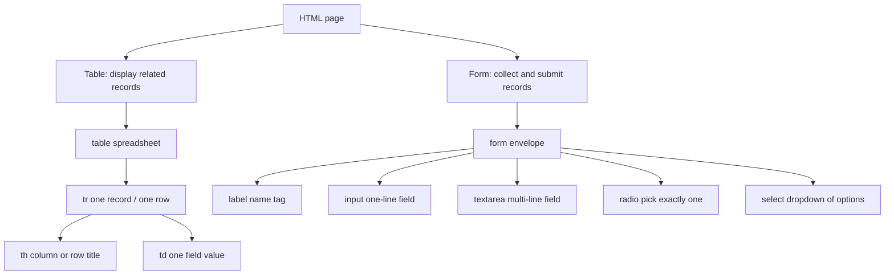

# HTML Fundamentals: Tables and Forms

Interview-ready notes for a final-year CSE student. Read this in order: first understand the two data jobs HTML solves (display tabular data vs collect user input), then master tables (`<table>`, `<tr>`, `<th>`, `<td>`), then forms (`<form>`, `<label>`, `<input>`, `<textarea>`, radio, select), then the deep dive on `<select>` / `<option>` from your practice file, then viva Q&A and a last-minute cheat sheet.

Hands-on files this note maps to:

- `tables.html` — `<table>`, `<tr>`, `<th>`, `<td>`
- `forms.html` — `<form>`, `<label>`, `<input>`, `<textarea>`, checkbox, radio, `<select>`, date/time inputs

---

## How to use these notes

Think of this lesson as two different jobs on the same webpage:

1. **Spreadsheet job** — show related records in rows and columns (`<table>`)
2. **Envelope job** — collect user answers and send them somewhere (`<form>`)

Read in this order:

1. **Big picture** — tables vs forms (display vs submit)
2. **Tables** — `<table>`, `<tr>`, `<th>` vs `<td>`, then fix what `tables.html` teaches by accident
3. **Forms** — `<form>`, `<label>`, `<input>`, `<textarea>`, radio vs checkbox
4. **Deep dive** — the `<select>` / `<option>` block in `forms.html` (lines 23–34)
5. **Viva** — interview Q&A and a last-minute cheat sheet

When you open `tables.html` and `forms.html`, read each tag twice: once as **what it looks like**, and once as **what it means to a browser, a server, and a screen reader**. That second reading is what interviews test.

---

## 1. Big picture: two data jobs on one page

> **Analogy:** A college admin office does two things. It **displays** the student list on a notice board (table). It **collects** new admission forms in a drop box (form). Same building, different purpose.

| Job | HTML tool | Analogy | What happens on submit |
| --- | --- | --- | --- |
| Display tabular data | `<table>` | Excel sheet on the wall | Nothing — it is read-only content |
| Collect user input | `<form>` | Addressed envelope | Browser sends `name=value` pairs to a server |



**Interview Tip:** If they ask “when do I use a table vs a form?” say: “Tables **display** structured data that already exists. Forms **collect** new data from the user and submit it.”

---

## 2. Tables: spreadsheet of related records

> **Analogy:** `<table>` is an Excel sheet. `<tr>` is one row — one student, one product, one log entry. `<th>` is the printed column title at the top. `<td>` is the handwritten value inside a cell.

### 2.1 What is a table?

A table is **tabular data**: information where rows and columns have a fixed relationship. Examples: student marks, product prices, server logs, timetable slots.

MDN rule: use `<table>` only for data that **benefits from row/column headers**. Do **not** use tables for page layout — that is a CSS job (`flexbox`, `grid`).

**Interview one-liner:** “HTML tables are for data grids, not for arranging divs on a page.”

### 2.2 `<table>` — the spreadsheet container

`<table>` wraps the entire grid. Everything inside it must be rows (`<tr>`) or row-group wrappers (`<thead>`, `<tbody>`, `<tfoot>`).

Minimal valid structure:

```html
<table>
  <tr>
    <td>Cell 1</td>
    <td>Cell 2</td>
  </tr>
</table>
```

Columns are not declared separately. A **column exists only because every row has a cell in that position**. Row 1 cell 1 and Row 2 cell 1 form column 1.

**Interview Tip:** “HTML has no `<column>` tag. Columns are implied by aligned cells across `<tr>` elements.”

### 2.3 `<tr>` — one horizontal record

> **Analogy:** `<tr>` (table **r**ow) is one line on the attendance register. Each `<td>` or `<th>` inside it is one field for that person.

`<tr>` groups cells into a single horizontal row. You cannot put text directly inside `<tr>` — only `<td>`, `<th>`, or header cells.

From MDN:

```html
<tr>
  <td>Hi, I'm your first cell.</td>
  <td>I'm your second cell.</td>
  <td>I'm your third cell.</td>
</tr>
```

If one row has 3 cells and the next has 2, the table is malformed and the browser will guess how to repair it. Always keep the same cell count per row (unless you use `colspan` / `rowspan` deliberately).

### 2.4 `<th>` vs `<td>` — the interview favourite

| Feature | `<th>` (table **h**eader cell) | `<td>` (table **d**ata cell) |
| --- | --- | --- |
| Role | Names a column or row — the **label** of an axis | Holds the **value** at that row/column intersection |
| Default styling | Bold, centered (browser stylesheet) | Regular weight, left-aligned |
| Semantics | Screen readers announce “column header” or “row header” | Screen readers read it as plain data |
| Typical position | Top row (column headers) or first cell of a data row (row header) | Body cells |
| `scope` attribute | Use `scope="col"` or `scope="row"` to say what it labels | Not used on data cells |

**Interview one-liner:** “`<th>` names the axis; `<td>` holds the measurement.”

Example — column headers + row header + data (MDN pattern):

```html
<table>
  <caption>Alien football stars</caption>
  <thead>
    <tr>
      <th scope="col">Player</th>
      <th scope="col">Gloobles</th>
      <th scope="col">Za'taak</th>
    </tr>
  </thead>
  <tbody>
    <tr>
      <th scope="row">TR-7</th>
      <td>7</td>
      <td>4,569</td>
    </tr>
    <tr>
      <th scope="row">Khiresh Odo</th>
      <td>7</td>
      <td>7,223</td>
    </tr>
  </tbody>
</table>
```

Here a screen reader can say “Player TR-7, Gloobles 7” instead of just “7” with no context.

#### `scope` values you should know

| `scope` | Meaning |
| --- | --- |
| `col` | This `<th>` is the header for **all cells below it in this column** |
| `row` | This `<th>` is the header for **all cells to the right in this row** |
| `rowgroup` | Header for a group of rows (advanced) |
| `colgroup` | Header for a group of columns (advanced) |

### 2.5 Table sections: `<thead>`, `<tbody>`, `<tfoot>`, `<caption>`

> **Analogy:** `<caption>` is the title sticker on the spreadsheet folder. `<thead>` is the printed header row you never edit. `<tbody>` is where data rows live. `<tfoot>` is the totals row at the bottom.

| Tag | Job |
| --- | --- |
| `<caption>` | Visible title of the table (accessibility + context) |
| `<thead>` | Header rows (usually `<th>` cells) |
| `<tbody>` | Main data rows |
| `<tfoot>` | Summary rows (totals, averages) |
| `colspan="2"` | One cell spans 2 columns |
| `rowspan="3"` | One cell spans 3 rows |

You can build a basic table with only `<tr>`, `<th>`, and `<td>`, but grouping with `<thead>` / `<tbody>` is **best practice** and a common follow-up interview question.

### 2.6 What your `tables.html` teaches — and what to fix

Open `tables.html`. It currently has **three separate `<table>` elements**:

```html
<!-- Table 1: headers only -->
<table>
  <tr>
    <th>Name</th>
    <th>Email</th>
    <th>City</th>
  </tr>
</table>

<!-- Table 2: John only -->
<table>
  <tr>
    <td>John</td>
    <td>john@example.com</td>
    <td>New York</td>
  </tr>
</table>

<!-- Table 3: Jane only -->
<table>
  <tr>
    <td>Jane</td>
    <td></td>
    <td>Los Angeles</td>
  </tr>
</table>
```

**Why this breaks the spreadsheet analogy:**

- Three mini-sheets instead of one dataset
- The browser cannot associate “Name” with “John” semantically — they live in different tables
- Screen readers lose the column-header relationship for data rows
- Visually it might look okay with CSS, but the **meaning** is wrong

**Interview-correct version — one table, one dataset:**

```html
<table>
  <caption>Registered users</caption>
  <thead>
    <tr>
      <th scope="col">Name</th>
      <th scope="col">Email</th>
      <th scope="col">City</th>
    </tr>
  </thead>
  <tbody>
    <tr>
      <td>John</td>
      <td>john@example.com</td>
      <td>New York</td>
    </tr>
    <tr>
      <td>Jane</td>
      <td></td>
      <td>Los Angeles</td>
    </tr>
  </tbody>
</table>
```

**Empty cell note:** Jane’s email is `<td></td>` — an empty cell is still a valid cell. She has no email on file. Do not delete the cell; that would shift “Los Angeles” into the Email column.

**Interview Tip:** “One logical dataset = one `<table>`. Headers in `<thead>`, records in `<tbody>`.”

### 2.7 When NOT to use tables

- Page layout (navbar + sidebar + content) → CSS Grid / Flexbox
- Unrelated cards in a dashboard → `<div>` + CSS
- Long prose → paragraphs and headings

Using tables for layout used to be common in the 1990s. Today it fails responsive design, accessibility audits, and semantic HTML reviews.

---

## 3. Forms: an addressed envelope

> **Analogy:** `<form>` is an envelope you hand to the post office. `action` is the delivery address (URL). `method` is how you send it: `GET` = postcard (data visible in the URL), `POST` = sealed letter (data in the body). Every control with a `name` is an item slip inside the envelope.

### 3.1 `<form>` — grouping controls for submission

```html
<form action="/submit-endpoint" method="post">
  <!-- controls here -->
  <button type="submit">Submit</button>
</form>
```

When the user clicks Submit (or presses Enter in a text field), the browser collects all **successful** controls that have a `name` attribute and sends them as `name=value` pairs.

| Attribute | Job |
| --- | --- |
| `action` | URL that receives the data |
| `method` | `get` or `post` (default is `get`) |
| `enctype` | How data is encoded (`multipart/form-data` for file uploads) |

**GET example:** `?user_name=Sayantan&user_email=test%40mail.com` appears in the address bar.

**POST example:** data is in the HTTP request body — better for passwords and large payloads.

From your `forms.html`, the first form has no `action` or `method`:

```html
<form>
  <textarea name="message" placeholder="Enter your name"></textarea>
  ...
  <button type="submit">Submit</button>
</form>
```

Without `action`, submit reloads the **current page**. Without `method`, it defaults to `GET`. Fine for learning; in production you always set both.

**Interview one-liner:** “`name` is the key the server reads; `id` is the hook for labels and JavaScript — they are different jobs.”

### 3.2 `<label>` — the name tag on each field

> **Analogy:** A `<label>` is the sticker on a suitcase. It tells humans and screen readers what belongs inside. Clicking the label should focus or activate the control.

MDN gives **two legal ways** to associate a label:

**Method 1 — explicit (recommended for clarity):**

```html
<label for="email">Email:</label>
<input type="email" id="email" name="user_email" />
```

`for` on the label must **exactly match** `id` on the control. IDs are **case-sensitive** (`Games` ≠ `games`).

**Method 2 — implicit (nest the control inside the label):**

```html
<label>
  I agree to the terms and conditions.
  <input type="checkbox" id="terms" name="terms" />
</label>
```

When nested, `for` and `id` are not required for the association — but you still want `id` if JavaScript or CSS targets that field.

**Why labels matter:**

1. **Accessibility** — screen readers announce “Email, edit text” instead of “edit text”
2. **Usability** — clicking the label text focuses the input (bigger tap target on mobile)
3. **Validation** — required fields paired with labels pass WCAG checks

### 3.3 `<input>` — one-line fields (void element)

`<input>` is a **void element** — no closing tag. The `type` attribute changes the widget and built-in validation.

Common types in your `forms.html`:

| `type` | Purpose | Notes |
| --- | --- | --- |
| `email` | Email address | Browser validates `@` format |
| `password` | Hidden characters | Never log or display in URLs |
| `checkbox` | On/off, independent toggles | Same `name` can submit multiple values |
| `radio` | Pick exactly one in a group | Same `name`, different `value` |
| `month` | Month picker | Submits `YYYY-MM` |
| `date` | Date picker | Submits `YYYY-MM-DD` |
| `time` | Time picker | Submits `HH:MM` |

Always pair with `name` (for submission) and usually `id` (for labels):

```html
<label for="mail">Email:</label>
<input type="email" id="mail" name="user_email" />
```

### 3.4 `<textarea>` — multi-line text (NOT void)

> **Analogy:** `<input>` is a single-line name field on a form. `<textarea>` is the “comments” box at the bottom — multiple lines, longer answers.

```html
<label for="msg">Message:</label>
<textarea id="msg" name="user_message" rows="4" cols="40"></textarea>
```

Key differences from `<input>`:

| | `<input>` | `<textarea>` |
| --- | --- | --- |
| Closing tag | No (`<input>`) | Yes (`</textarea>`) |
| Content | Uses `value` attribute | Default text goes **between** tags |
| Lines | Single line | Multi-line |
| `placeholder` | Hint only | Hint only — **not** a substitute for `<label>` |

From your `forms.html`:

```html
<textarea name="message" placeholder="Enter your name"></textarea>
```

Issues to notice:

- No `<label>` — screen reader users hear “edit text” with no context
- Placeholder says “Enter your name” but `name="message"` — inconsistent naming
- Placeholder disappears when typing; if it is your only label, that is an accessibility fail

**Interview one-liner:** “Use `<textarea>` for essays, feedback, addresses. Use `<input type="text">` for one-line answers.”

### 3.5 `type="radio"` vs checkbox — the choice controls

> **Analogy:** **Radio** = car radio stations — pick **one** frequency in a group. **Checkbox** = pizza toppings — pick **many**, each independent.

**Radio — mutual exclusion via shared `name`:**

```html
<fieldset>
  <legend>Gender</legend>
  <input type="radio" id="male" name="gender" value="male" />
  <label for="male">Male</label>

  <input type="radio" id="female" name="gender" value="female" />
  <label for="female">Female</label>
</fieldset>
```

Rules:

- All radios in one group share the **same `name`**
- Each radio has a **different `value`** — that value is what submits
- Each radio needs its own **`id`** and a `<label for="...">`
- Only the **selected** radio’s `name=value` pair is sent

**Checkbox — independent toggles:**

```html
<input type="checkbox" id="terms" name="terms" value="accepted" />
<label for="terms">I agree to the terms</label>
```

Unchecked checkboxes are **not submitted at all**.

From your `forms.html`:

```html
<input type="checkbox" name="terms" id="terms">
<input type="radio" name="gender" id="male">
```

Interview bugs:

- Checkbox has `id="terms"` but no `<label for="terms">` with visible text
- Only **one** radio with `name="gender"` — you cannot demonstrate exclusive choice with a group of one
- Radio has no `value` attribute — browser may submit `on` instead of a meaningful enum

### 3.6 Spot the interview bugs in `forms.html`

Use this file as a **debugging exercise**. Do not memorize the bugs — learn to spot them in any form.

| Line / pattern | Bug | Fix |
| --- | --- | --- |
| `for="email"` but input has no `id` | Label association broken for explicit `for` | Add `id="email"` to the input, or remove `for` and rely on nesting |
| `for="password"` but input has no `id` | Same | Add `id="password"` |
| `for="Games"` vs `id="games"` | IDs are case-sensitive — `for` does not match | Use consistent casing: `for="games"` |
| `<textarea placeholder="Enter your name">` | Placeholder is not a label | Add `<label for="message">` |
| Lone radio `name="gender"` | Not a group | Add at least one more radio with same `name`, different `value` |
| Checkbox without label text | Accessibility fail | Add `<label for="terms">I agree</label>` |
| No `action` / `method` on `<form>` | Submit goes nowhere useful | Set `action` and `method="post"` in production |

**Interview Tip:** Walk through a form and ask three questions: (1) Does every control have a `name`? (2) Does every control have a label? (3) Do `for` and `id` match exactly?

---

## 4. Deep dive: `<select>` and `<option>` (forms.html lines 23–34)

This is the block you selected. Read it slowly — dropdowns confuse many students in viva because **what you see is not what the server receives**.

### 4.1 Your practice code

```html
<label for="Games">Games
  <select name="games" id="games">
    <option value="1">Cricket</option>
    <option value="2">Football</option>
    <option value="3">Tennis</option>
    <option value="4">Basketball</option>
    <option value="5">Hockey</option>
    <option value="6">Volleyball</option>
    <option value="7">Baseball</option>
    <option value="8">Golf</option>
    <option value="9">Tennis</option>
    <option value="10">Basketball</option>
  </select>
</label>
```

### 4.2 The restaurant menu analogy

> **Analogy:** `<select>` is a **closed restaurant menu**. The customer reads dish names (`Cricket`, `Football`). The waiter writes the **kitchen code** on the order slip (`1`, `2`), not the pretty name. `<option>` is one line on that menu. `value` is the kitchen SKU. The visible text is marketing copy for humans.

Walk through what happens when the user picks **Cricket** and clicks Submit:

```
games=1
```

Not `games=Cricket`. The server receives **`1`**, because that is the `value` of the selected `<option>`.

| Part | Attribute | What it does | Analogy |
| --- | --- | --- | --- |
| `<select>` | `name="games"` | Key on the submitted form data | Field name on the order slip |
| `<select>` | `id="games"` | Target for `<label for="games">` and JS | Barcode on the menu slot |
| `<option>` | visible text | What the user reads | “Butter chicken” on menu |
| `<option>` | `value="1"` | What actually submits | Kitchen code `#001` |

**Interview one-liner:** “The option’s visible text is for humans; `value` is for the server.”

### 4.3 `name` vs `id` on `<select>` — do not mix them up

Both can be `"games"` in your file, but they do **different jobs**:

| Attribute | Consumer | Purpose |
| --- | --- | --- |
| `name` | Server / backend | `req.body.games` or `$_POST['games']` |
| `id` | Browser / CSS / JS / `<label for>` | `document.getElementById('games')` |

You can have `name="favorite_sport"` and `id="games"` — legal, but confusing. In interviews, say they **often match for simplicity** but are not the same concept.

### 4.4 Why `value` should be a stable ID, not display text

Your options use numeric IDs (`value="1"`, `value="2"`). That is good practice because:

1. **Database keys** — `1` might map to `sports.id = 1` in MongoDB or SQL
2. **Renaming** — you can change “Cricket” to “Cricket (Outdoor)” without breaking the API
3. **i18n** — Hindi UI might show “क्रिकेट” but still submit `1`
4. **Validation** — backend checks `if (!allowedIds.includes(games))` instead of string matching

Bad pattern for production:

```html
<option value="Cricket">Cricket</option>
```

Works in demos. Breaks when marketing renames the sport or you need localization.

Duplicate display names in your file (`Tennis` at value 3 and 9, `Basketball` at 4 and 10) are another lesson: **the user sees duplicates, but the server still gets different IDs**. In a real app, deduplicate options or use distinct labels.

### 4.5 Label association — explicit vs implicit in your snippet

Your label uses **both** patterns at once:

```html
<label for="Games">Games   <!-- explicit for= — WRONG case -->
  <select name="games" id="games">  <!-- implicit nesting — WORKS -->
```

Because the `<select>` is **nested inside** `<label>`, the implicit association already works — clicking “Games” focuses the dropdown even though `for="Games"` does not match `id="games"`.

But the stray `for="Games"` is still wrong:

- IDs are **case-sensitive** in HTML
- An interviewer may ask you to fix it to `for="games"` or remove `for` entirely when nesting

**Cleaner explicit pattern (common in React/Vue templates):**

```html
<label for="games">Favorite game</label>
<select name="games" id="games">
  ...
</select>
```

**Cleaner implicit pattern:**

```html
<label>
  Favorite game
  <select name="games" id="games">...</select>
</label>
```

Pick one style per project and stay consistent.

### 4.6 Placeholder option — force the user to choose

Your dropdown defaults to the first real option (Cricket). The user might submit without consciously choosing. Production forms often add:

```html
<select name="games" id="games" required>
  <option value="">-- Choose a game --</option>
  <option value="1">Cricket</option>
  <option value="2">Football</option>
  ...
</select>
```

- `value=""` on the first option means “nothing selected”
- `required` prevents submit until a real option is picked
- Interviewers like this pattern — it shows you understand default selection vs empty state

### 4.7 `selected` attribute

To pre-select an option without relying on “first in list”:

```html
<option value="2" selected>Football</option>
```

Only one option per `<select>` should have `selected` (unless `multiple` is set).

### 4.8 `<optgroup>` — grouping options (interview extra)

```html
<select name="games" id="games">
  <optgroup label="Team sports">
    <option value="1">Cricket</option>
    <option value="2">Football</option>
  </optgroup>
  <optgroup label="Individual sports">
    <option value="8">Golf</option>
    <option value="3">Tennis</option>
  </optgroup>
</select>
```

Screen readers announce the group label. Use when a flat list is too long to scan.

### 4.9 `<select multiple>` — one-liner

`<select multiple size="5">` allows Ctrl+click selection of many options. Rare in modern UI — checkboxes or a multi-select component are usually clearer. Mention it if asked; do not default to it.

### 4.10 When to use `<select>` vs radio buttons

| Situation | Use |
| --- | --- |
| 2–4 options, all must be visible | `type="radio"` |
| 5+ options, space is limited | `<select>` |
| User must see all choices without clicking | Radio |
| Long list (countries, sports, departments) | `<select>` or searchable combobox |

Your games list has 10 entries — **`<select>` is the right control**.

### 4.11 Production-ready rewrite (interview answer)

If an interviewer says “Improve this dropdown,” answer with this:

```html
<label for="games">Favorite game</label>
<select name="games" id="games" required>
  <option value="">-- Choose a game --</option>
  <option value="1">Cricket</option>
  <option value="2">Football</option>
  <option value="3">Tennis</option>
  <option value="4">Basketball</option>
  <option value="5">Hockey</option>
  <option value="6">Volleyball</option>
  <option value="7">Baseball</option>
  <option value="8">Golf</option>
</select>
```

Changes explained out loud:

1. Fixed label `for` / `id` match
2. Added placeholder option with empty `value`
3. Added `required`
4. Removed duplicate sports entries
5. Kept numeric `value` for backend mapping

### 4.12 End-to-end: browser → server mental model

```
User selects "Football" in UI
        ↓
Browser reads <option value="2"> (not the visible text)
        ↓
Form submit → POST body: games=2
        ↓
Express / Next.js route: req.body.games === "2"
        ↓
Database lookup: db.sports.findOne({ id: 2 })
```

That pipeline is what “full stack” means for one dropdown field.

---

## 5. Interview quick-fire Q&A

Practice answering out loud in 20–40 seconds each.

### Q1. What is the difference between `<th>` and `<td>`?

**A:** Both live inside `<tr>`. `<th>` is a **header cell** — it names a column or row. Browsers default to bold/centered, and screen readers treat it as a header. `<td>` is a **data cell** — it holds the actual value at that row/column intersection. Rule of thumb: `<th>` names the axis; `<td>` holds the measurement.

### Q2. How do `<table>` and `<tr>` create columns if there is no `<column>` tag?

**A:** Columns are implied. Each `<tr>` is a row of cells. The first cell in every row forms column one, the second cell forms column two, and so on. `<table>` wraps the grid; `<tr>` groups one horizontal line of `<td>` or `<th>` elements. Alignment across rows creates the column structure.

### Q3. Why should you not use tables for page layout?

**A:** Tables are for **tabular data** with semantic row/column relationships. Layout tables break responsive design, confuse screen readers (which announce “table, row, cell” for navigation chrome), and mix content structure with presentation. Modern layout uses CSS Flexbox and Grid. Interviewers want to hear “separation of structure and presentation.”

### Q4. What are `scope`, `<thead>`, and `<tbody>` for?

**A:** `<thead>` groups header rows, `<tbody>` groups data rows — improves semantics and styling. `scope="col"` on a `<th>` says it labels all cells below it in that column; `scope="row"` labels cells to its right in that row. Together they help assistive tech read “City: New York” instead of orphan values.

### Q5. What does a `<form>` submit, and why does every control need `name`?

**A:** On submit, the browser sends **successful controls** as `name=value` pairs to the URL in `action`, using `method` (`get` puts them in the query string; `post` puts them in the body). Without `name`, the control is invisible to the server. `id` is for labels and JavaScript; `name` is for the backend.

### Q6. What are the two ways to associate a `<label>` with a control?

**A:** Explicit: `<label for="email">` matches `id="email"` on the input. Implicit: nest the input inside the label — association is automatic. Both are valid per MDN. Explicit is easier to style in component frameworks; implicit is compact for checkboxes.

### Q7. `<input>` vs `<textarea>` — when do you use which?

**A:** `<input>` is a void element for single-line data — text, email, password, date, etc. `<textarea>` has a closing tag and supports multi-line content between the tags — comments, feedback, long addresses. Both use `name` for submission; neither should rely on `placeholder` alone instead of a real label.

### Q8. Radio vs checkbox — what does `name` do in each case?

**A:** Radio buttons with the **same `name`** form one exclusive group — only one can be selected, and only that one’s `value` submits. Checkboxes with the same `name` can submit multiple values (or use different names for independence). Unchecked boxes do not submit at all. Radio = pick one station; checkbox = pick many toppings.

### Q9. In `<select>`, what is the difference between option text and `value`?

**A:** The text between `<option>...</option>` is what the user sees — “Cricket”. The `value` attribute is what the form submits — e.g. `games=1`. Servers should store and validate `value` (often a database ID or enum), not the display string, so labels can change without breaking the backend.

### Q10. Why must `for` on `<label>` match `id` on the control exactly?

**A:** The `for` attribute references the control’s `id` via a document-wide ID lookup. IDs are **case-sensitive** — `for="Games"` does not match `id="games"`. If they mismatch and the control is not nested inside the label, clicking the label text will not focus the field, and screen readers may not connect them. Always verify pairs in code review.

---

## 6. Last-minute cheat sheet

### 6.1 Table skeleton

```html
<table>
  <caption>Title of dataset</caption>
  <thead>
    <tr>
      <th scope="col">Column A</th>
      <th scope="col">Column B</th>
    </tr>
  </thead>
  <tbody>
    <tr>
      <th scope="row">Row label</th>
      <td>Value</td>
    </tr>
  </tbody>
</table>
```

### 6.2 Form skeleton

```html
<form action="/api/register" method="post">
  <label for="email">Email</label>
  <input type="email" id="email" name="email" required />

  <label for="bio">Bio</label>
  <textarea id="bio" name="bio" rows="4"></textarea>

  <fieldset>
    <legend>Plan</legend>
    <input type="radio" id="free" name="plan" value="free" />
    <label for="free">Free</label>
    <input type="radio" id="pro" name="plan" value="pro" />
    <label for="pro">Pro</label>
  </fieldset>

  <label for="country">Country</label>
  <select id="country" name="country" required>
    <option value="">-- Select --</option>
    <option value="in">India</option>
    <option value="us">United States</option>
  </select>

  <button type="submit">Register</button>
</form>
```

### 6.3 Tag → job → analogy

| Tag | Job | Analogy |
| --- | --- | --- |
| `<table>` | Tabular data grid | Excel sheet |
| `<tr>` | One record / one row | One line on attendance register |
| `<th>` | Column or row header | Printed column title |
| `<td>` | Data cell | Handwritten cell value |
| `<caption>` | Table title | Sticker on spreadsheet folder |
| `<form>` | Submit container | Addressed envelope |
| `<label>` | Names a control | Luggage name tag |
| `<input>` | One-line field | Single blank on a form |
| `<textarea>` | Multi-line field | “Comments” box |
| `type="radio"` | Pick one in group | Car radio station |
| `type="checkbox"` | Toggle on/off | Pizza topping |
| `<select>` | Dropdown choice | Closed restaurant menu |
| `<option>` | One menu item | One dish + kitchen code (`value`) |

### 6.4 One-breath revision

1. One dataset = one `<table>`. Headers in `<th>`, values in `<td>`, rows in `<tr>`.
2. `<th>` names the axis; `<td>` holds the value. Add `scope` for accessibility.
3. Never use tables for layout — use CSS Grid/Flexbox.
4. `<form>` submits `name=value`. Set `action` and `method`.
5. Every control needs a `name` (server) and a label (`for` + `id`, or nesting).
6. `<input>` = single line, void. `<textarea>` = multi-line, closing tag.
7. Radio: same `name`, one choice. Checkbox: independent toggles.
8. `<select>` submits the selected option’s **`value`**, not its visible text.
9. Placeholder is not a label. Empty `<td>` is still a valid cell.
10. Read your HTML twice: appearance vs semantics.

---

## 7. How this lesson maps to real usage

| You learned | You will use it when |
| --- | --- |
| `<table>` + `<th>` / `<td>` | Admin dashboards, marksheets, invoice line items, analytics tables |
| `scope` + `<thead>` / `<tbody>` | Accessibility audits, government/edu projects, any WCAG-compliant UI |
| `<form>` + `method` / `action` | Login, signup, checkout, contact pages, Next.js API routes |
| `<label>` + `for` / `id` | Every production form; failing this fails accessibility reviews |
| `<input type="email|password|date|time">` | Auth flows, booking systems, filters |
| `<textarea>` | Support tickets, job applications, comment boxes |
| Radio vs checkbox | Payment plan pickers vs terms-and-conditions toggles |
| `<select>` + `value` | Country lists, category filters, enum fields mapped to DB IDs |
| Spotting bugs in `forms.html` | Code review rounds, UI intern tasks, live debugging interviews |

When you open `tables.html` and `forms.html`, fix them **on paper first** using this note, then rebuild the corrected versions in a new file if you want practice. The goal is not perfect demo HTML — it is to explain **why** the corrected version is better in front of an interviewer.

---

## 8. Emmet shortcuts for this lesson (bonus)

| Type this | Get this |
| --- | --- |
| `table>tr*3>td*4` | 3 rows, 4 columns |
| `table>thead>tr>th*3+tbody>tr*2>td*3` | Header row + 2 data rows |
| `form>label+input` | Label followed by input |
| `form>(label+input[type=text])*3` | Three labeled text fields |
| `select>option*5` | Select with 5 empty options |
| `form>fieldset>legend+input[type=radio]*3` | Radio group in fieldset |

Press **Tab** in VS Code / Cursor after typing the abbreviation.

---

*Sources aligned with MDN Web Docs: HTML table basics, `<th>`, `<tr>`, `<td>`, `<form>`, `<label>`, `<input>`, `<textarea>`, `<select>`, `<option>`, and radio button grouping.*
