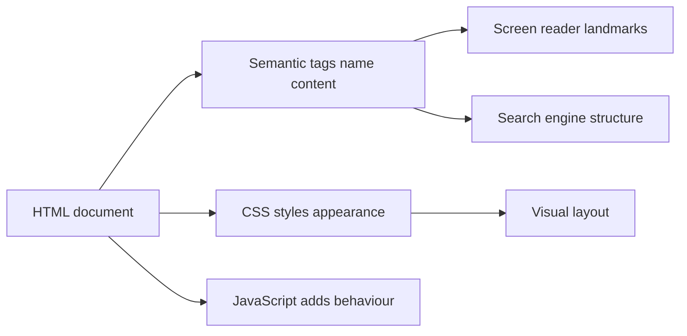
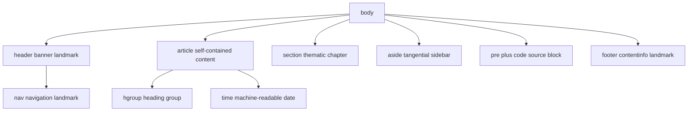
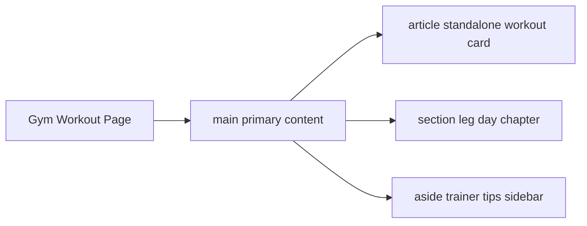

# HTML Fundamentals: Semantic HTML, CSS in `<head>`, and Character Entities

Interview-ready notes for a final-year CSE student. Read this in order: first understand why HTML meaning matters more than how it looks, then learn how CSS gets onto the page (internal `<style>` vs script-injected CSS), then walk through the old `div`-based layout vs the new semantic layout in your practice file, then master each landmark tag, then decode `&copy;` and `&nbsp;`, then the deep dive on the selected blocks, then viva Q&A and a last-minute cheat sheet.

Hands-on file this note maps to:

- `semantics.html` — `<style>` in `<head>`, Tailwind Play CDN script, old `div` layout (commented), semantic landmarks (`header`, `nav`, `article`, `hgroup`, `section`, `aside`, `footer`, `time`, `pre`, `code`), and character entities in the footer

---

## How to use these notes

Think of building a webpage like designing a **college gym building**:

1. **Blueprint** — semantic HTML tags name each room (Reception, Gym Floor, Notice Board, Front Desk)
2. **Costume** — CSS paints the walls and picks the fonts
3. **Old way** — cardboard boxes labeled with sticky notes (`div class="header"`)
4. **New way** — rooms with permanent nameplates (`<header>`, `<main>`, `<footer>`)

Read in this order:

1. **Big picture** — HTML = meaning, CSS = appearance
2. **CSS in `<head>`** — how the commented `<style>` block works
3. **CSS through `<script>`** — how Tailwind Play CDN injects styles at runtime
4. **Old layout** — the commented `div` block (lines 38–47)
5. **New layout** — each semantic tag in `semantics.html`, in source order
6. **Deep dive** — `article` + `hgroup`, then `section` + `aside`
7. **Character entities** — `&copy;`, `&nbsp;`, and how `&` works
8. **Code review** — what to fix in `semantics.html` before an interview
9. **Viva** — interview Q&A and a last-minute cheat sheet

When you open `semantics.html`, read each tag twice: once as **what it looks like**, and once as **what it means to a browser, a search engine, and a screen reader**. That second reading is what interviews test.

---

## 1. Big picture: HTML is meaning, CSS is costume

> **Analogy:** A theatre play has a **script** (HTML) and a **costume department** (CSS). The script says "this character is the King." The costume makes him look royal. If you only read the costume, you might miss who he actually is. Screen readers and search engines read the script.

| Layer | Tool | Analogy | Who cares |
| --- | --- | --- | --- |
| Structure + meaning | Semantic HTML (`header`, `article`, `nav`) | Named rooms on a campus map | Screen readers, SEO crawlers, keyboard navigation |
| Appearance | CSS (`<style>`, `.class`, Tailwind utilities) | Paint, lighting, furniture | Human eyes |
| Behaviour | JavaScript (`<script>`) | Remote controls, automatic doors | Interactivity |

**Interview one-liner:** "HTML describes **what** something is; CSS describes **how** it looks. A `<div class='header'>` and a `<header>` can look identical after CSS, but only `<header>` tells assistive technology 'this is the page banner.'"



---

## 2. How `<style>` in `<head>` applies CSS

Your practice file has an **internal stylesheet** commented out in the `<head>` (lines 6–32):

```html
<!-- <style>
body {
    font-family: Arial, sans-serif;
    line-height: 1.6;
    margin: 0;
    padding: 0;
    background-color: #f4f4f4;
}
header {
    background-color: #333;
    color: #fff;
    padding: 1rem;
    text-align: center;
}
main {
    padding: 2rem;
    background-color: #fff;
    margin: 0 auto;
    max-width: 800px;
}
footer {
    background-color: #333;
    color: #fff;
    padding: 1rem;
    text-align: center;
}
</style> -->
```

### 2.1 What happens when the browser sees `<style>`

> **Analogy:** The costume department receives the outfit list **before** the actor walks on stage. `<style>` in `<head>` is that prep work.

1. Browser starts parsing HTML from the top.
2. It hits `<head>` and reads metadata: charset, viewport, title, stylesheets.
3. Text inside `<style>` is parsed as **CSS rules** and stored in a `CSSStyleSheet` object.
4. When the browser reaches `<body>`, it already knows how to paint `header`, `main`, `footer`.
5. Elements are styled by **matching selectors** (`header { ... }` matches every `<header>` tag).

**Interview one-liner:** "`<style>` in `<head>` is an internal stylesheet — CSS lives inside the HTML file itself."

### 2.2 Three ways to attach CSS (MDN)

| Method | Syntax | Best for | Interview note |
| --- | --- | --- | --- |
| **External** | `<link rel="stylesheet" href="styles.css">` | Production sites, reuse across pages | Most common and maintainable |
| **Internal** | `<style>...</style>` in `<head>` | Single-page demos, email templates | Your commented block is this |
| **Inline** | `<p style="color: red;">` | One-off tweaks | Avoid in production — mixes structure and presentation |

Notice something important in the commented CSS: the selectors are **`header`**, **`main`**, **`footer`** — element names, not `.header`, `.main`, `.footer`. That works because the **new semantic tags** in the live body match those selectors directly. The old `div` layout used **classes** (`class="header"`) which would need `.header { ... }` instead.

### 2.3 Why `<style>` lives in `<head>`, not `<body>`

- CSS in `<head>` can **block first paint** until rules are ready — the page does not flash unstyled content.
- Putting styles at the bottom of `<body>` causes a visible "flash of unstyled content" (FOUC).
- MDN: only `<style>` elements in `<head>` block rendering by default. If you inject `<style>` via JavaScript later, you need `blocking="render"` to get the same effect.

**Interview Tip:** "Always put stylesheets in `<head>` so the browser knows the costume before drawing the stage."

---

## 3. How CSS is inserted through `<script>`

Your live file loads Tailwind v4 Play CDN (line 33):

```html
<script src="https://cdn.jsdelivr.net/npm/@tailwindcss/browser@4"></script>
```

This is **not** CSS. It is a **JavaScript program** that generates CSS at runtime.

### 3.1 `<style>` vs `<script>` — the core difference

| | `<style>` in `<head>` | `<script>` (Tailwind CDN) |
| --- | --- | --- |
| Contains | Raw CSS text the browser already understands | JavaScript that runs, scans the DOM, then writes CSS |
| When styles apply | During initial parse of `<head>` | After the script downloads and executes |
| Who reads it | CSS engine directly | JS engine first, then CSS engine |
| Analogy | Printed costume list handed to wardrobe | Robot that walks the stage, sees what actors wear, then sews matching outfits |

### 3.2 What Tailwind Play CDN actually does

1. Browser downloads `@tailwindcss/browser@4` JavaScript.
2. JS scans every HTML element for **utility class names** (`text-3xl`, `bg-blue-500`, `p-4`, etc.).
3. JS generates the matching CSS rules and **injects a `<style>` element** into the document.
4. Browser applies those generated rules.

Example of what Play CDN expects (from Tailwind docs):

```html
<head>
  <script src="https://cdn.jsdelivr.net/npm/@tailwindcss/browser@4"></script>
</head>
<body>
  <h1 class="text-3xl font-bold underline">Hello world!</h1>
</body>
```

**Important honesty about your file:** `semantics.html` loads Tailwind but **does not use any utility classes** on its elements. The script runs, finds no classes, and effectively does nothing visible. The commented `<style>` block is also disabled. So the page renders with **browser default styles only**.

**Interview one-liner:** "Tailwind Play CDN is a dev-time hack — a script that generates CSS from class names. It is not intended for production."

### 3.3 Generic JavaScript pattern for injecting CSS

Even without Tailwind, developers inject CSS via script:

```javascript
const styleEl = document.createElement("style");
document.head.appendChild(styleEl);
const sheet = styleEl.sheet;
sheet.insertRule("header { background-color: #333; color: #fff; }", sheet.cssRules.length);
```

This creates a `<style>` node, appends it to `<head>`, and adds rules programmatically. Tailwind Play CDN does the same thing — just automatically, by reading your class names.

### 3.4 Tailwind custom CSS via `<style type="text/tailwindcss">`

When using Play CDN, you can also write Tailwind-aware CSS inside a special style tag:

```html
<style type="text/tailwindcss">
  @theme {
    --color-gym-red: #e63946;
  }
</style>
```

The CDN script reads `style[type="text/tailwindcss"]` and processes Tailwind directives like `@theme` and `@apply`. Regular `<style>` (without the type attribute) holds plain CSS only.

---

## 4. Old layout: `div` tags with classes (commented lines 38–47)

Before HTML5 semantics, developers built page skeletons with generic `<div>` boxes:

```html
<!-- earlier we used to use div tags to create the layout of the page.
<div class="header">
    <h1>Gym Workout</h1>
</div>
<div class="main">
    <h2>Workout Plan</h2>
    <p>This is the workout plan for the day.</p>
</div>
<div class="footer">
    <p>&copy; 2026 Gym Workout. All rights reserved.</p>
</div> -->
```

### 4.1 Why this worked visually but failed semantically

> **Analogy:** Three cardboard moving boxes with sticky notes saying "Header", "Main", "Footer". A human can read the notes. A blind campus visitor with a map app cannot — the app only sees "Box, Box, Box."

| Problem with `div` layout | Consequence |
| --- | --- |
| No implicit ARIA landmark | Screen reader cannot jump to "navigation" or "main content" |
| Class names are author-defined, not standard | `.header` vs `.top-bar` vs `.page-head` — every team names differently |
| SEO gets no structural hints | Search engines treat it all as generic containers |
| Requires manual ARIA | You would need `role="banner"`, `role="main"`, `role="contentinfo"` on each div |

**Interview one-liner:** "`<div>` is a generic container with **no semantic meaning**. It is fine for styling hooks, but not for page regions that convey structure."

### 4.2 Side-by-side: same visual, different meaning

```html
<!-- OLD: looks like a header after CSS, means nothing to AT -->
<div class="header">
  <h1>Gym Workout</h1>
</div>

<!-- NEW: same CSS possible, but now a landmark region -->
<header>
  <h1>Gym Workout</h1>
</header>
```

Both can share the same CSS rule if you use a class or element selector. The difference is invisible to sighted users but critical for accessibility tooling.

---

## 5. New layout: each semantic tag in `semantics.html`

Here is the live body structure, tag by tag, in source order.



### 5.1 The decision rule (memorise this for interviews)

From MDN and the WHATWG HTML spec:

| If the content is… | Use | Not |
| --- | --- | --- |
| Self-contained, syndicatable (blog post, product card, forum post) | `<article>` | `<section>` |
| A thematic chapter of a larger document, with its own heading | `<section>` | `<article>` |
| Tangentially related (sidebar, pull quote, related links, ads) | `<aside>` | `<section>` |
| The primary unique content of the page (one per page) | `<main>` | `<div>` |
| Only a styling or scripting hook | `<div>` | `<section>` |

**Interview one-liner:** "A `<section>` forms part of something else. An `<article>` **is** its own thing. The answer often depends on author intent — can this block be RSS-fed or embedded elsewhere?"

---

### 5.2 `<header>` — the page banner

```html
<header>
    <h1>Gym Workout</h1>
    <nav>...</nav>
</header>
```

| Property | Value |
| --- | --- |
| Role | Introductory content for its nearest ancestor sectioning element, or the whole page |
| Implicit ARIA role | `banner` (when not nested inside `<article>` or `<section>`) |
| Analogy | The gym reception desk — logo, name, and wayfinding |
| Typical contents | Logo, site title (`<h1>`), `<nav>`, search form |

**Interview Tip:** A page can have multiple `<header>` elements (one per `<article>`), but only the top-level one gets the `banner` landmark.

---

### 5.3 `<nav>` — primary navigation

```html
<nav>
    <ul>
        <li><a href="#">Home</a></li>
        <li><a href="#">About</a></li>
        <li><a href="#">Contact</a></li>
    </ul>
</nav>
```

| Property | Value |
| --- | --- |
| Role | A block of navigation links — major sections of the site or page |
| Implicit ARIA role | `navigation` |
| Analogy | Direction signs in the gym lobby |
| Do not use for | Every group of links — only **major** navigation blocks |

Screen readers expose a "Navigation" landmark. Users can press a shortcut to jump straight to `<nav>` instead of tabbing through every link on the page.

---

### 5.4 `<article>` — self-contained composition

```html
<article>
    <hgroup>...</hgroup>
    <p>This is the workout plan for the day.</p>
    <time datetime="2026-08-23">2026-08-23</time>
</article>
```

| Property | Value |
| --- | --- |
| Role | Independent content distributable on its own (RSS, embed, syndication) |
| Implicit ARIA role | `article` |
| Analogy | One printed workout card you could tear off and hand to a friend |
| Examples | Blog post, news story, forum post, product card, user comment |

**Interview Tip:** Nested `<article>` inside `<article>` means "related article" — e.g. comments on a blog post are `<article>` elements inside the parent `<article>`.

---

### 5.5 `<hgroup>` — heading + tagline as one unit

```html
<hgroup>
    <h1>Workout Plan</h1>
    <h2>This is the workout plan for the day.</h2>
</hgroup>
```

| Property | Value |
| --- | --- |
| Role | Groups one primary heading with secondary content (subtitle, tagline, date line) |
| Implicit ARIA role | `group` |
| Analogy | Book cover: title + "A Novel by…" printed as one visual unit |
| Outline impact | Only the single allowed heading inside `<hgroup>` contributes to the document outline |

**Modern spec rule (WHATWG / MDN, 2022+):** `<hgroup>` contains **one** `h1`–`h6` element, optionally surrounded by `<p>` elements for subtitles — **not** two headings.

Correct modern pattern:

```html
<hgroup>
  <h1>Workout Plan</h1>
  <p>This is the workout plan for the day.</p>
</hgroup>
```

Your file uses `<h1>` + `<h2>` inside `<hgroup>`. That was an older pattern. In an interview, say: "I'd use one heading plus a `<p>` for the subtitle per the current spec."

---

### 5.6 `<time>` — machine-readable date/time

```html
<time datetime="2026-08-23">2026-08-23</time>
```

| Property | Value |
| --- | --- |
| Role | Represents a specific moment in time |
| `datetime` attribute | ISO 8601 format for machines (`2026-08-23`, `2026-08-23T19:00`) |
| Visible text | Human-friendly display (can differ from `datetime`) |
| Analogy | Shipping label barcode (machine) + printed date (human) |

Search engines and calendar apps can extract structured date data from `<time datetime="...">` without guessing the format of visible text.

---

### 5.7 `<section>` — thematic grouping with a heading

```html
<section>
    <h2>Workout Plan</h2>
    <p>This is the workout plan for the day.</p>
</section>
```

| Property | Value |
| --- | --- |
| Role | Generic section of a document — a thematic group, not a standalone unit |
| Implicit ARIA role | `region` (only when it has an accessible name, usually via a heading) |
| Analogy | A chapter inside a textbook — part of the whole, not publishable alone |
| Rule | Should almost always start with a heading (`<h2>`–`<h6>`) |

**Interview one-liner:** "Use `<section>` when you'd list this block in the document's table of contents. If it makes sense in an RSS feed alone, use `<article>` instead."

---

### 5.8 `<aside>` — tangential sidebar content

```html
<aside>
    <h2>Workout Plan</h2>
    <p>This is the workout plan for the day.</p>
</aside>
```

| Property | Value |
| --- | --- |
| Role | Content tangentially related to the content around it |
| Implicit ARIA role | `complementary` |
| Analogy | The notice board beside the gym floor — related tips, ads, author bio, "related workouts" |
| Typical placement | Sidebars, pull quotes, glossary boxes, ad slots |

**Key distinction from `<section>`:** `<aside>` content could be skipped without losing the main narrative. `<section>` content is part of the main flow.

In a real gym site, `<aside>` might hold "Today's trainer tip" or "Recommended supplements" while `<section>` holds "Warm-up routine" as part of the workout article.

---

### 5.9 `<pre>` + `<code>` — preformatted source code

Your file currently has:

```html
<code>
    <pre>
        <code>
            <span>This is the workout plan for the day.</span>
        </code>
    </pre>
</code>
```

**Correct nesting** (MDN pattern):

```html
<pre><code>
let reps = 10;
console.log("Workout complete");
</code></pre>
```

| Tag | Role |
| --- | --- |
| `<pre>` | Preserves whitespace and line breaks (preformatted text) |
| `<code>` | Marks a fragment of computer code |
| Together | Display a code block with indentation intact |

**Interview Tip:** `<pre>` wraps `<code>`, not the other way around. Your file has it inverted — good to mention in a code review answer.

---

### 5.10 `<footer>` — closing information

```html
<footer>
    <p>&copy; 2026 Gym Workout. &nbsp; All rights reserved.</p>
</footer>
```

| Property | Value |
| --- | --- |
| Role | Footer for its nearest sectioning ancestor, or the whole page |
| Implicit ARIA role | `contentinfo` (when not nested inside `<article>` or `<section>`) |
| Analogy | Credits at the end of a movie — copyright, contact, legal links |
| Typical contents | Copyright, author, `<nav>` for footer links, contact info |

---

### 5.11 Missing: `<main>` — the one-per-page primary content

Your file does **not** wrap its unique content in `<main>`. In production, you should:

```html
<header>...</header>
<main>
  <article>...</article>
  <section>...</section>
  <aside>...</aside>
</main>
<footer>...</footer>
```

| Property | Value |
| --- | --- |
| Rule | Exactly **one** visible `<main>` per page (skip link target) |
| Implicit ARIA role | `main` |
| Analogy | The gym floor itself — the reason you came, distinct from lobby and front desk |

**Interview one-liner:** "`<main>` holds the unique content of the page. Skip-navigation links point here so keyboard users bypass repetitive headers."

---

## 6. Deep dive: the selected blocks in `semantics.html`

### 6.1 `article` + `hgroup` (lines 59–66)

```html
<article>
    <hgroup>
        <h1>Workout Plan</h1>
        <h2>This is the workout plan for the day.</h2>
    </hgroup>
    <p>This is the workout plan for the day.</p>
    <time datetime="2026-08-23">2026-08-23</time>
</article>
```

> **Analogy:** Think of `<article>` as a **newspaper clipping** about today's workout. You could photocopy just this clipping and it still makes sense. `<hgroup>` is the **headline area** of that clipping — the big title plus a subtitle printed together as one visual unit.

**What each piece does:**

1. **`<article>`** — tells browsers and screen readers: "This is one self-contained workout plan entry." If this were a blog, each post would be an `<article>`.
2. **`<hgroup>`** — bundles the title block. Screen readers treat the group as related heading content. Only the `<h1>` inside should affect the document outline (per modern spec).
3. **`<p>`** — the body copy of the article.
4. **`<time datetime="2026-08-23">`** — machines read `2026-08-23`; humans see the same string. A calendar widget or search engine can index the date without NLP.

**Interview scenario:** "Why is this an `<article>` and not a `<section>`?"

**Answer:** "Because a workout plan entry could be syndicated — shared on its own, embedded in another site, or listed in an RSS feed. It is a standalone unit of content, not just a chapter inside a larger document."

**What you'd fix in code review:**

- Change `<h2>` subtitle inside `<hgroup>` to `<p>` per current spec.
- Wrap `<article>`, `<section>`, and `<aside>` inside `<main>`.
- Remove duplicate `<p>` if the subtitle already says the same thing as the `<hgroup>` tagline.

---

### 6.2 `section` + `aside` (lines 67–74)

```html
<section>
    <h2>Workout Plan</h2>
    <p>This is the workout plan for the day.</p>
</section>
<aside>
    <h2>Workout Plan</h2>
    <p>This is the workout plan for the day.</p>
</aside>
```

> **Analogy:** You are on the gym floor reading a workout poster (`<section>` — part of the main experience). Glance to your left at a notice board (`<aside>` — related but skippable). Both might say "Workout Plan" and look similar after CSS, but their **roles** differ.

| | `<section>` | `<aside>` |
| --- | --- | --- |
| Relationship | Part of the main content flow | Tangential — could be removed without breaking the story |
| Heading required? | Yes, almost always | Recommended for accessibility |
| ARIA role | `region` (with accessible name) | `complementary` |
| Real gym example | "Leg Day Routine" chapter inside the workout page | "Trainer's tip of the day" sidebar |
| RSS test | Would you syndicate this block alone? No → section | Would the page still work without it? Yes → aside |

**Interview scenario:** "Both blocks have identical content and CSS. Does it matter which tag you use?"

**Answer:** "Yes. HTML semantics are not about appearance. `<section>` says 'this is a thematic chapter of the document.' `<aside>` says 'this is supplementary content related to what's nearby.' A screen reader announces different landmark types, and SEO tools infer different document structure."



---

## 7. How `&` works: `&copy;`, `&nbsp;`, and character entities

Your footer (line 83):

```html
<p>&copy; 2026 Gym Workout. &nbsp; All rights reserved.</p>
```

Renders as: **© 2026 Gym Workout.   All rights reserved.** (with a non-breaking space before "All").

### 7.1 What is a character reference (entity)?

> **Analogy:** Morse code for a single symbol. You tap a short pattern (`&copy;`) and the receiver prints one character (`©`).

A **character reference** is an escape sequence that represents one Unicode character. It always starts with **`&`** and ends with **`;`**.

The HTML parser replaces the entire reference with one character **before** the page is painted. You never see `&copy;` on screen — you see `©`.

### 7.2 Three forms of character references

| Form | Pattern | Example for © | Example for `<` |
| --- | --- | --- | --- |
| **Named** | `&name;` | `&copy;` | `&lt;` |
| **Decimal** | `&#number;` | `&#169;` | `&#60;` |
| **Hexadecimal** | `&#xhex;` | `&#xA9;` | `&#x3C;` |

All three produce the same character. Named references are easiest to remember (`copy` = copyright, `nbsp` = non-breaking space, `lt` = less than).

### 7.3 `&copy;` — copyright symbol

| Written in HTML | Rendered | Unicode |
| --- | --- | --- |
| `&copy;` | © | U+00A9 |

Used in footers: `&copy; 2026 Gym Workout. All rights reserved.`

You **could** type `©` directly in UTF-8 HTML (your file already has `<meta charset="UTF-8">`), but entities are safer when:

- File encoding is uncertain
- You want readable source code (`&copy;` is self-documenting)
- You are teaching HTML syntax in interviews

### 7.4 `&nbsp;` — non-breaking space

| Written in HTML | Rendered | Unicode |
| --- | --- | --- |
| `&nbsp;` | (invisible space) | U+00A0 |

Two special properties:

1. **Will not collapse** — HTML collapses normal spaces. Writing `Hello     World` in source renders as "Hello World". `&nbsp;` forces a visible gap.
2. **Will not wrap** — the browser will not break a line between characters joined by `&nbsp;`. "All" stays on the same line as the period before it.

In your footer: `Gym Workout. &nbsp; All rights reserved.` — the space before "All" is guaranteed.

**Interview Tip:** `&nbsp;` is not for layout spacing. Use CSS `margin` or `padding` for design gaps. Use `&nbsp;` for semantic non-breaking joins like "10&nbsp;kg" or "Dr.&nbsp;Smith".

### 7.5 Why `&` itself must be escaped as `&amp;`

`&` starts every character reference. If you write:

```html
<p>Tom & Jerry</p>          <!-- risky if followed by letters that form an entity -->
<p>Tom &amp; Jerry</p>      <!-- safe: renders "Tom & Jerry" -->
<p>&amp;copy;</p>           <!-- safe: renders "&copy;" literally on screen -->
```

**Ambiguous ampersand (viva favourite):** In HTML attributes, `&copy` without the semicolon can still be parsed as `©`:

```html
<!-- BUG: href becomes "?art©" not "?art&copy" -->
<a href="?art&copy">Art and Copy</a>

<!-- FIX: escape the ampersand -->
<a href="?art&amp;copy">Art and Copy</a>
```

The HTML spec requires the trailing `;` for all character references. Browsers forgive some omissions for legacy reasons, but **always write the semicolon** in production and interviews.

### 7.6 Reserved characters you must escape in HTML text

| Character | Why reserved | Entity |
| --- | --- | --- |
| `<` | Starts a tag | `&lt;` |
| `>` | Ends a tag | `&gt;` |
| `"` | Delimits attribute values | `&quot;` |
| `'` | Delimits attribute values | `&apos;` |
| `&` | Starts a character reference | `&amp;` |

Example — showing code inside `<pre><code>`:

```html
<pre><code>
if (i &lt; 10 &amp;&amp; i &gt; 0)
  return &quot;Single Digit&quot;;
</code></pre>
```

---

## 8. Code review: what to say about `semantics.html` in an interview

If an interviewer asks "review this HTML," mention these points confidently:

| Issue | Location | Fix |
| --- | --- | --- |
| Missing `<main>` | Body has no primary content wrapper | Wrap unique content in one `<main>` |
| `hgroup` uses two headings | Lines 61–62 | Use one `h1`–`h6` + `<p>` for subtitle |
| `<pre>` / `<code>` nesting inverted | Lines 75–81 | Use `<pre><code>...</code></pre>` |
| Tailwind loaded but unused | Line 33 | Add utility classes or remove the script |
| Internal `<style>` commented out | Lines 6–32 | Uncomment for demo, or use external CSS in production |
| Duplicate placeholder copy | section, aside, article all identical | Use realistic distinct content to show intent |
| No `<main>` skip target | Accessibility | Add `<a href="#main">Skip to content</a>` in `<header>` |

**Interview framing:** "The semantic structure is on the right track — the author migrated from `div` soup to landmarks. I'd add `<main>`, fix `hgroup` per the current spec, correct the code block nesting, and either use Tailwind classes or drop the CDN script."

---

## 9. How this maps to real projects

| You learned | You will use it when |
| --- | --- |
| `<header>` + `<nav>` | Every site layout, component libraries, Next.js `layout.tsx` shells |
| `<main>` + skip links | Accessibility audits, WCAG compliance, government/edu projects |
| `<article>` vs `<section>` | Blog platforms, news sites, product listing pages, RSS feeds |
| `<aside>` | Sidebars, related-post widgets, ad slots, author bios |
| `<hgroup>` | Hero sections with title + tagline, document titles |
| `<time datetime>` | Event pages, blog post dates, schema-friendly markup |
| `<pre><code>` | Documentation sites, tutorial pages, dev portfolios |
| Internal `<style>` | Single-file demos, HTML emails, CodePen snippets |
| External `<link rel="stylesheet">` | Production apps, design systems, cached static assets |
| Tailwind Play CDN | Quick prototypes only — not production |
| `&copy;`, `&nbsp;`, `&amp;` | Footers, legal pages, displaying code samples, preventing bad line breaks |

---

## 10. Viva voce: interview Q&A

### Q1. What is semantic HTML?

**A:** Semantic HTML uses tags whose **names describe their meaning** (`<header>`, `<article>`, `<nav>`) instead of generic containers (`<div>`). Browsers, screen readers, and search engines understand page structure without extra ARIA attributes. CSS still controls appearance — semantics control meaning.

### Q2. What is the difference between `<div class="header">` and `<header>`?

**A:** Visually they can be identical after CSS. Semantically, `<header>` is a **landmark region** with an implicit ARIA role of `banner` (when top-level). A `<div>` has no role unless you add `role="banner"` manually. Semantic tags are self-documenting and standardised across all projects.

### Q3. How does `<style>` in `<head>` work?

**A:** The browser parses the CSS text inside `<style>` into a stylesheet during `<head>` processing. When `<body>` elements appear, matching selectors already apply. It is an **internal stylesheet**. Styles in `<head>` can block first paint until loaded.

### Q4. How is CSS inserted through a `<script>` tag?

**A:** A `<script>` runs JavaScript. That JS can create a `<style>` element, append it to `<head>`, and insert CSS rules — either hard-coded or generated from class names (Tailwind Play CDN). The browser did not know the CSS at parse time; the script wrote it at runtime.

### Q5. What is Tailwind Play CDN and can you use it in production?

**A:** It is `@tailwindcss/browser@4` loaded via `<script src="...">`. It scans HTML for utility classes and injects matching CSS. Tailwind's official docs say it is **for development and demos only**, not production. Production uses a build step (Vite, PostCSS, Tailwind CLI) that outputs a static CSS file.

### Q6. When do you use `<article>` vs `<section>`?

**A:** Use `<article>` for self-contained content that makes sense on its own — syndicated in RSS, embedded elsewhere, or listed independently (blog post, product card). Use `<section>` for a thematic grouping that is **part of** a larger document and would appear as a chapter in an outline. Both should have headings. When in doubt: "Could I RSS-feed just this block?" — yes → article, no → section.

### Q7. What is `<aside>` for?

**A:** Content tangentially related to the surrounding content — sidebars, pull quotes, related links, ads, glossary notes. It has an implicit ARIA role of `complementary`. The page still works if you remove the aside; you cannot say that about main `<section>` content.

### Q8. What is `<hgroup>` and what goes inside it?

**A:** It groups one primary heading (`h1`–`h6`) with secondary content like a subtitle or tagline, typically in a `<p>`. It has an implicit role of `group`. Per the modern HTML spec, it contains **one** heading element, not multiple headings. Only that heading affects the document outline.

### Q9. Why is `<main>` important and how many can a page have?

**A:** `<main>` wraps the unique primary content of the page — not repeated headers, footers, or side navigation. A page should have **exactly one** visible `<main>`. It is the target for "skip to main content" links and has an implicit ARIA role of `main`. Screen reader users jump here to skip repetitive chrome.

### Q10. What does `&copy;` render and why not just type ©?

**A:** `&copy;` renders the copyright symbol © (Unicode U+00A9). With UTF-8 you can type © directly, but entities are encoding-safe, readable in source, and required knowledge for reserved-character contexts. In interviews, mention both work with `<meta charset="UTF-8">`.

### Q11. What is `&nbsp;` and when should you use it?

**A:** A non-breaking space (U+00A0). It prevents whitespace collapse and prevents line breaks between adjacent characters. Use it for semantic joins like "10&nbsp;kg" or "Fig.&nbsp;1". Do **not** use it for layout spacing — that is a CSS job.

### Q12. Why must `&` be written as `&amp;` in HTML?

**A:** Because `&` starts every character reference. An unescaped `&` followed by letters can be misread as an entity (`&copy` → ©). Always escape literal ampersands as `&amp;`, especially in attributes and when displaying entity syntax as text.

---

## 11. Last-minute cheat sheet

### 11.1 Semantic page skeleton (production-ready)

```html
<!DOCTYPE html>
<html lang="en">
<head>
  <meta charset="UTF-8">
  <meta name="viewport" content="width=device-width, initial-scale=1.0">
  <link rel="stylesheet" href="styles.css">
  <title>Gym Workout</title>
</head>
<body>
  <a href="#main">Skip to content</a>
  <header>
    <h1>Gym Workout</h1>
    <nav aria-label="Primary">
      <ul>
        <li><a href="#">Home</a></li>
        <li><a href="#">About</a></li>
      </ul>
    </nav>
  </header>
  <main id="main">
    <article>
      <hgroup>
        <h1>Workout Plan</h1>
        <p>Your daily training schedule</p>
      </hgroup>
      <p>Today focuses on compound lifts.</p>
      <time datetime="2026-08-23">August 23, 2026</time>
    </article>
    <section aria-labelledby="warmup-heading">
      <h2 id="warmup-heading">Warm-up</h2>
      <p>5 minutes dynamic stretching.</p>
    </section>
    <aside aria-labelledby="tip-heading">
      <h2 id="tip-heading">Trainer Tip</h2>
      <p>Keep your core engaged on squats.</p>
    </aside>
  </main>
  <footer>
    <p>&copy; 2026 Gym Workout. &nbsp; All rights reserved.</p>
  </footer>
</body>
</html>
```

### 11.2 Tag → job → analogy

| Tag | Job | Analogy |
| --- | --- | --- |
| `<header>` | Page/section intro + banner landmark | Gym reception desk |
| `<nav>` | Major navigation links | Lobby direction signs |
| `<main>` | Unique primary content (one per page) | The gym floor |
| `<article>` | Self-contained, syndicatable content | Tear-off workout card |
| `<hgroup>` | Title + subtitle as one unit | Book cover title block |
| `<section>` | Thematic chapter with heading | Textbook chapter |
| `<aside>` | Tangential sidebar content | Notice board by the wall |
| `<time>` | Machine-readable date/time | Barcode + printed date |
| `<pre><code>` | Preformatted code block | Printed terminal output |
| `<footer>` | Closing info + contentinfo landmark | Movie credits |
| `<div>` | Generic box — styling/scripting only | Unlabeled cardboard box |
| `<style>` | Internal CSS in `<head>` | Costume list before show |
| `<script>` | JS — can inject CSS at runtime | Robot wardrobe assistant |

### 11.3 CSS attachment methods

| Method | Where | Production? |
| --- | --- | --- |
| `<link rel="stylesheet" href="file.css">` | `<head>` | Yes — preferred |
| `<style>...</style>` | `<head>` | OK for single pages / emails |
| `style=""` on element | Inline | Avoid |
| `<script>` generating CSS | `<head>` or end of `<body>` | Dev/demo only (Tailwind CDN) |

### 11.4 Common character entities

| Entity | Renders | Use |
| --- | --- | --- |
| `&copy;` | © | Copyright footer |
| `&nbsp;` | non-breaking space | Prevent wrap/collapse |
| `&amp;` | & | Literal ampersand |
| `&lt;` | < | Display `<` in text/code |
| `&gt;` | > | Display `>` in text/code |
| `&quot;` | " | Quote inside attributes |

### 11.5 One-breath revision

1. HTML = meaning; CSS = appearance; never confuse them in interviews.
2. `<style>` in `<head>` = internal stylesheet parsed before body paints.
3. `<script>` can inject CSS at runtime (Tailwind CDN scans classes → writes `<style>`).
4. Old layout: `<div class="header">` — no landmarks. New: `<header>` — free `banner` role.
5. `<article>` = standalone (RSS-able). `<section>` = chapter. `<aside>` = sidebar. `<div>` = styling only.
6. One `<main>` per page. Put articles, sections, asides inside it.
7. `<hgroup>` = one heading + subtitle in `<p>`, not two headings.
8. `<pre><code>` nesting: pre outside, code inside.
9. `&name;` = character reference. Always end with `;`. Escape literal `&` as `&amp;`.
10. Read your HTML twice: how it looks vs what it means to AT and SEO.

---

*Sources aligned with MDN Web Docs (structuring documents, `<style>`, `<header>`, `<nav>`, `<main>`, `<article>`, `<section>`, `<aside>`, `<hgroup>`, `<footer>`, `<time>`, `<pre>`, `<code>`, character references), WHATWG HTML Standard (sections, syntax), and Tailwind CSS Play CDN documentation (`@tailwindcss/browser@4`, development-only).*
