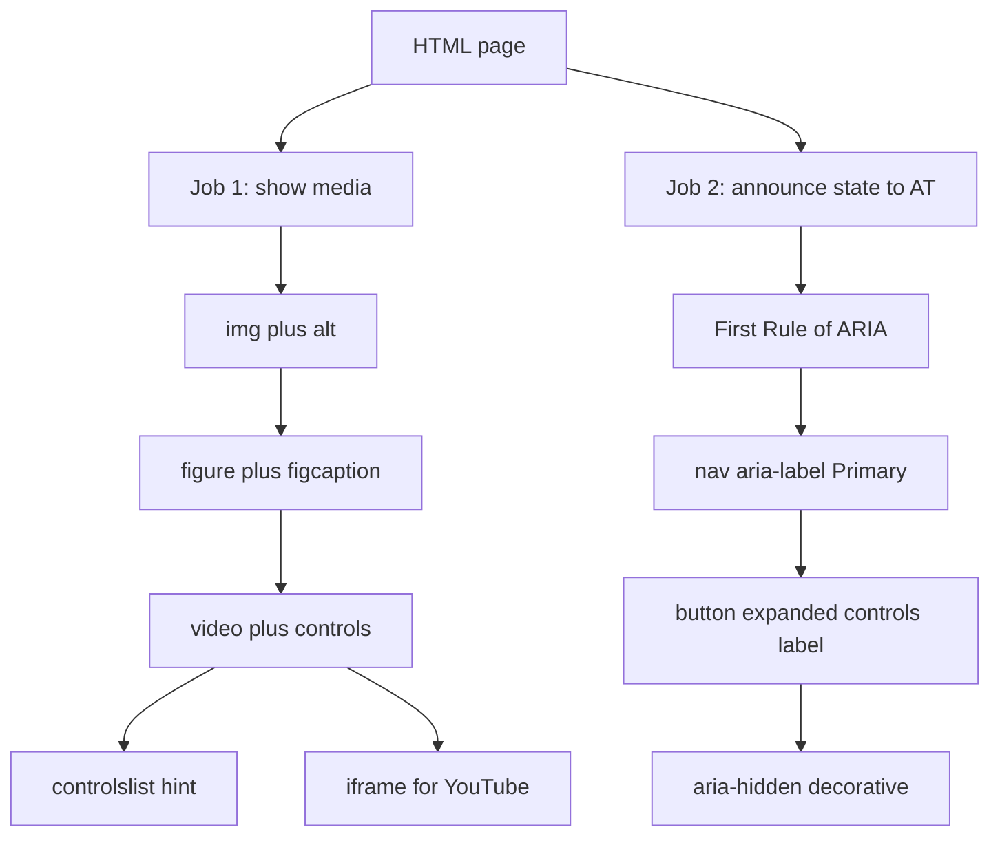

# HTML Fundamentals: Multimedia and ARIA

Interview-ready notes for a final-year CSE student. Read this in order: first understand the two jobs HTML solves on a media-heavy page (show content vs announce widget state), then master images and captions, then native video, then the YouTube embed trap, then ARIA attributes on navigation and decorative UI, then the deep dive on the selected blocks in your practice files, then viva Q&A and a last-minute cheat sheet.

Hands-on files this note maps to:

- `media.html` — ``, `<figure>`, `<figcaption>`, `<video controls>`, YouTube `<iframe>`
- `portfolio-poc/index.html` — `aria-label="Primary"`, hamburger `aria-expanded` / `aria-controls` / `aria-label="Toggle menu"`, `aria-hidden="true"`
- `portfolio-poc/js/main.js` — JavaScript that toggles `aria-expanded` when the mobile menu opens and closes

---

## How to use these notes

Think of a modern webpage as a **campus gallery with a smart intercom system**:

1. **Gallery job** — show photos and videos (``, `<figure>`, `<video>`, `<iframe>`)
2. **Intercom job** — tell blind/low-vision visitors what each room is called and whether a door is open (`aria-label`, `aria-expanded`, `aria-controls`, `aria-hidden`)

Read in this order:

1. **Big picture** — native HTML media vs ARIA; the First Rule of ARIA
2. **``** — `src`, mandatory `alt`, decorative vs meaningful images
3. **`<figure>` + `<figcaption>`** — exhibit + plaque; why alt and caption are different jobs
4. **`<video>` + `controls`** — native player, sources, captions, boolean attributes
5. **Deep dive** — `controlslist` vs `controlsList` (HTML vs JavaScript)
6. **YouTube trap** — why `<video src="watch?v=...">` fails and `<iframe embed/...>` works
7. **ARIA on navigation** — `aria-label="Primary"`, hamburger trio, `aria-hidden="true"`
8. **Code review** — what to fix in `media.html` and what the portfolio already does right
9. **Viva** — interview Q&A and a last-minute cheat sheet

When you open `media.html` and the portfolio nav, read each tag twice: once as **what it looks like**, and once as **what it means to a browser, a search engine, and a screen reader**. That second reading is what interviews test.

---

## 1. Big picture: show media, announce state

> **Analogy:** A college tech fest has two systems. The **projector** shows slides and demo videos (HTML media tags). The **PA system** announces "Main hall is now open" (ARIA attributes). The projector does not replace the PA, and the PA does not replace the projector.

| Job | Tool | Analogy | Who cares |
| --- | --- | --- | --- |
| Embed photos | `` + `alt` | Photo on a wall with a braille plaque | Screen readers, SEO, broken-image fallback |
| Group image + caption | `<figure>` + `<figcaption>` | Museum exhibit with a plaque underneath | Sighted readers + AT users get linked context |
| Play self-hosted video | `<video>` + `controls` | Your own TV with a built-in remote | Users who need play/pause/volume |
| Embed third-party video | `<iframe>` (YouTube embed URL) | Inviting YouTube's player into a window on your page | When you do not host the `.mp4` yourself |
| Name a landmark | `aria-label` on `<nav>` | Label on a door: "Primary Navigation" | Screen reader users with multiple navs |
| Announce open/closed | `aria-expanded` | ON/OFF light switch state | AT users using hamburger menus, accordions |
| Wire control to target | `aria-controls` | Switch wired to a specific lamp circuit | AT users know *which* panel the button opens |
| Hide decoration from AT | `aria-hidden="true"` | Mural painted on the wall — visible but not read aloud | Avoids noisy, redundant announcements |

**Interview one-liner:** "HTML media tags embed content; ARIA attributes expose **state and relationships** to assistive technology when native semantics are not enough."

### The First Rule of ARIA (WAI-ARIA)

> **Analogy:** Do not install a second doorbell if the front door already has one that works.

**Do not use ARIA if a native HTML element already provides the role and behaviour you need.**

| Situation | Wrong | Right |
| --- | --- | --- |
| Navigation | `<div role="navigation">` | `<nav>` |
| Button that toggles menu | `<div onclick="...">` | `<button>` + `aria-expanded` |
| Image with text alternative | `` when `alt` works | `` |
| Hidden off-screen menu | `aria-hidden="true"` on focusable links | `hidden` or `display: none` until open |

Use ARIA to **fill gaps**, not to recreate what `<nav>`, `<button>`, and `alt` already give you for free.



---

## 2. `` — embedding an image

> **Analogy:** `` is a **photo frame on a hostel notice board**. The `src` is the actual photograph. The `alt` attribute is the braille plaque beside it — and also the sticky note the board shows if someone steals the photo overnight.

Your practice file (line 10):

```html

```

### 2.1 What is ``?

- A **void element** — no closing tag, no child content.
- Requires at least one of `src` or `srcset`.
- **`alt` is mandatory** in valid, accessible HTML — even if the value is empty.

### 2.2 Key attributes (MDN)

| Attribute | Job | Interview note |
| --- | --- | --- |
| `src` | URL of the image file | Can be relative or absolute |
| `srcset` + `sizes` | Responsive image sources | Browser picks best file for viewport |
| `alt` | Text replacement for the image | Read by screen readers; shown when image fails to load |
| `width` + `height` | Intrinsic dimensions in CSS pixels | Reserve space before load → prevents layout shift (CLS) |
| `loading="lazy"` | Defer download until near viewport | Good for below-the-fold images |
| `decoding="async"` | Hint when to decode pixels | Minor perf tuning; not an interview deep dive |

### 2.3 `alt` — the attribute interviews love

| `alt` value | Meaning | Implicit ARIA role | When to use |
| --- | --- | --- | --- |
| Descriptive text | Image carries information | `img` | Product photo, chart, avatar, diagram |
| `alt=""` (empty string) | Decorative or redundant | `presentation` | Pure decoration, icon next to visible text |
| Missing entirely | Invalid / inaccessible | Browser may announce filename | **Never do this in production or interviews** |

**Interview one-liner:** "`alt` describes **what the image shows**. It is not a caption, not a title, and not SEO keyword stuffing."

Examples:

```html
<!-- Meaningful: describes content -->


<!-- Decorative: empty alt tells AT to skip it -->


<!-- BAD for interviews: lazy, useless alt -->

```

Say in a viva: "Random Image" tells a blind user nothing. Describe what is actually in the photo, or use `alt=""` if it is purely decorative.

### 2.4 Do not use `title` as a caption

MDN explicitly says: if an image needs a visible caption, use `<figure>` and `<figcaption>`. Do not rely on the `title` attribute — it is inconsistent across devices and is not a reliable accessibility strategy.

---

## 3. `<figure>` and `<figcaption>` — exhibit + plaque

> **Analogy:** `<figure>` is the **whole museum exhibit** (photo + stand + plaque). `<figcaption>` is the **plaque under the photo** that gives context, credit, or figure number. `` describes what you see; the caption explains why it is here.

Your practice file (lines 11–14):

```html
<figure>
    
    <figcaption>Random Image</figcaption>
</figure>
```

### 3.1 What is `<figure>`?

- Represents **self-contained content** referenced in the document flow.
- Can wrap an image, diagram, code block, video, table, or quote.
- Has an implicit ARIA role of **`figure`**.
- The first `<figcaption>` inside it becomes the figure's **accessible name**.

### 3.2 What is `<figcaption>`?

- A **caption** for the parent `<figure>`.
- Visible to everyone — not hidden like `alt`.
- Can be the first or last child of `<figure>`.

### 3.3 `alt` vs `figcaption` — do not duplicate

| Attribute / element | Audience | Describes |
| --- | --- | --- |
| `alt` | Screen reader users when image is unavailable | **What is visible in the image** |
| `<figcaption>` | All readers (sighted + AT) | **Context, credit, figure label, "why this matters"** |

MDN example (correct pattern):

```html
<figure>
  
  <figcaption>
    A T-Rex on display in the Manchester University Museum.
  </figcaption>
</figure>
```

**Interview Tip:** If `alt` and `figcaption` say the same thing, screen reader users hear it **twice** — annoying and unprofessional. In your practice file, both say "Random Image" — fix one of them.

Turn images off in your browser (or use a screen reader). You will hear `alt` when the image is gone, and `figcaption` as normal page text. They serve different moments.

### 3.4 When to use `<figure>` vs bare ``

| Use bare `` | Wrap in `<figure>` |
| --- | --- |
| Inline icon in a sentence | Blog post hero with caption |
| Avatar next to a username (name is already visible) | Product gallery with "Fig. 2 — rear view" |
| Decorative background-style image with `alt=""` | Tutorial screenshot with explanatory caption |

---

## 4. `<video>` and `controls` — native video player

> **Analogy:** `<video>` is a **TV set**. The `controls` attribute is the **remote control** that pops out of the side — play, pause, seek, volume. Without `controls`, the TV has no buttons unless you build your own with JavaScript.

Your practice file (line 15):

```html
<video src="https://www.youtube.com/watch?v=5oB7X7Vq2Nc" controls></video>
```

This line is a teaching moment — see Section 6 for why it fails.

### 4.1 What is `<video>`?

- Embeds a **media player** for video (and sometimes audio) content.
- Not a void element — can contain `<source>`, `<track>`, and fallback text.
- Baseline widely supported since 2015.

### 4.2 The `controls` attribute

- A **boolean attribute** — its mere **presence** enables the browser's default player UI.
- `controls="false"` does **not** disable controls. Remove the attribute entirely to hide them.
- When present, the element becomes **interactive content**.

```html
<!-- Shows native play/pause/volume/seek bar -->
<video controls width="400" src="demo.mp4"></video>

<!-- No native UI — you must build custom controls in JS -->
<video width="400" src="demo.mp4"></video>
```

**Interview one-liner:** "Boolean attributes in HTML are **on when present, off when absent** — never set them to the string `false`."

### 4.3 Production pattern: multiple sources + fallback

Browsers do not all support the same codecs. Provide WebM and MP4, plus text for old browsers:

```html
<video controls width="640" height="360" poster="poster.jpg">
  <source src="clip.webm" type="video/webm" />
  <source src="clip.mp4" type="video/mp4" />
  <p>
    Your browser does not support HTML video.
    <a href="clip.mp4" download>Download the MP4</a> instead.
  </p>
</video>
```

| Attribute | Job |
| --- | --- |
| `poster` | Thumbnail shown before first frame loads |
| `preload` | Hint: `none`, `metadata`, or `auto` |
| `muted` | Starts silent; required for many autoplay scenarios |
| `loop` | Restarts when finished |
| `playsinline` | Plays inline on mobile instead of forcing fullscreen |
| `width` / `height` | Prevent layout shift |

### 4.4 Accessibility: captions are not optional in interviews

WCAG Success Criterion 1.2.2 expects captions for prerecorded video with audio. Use `<track>` with WebVTT:

```html
<video controls src="lecture.mp4">
  <track
    kind="captions"
    src="lecture-captions.en.vtt"
    srclang="en"
    label="English"
    default />
</video>
```

**Interview Tip:** Mention `<track kind="captions">` even if the course demo skips it — it signals you know real-world accessibility requirements.

---

## 5. Deep dive: `controlslist` vs `controlsList`

> **Analogy:** `controls` gives the user the **full TV remote**. `controlslist` is you **taping over three buttons** — no download, no fullscreen, no cast — but only on remotes made by one manufacturer (Chromium).

### 5.1 Two names, one feature — HTML vs JavaScript

| Layer | Name | Case | Example |
| --- | --- | --- | --- |
| HTML attribute | `controlslist` | all lowercase | `controlslist="nodownload nofullscreen"` |
| DOM property | `controlsList` | camelCase | `video.controlsList.add('nodownload')` |
| Type in JS | `DOMTokenList` | — | Same pattern as `classList` |

```html
<video controls controlslist="nodownload nofullscreen noremoteplayback" src="clip.mp4"></video>
```

```javascript
const video = document.querySelector('video');
video.controlsList.add('nodownload');
video.controlsList.remove('nofullscreen');
console.log(video.controlsList.value); // "nodownload noremoteplayback"
```

### 5.2 Allowed token values (MDN)

| Token | Hides |
| --- | --- |
| `nodownload` | Download button |
| `nofullscreen` | Fullscreen button |
| `noremoteplayback` | Cast / AirPlay / remote playback button |

**Only works when `controls` is present** — it filters the native UI; it does not create controls.

### 5.3 Browser support and interview honesty

| Fact | What to say in a viva |
| --- | --- |
| Chromium-only hint | Works in Chrome/Edge; **ignored in Firefox and Safari** |
| Not in WHATWG HTML Living Standard | HTML validators may flag it as invalid |
| WICG proposal | Experimental; use for progressive enhancement, not as sole strategy |
| Standard alternative for remote playback | `disableremoteplayback` attribute (valid HTML) |

**Interview one-liner:** "`controlslist` is a **Chromium hint** to hide specific native buttons. For cross-browser control, build custom controls with the HTMLMediaElement API or accept the full native UI."

---

## 6. Deep dive: the YouTube trap in `media.html`

### 6.1 What your file does wrong (line 15)

```html
<video src="https://www.youtube.com/watch?v=5oB7X7Vq2Nc" controls></video>
```

Two separate bugs:

1. **Wrong URL type** — `watch?v=` is a **web page**, not a video file. `<video>` expects a direct media resource (`video/mp4`, `video/webm`).
2. **Wrong embedding model** — YouTube hosts the player, encoding, CDN, and DRM. You do not stream their `.mp4` from a watch URL.

> **Analogy:** Putting a YouTube watch URL inside `<video>` is like inserting a **cinema ticket** into a DVD player. The ticket mentions the movie; it is not the movie file.

### 6.2 What your file does right (lines 16–22)

```html
<iframe
  width="560"
  height="315"
  src="https://www.youtube.com/embed/5oB7X7Vq2Nc"
  allow="accelerometer; autoplay; clipboard-write; encrypted-media; gyroscope; picture-in-picture"
  allowfullscreen
></iframe>
```

| Piece | Why it matters |
| --- | --- |
| `/embed/VIDEO_ID` | YouTube's official embed endpoint (IFrame Player API) |
| `allow` | Permissions for autoplay, PiP, encrypted media |
| `allowfullscreen` | Lets user expand the player |

**Interview one-liner:** "Self-hosted files → `<video>`. Third-party hosted players → `<iframe>` with the provider's embed URL."

### 6.3 URL cheat sheet

| URL pattern | Works in | Purpose |
| --- | --- | --- |
| `youtube.com/watch?v=ID` | Browser address bar | Watching on YouTube |
| `youtube.com/embed/ID` | `<iframe src="...">` | Embedding on your site |
| `https://example.com/clip.mp4` | `<video src="...">` | Self-hosted progressive download |

### 6.4 Interview-ready iframe (add `title`)

```html
<iframe
  width="560"
  height="315"
  src="https://www.youtube.com/embed/5oB7X7Vq2Nc"
  title="YouTube video: [describe the video topic]"
  allow="accelerometer; autoplay; clipboard-write; encrypted-media; gyroscope; picture-in-picture; web-share"
  allowfullscreen
></iframe>
```

`title` gives the iframe an accessible name — same idea as `alt` for images.

---

## 7. ARIA deep dive: portfolio navigation and decorative UI

Your portfolio uses ARIA where native HTML needs **extra labels and state**. These are the selected snippets from `portfolio-poc/index.html`.

### 7.1 `aria-label="Primary"` on `<nav>`

```html
<nav class="nav" aria-label="Primary">
```

> **Analogy:** A building has three lobbies — Main, Parking, Emergency. Without labels, a screen reader just says "navigation, navigation, navigation." `aria-label="Primary"` is the **nameplate on the main lobby door**.

| Without label | With `aria-label="Primary"` |
| --- | --- |
| "Navigation" (ambiguous) | "Primary, navigation" (distinct) |

**When you need it:** Multiple `<nav>` elements on one page — header nav, footer nav, in-page table-of-contents nav.

**Prefer `aria-labelledby`** if a visible heading already names the nav:

```html
<h2 id="site-nav-heading" class="visually-hidden">Primary</h2>
<nav aria-labelledby="site-nav-heading">...</nav>
```

MDN: if a visible label exists, `aria-labelledby` beats `aria-label`.

**Interview one-liner:** "`aria-label` renames an element for assistive technology when there is no visible text label to point at."

### 7.2 Hamburger button trio: `aria-label`, `aria-expanded`, `aria-controls`

```html
<button class="nav__toggle" id="navToggle"
  aria-expanded="false"
  aria-controls="navMenu"
  aria-label="Toggle menu">
  <span></span><span></span><span></span>
</button>

<ul class="nav__menu" id="navMenu">
  ...
</ul>
```

> **Analogy:** An **unlabeled light switch** in a dark hallway.
> - `aria-label="Toggle menu"` — the label on the switch ("Menu")
> - `aria-expanded="false"` — announces OFF/ON ("door is closed")
> - `aria-controls="navMenu"` — which circuit it is wired to (`#navMenu`)

| Attribute | Role | Value when closed | Value when open |
| --- | --- | --- | --- |
| `aria-label` | Accessible **name** of the button | `"Toggle menu"` (or `"Open menu"`) | Update to `"Close menu"` (best practice) |
| `aria-expanded` | **State** of controlled panel | `"false"` | `"true"` |
| `aria-controls` | **ID reference** to controlled element | `"navMenu"` | unchanged |

**Why a real `<button>`?** Keyboard accessible by default (Enter/Space), correct implicit role, focusable. Never use `<div onclick="...">` for this.

Your JavaScript already toggles state correctly (`main.js`):

```javascript
navToggle.addEventListener('click', () => {
  const isOpen = navMenu.classList.toggle('is-open');
  navToggle.setAttribute('aria-expanded', isOpen);
});

navMenu.querySelectorAll('a').forEach(link => {
  link.addEventListener('click', () => {
    navMenu.classList.remove('is-open');
    navToggle.setAttribute('aria-expanded', 'false');
  });
});
```

**Interview Tip:** CSS class `is-open` is for **eyes**. `aria-expanded` is for **ears**. You must keep them in sync — the portfolio does this.

Common viva trap: copying code with `aria-expanded="true"` when the menu is visually closed. Always match the **actual** state.

Optional enhancement for interviews: also toggle `aria-label` between "Open menu" and "Close menu", and add `aria-hidden="true"` on the decorative `<span>` bars inside the button.

### 7.3 `aria-hidden="true"` on decorative motion

```html
<div class="ticker" aria-hidden="true">
  <span class="ticker__prompt">$</span>
  <span class="ticker__text" id="tickerText"></span>
  <span class="ticker__cursor">▍</span>
</div>

<div class="hero__visual" aria-hidden="true">
  <svg viewBox="0 0 220 120" class="waveform">...</svg>
</div>
```

> **Analogy:** A **animated mural** in the lobby — pretty for sighted visitors, but you do not want the intercom reading every flickering pixel aloud.

| What `aria-hidden="true"` does | What it does **not** do |
| --- | --- |
| Removes element + descendants from accessibility tree | Does not hide visually |
| Stops screen readers announcing decorative content | Does not remove keyboard focus |

**Rules (MDN + WCAG):**

- Use on **purely decorative** content duplicated elsewhere in text.
- **Never** put `aria-hidden="true"` on a focusable element (button, link, input).
- **Never** hide content that is the **only** way to access information.
- Do not add it when `hidden` or `display: none` already removes the element — redundant.
- `aria-hidden="false"` cannot un-hide content if a parent has `aria-hidden="true"`.

**Interview one-liner:** "`aria-hidden` removes noise from the accessibility tree; it is for decoration, not for hiding interactive controls."

---

## 8. Code review: what to say in an interview

### 8.1 `media.html`

| Issue | Location | Fix |
| --- | --- | --- |
| Weak `alt` text | Lines 10, 12 | Describe actual content, or use `alt=""` if decorative |
| Duplicate alt + caption | Lines 12–13 | Different jobs — do not both say "Random Image" |
| YouTube URL in `<video>` | Line 15 | Remove or replace with self-hosted `.mp4`/`.webm` |
| Missing `width`/`height` on images | Lines 10–12 | Add dimensions to prevent layout shift |
| `<iframe>` missing `title` | Lines 16–22 | Add descriptive `title` for accessible name |
| No `<main>` landmark | Body structure | Wrap primary content in `<main>` for semantics |

**Interview framing:** "The figure/figcaption structure shows good instincts, but the alt/caption duplication and YouTube-in-video mistake are common beginner errors. The iframe embed is the correct YouTube approach — I would add a `title` and fix the alt text."

### 8.2 Portfolio nav (mostly correct)

| Good | Why |
| --- | --- |
| `<nav aria-label="Primary">` | Distinguishes main navigation landmark |
| `<button>` for hamburger | Native keyboard + role |
| `aria-expanded` toggled in JS | State matches visual open/close |
| `aria-controls="navMenu"` | Links button to menu by ID |
| `aria-hidden` on ticker/SVG | Decorative motion excluded from AT |

| Could improve | Why |
| --- | --- |
| Hamburger `<span>` bars | Add `aria-hidden="true"` so AT ignores empty spans |
| `aria-label` static "Toggle menu" | Dynamically switch to "Open menu" / "Close menu" |
| Menu visibility when closed | Ensure links are not tabbable when menu is closed (`hidden` or `tabindex="-1"`) |

---

## 9. How this maps to real projects

| You learned | You will use it when |
| --- | --- |
| `` | Every UI with icons, avatars, product images, OG previews |
| `<figure>` + `<figcaption>` | Blog posts, docs, e-commerce galleries, research papers |
| `<video controls>` + `<source>` | Course platforms, hero loops, product demos you host |
| `<track kind="captions">` | WCAG audits, government/edu video, public SaaS |
| `controlslist` | Enterprise portals that must hide download on confidential clips (Chromium only) |
| YouTube `<iframe embed>` | Marketing pages, tutorials, embedded talks |
| `aria-label` on `<nav>` | Any site with header + footer + in-page nav |
| `aria-expanded` + `aria-controls` | Mobile menus, accordions, disclosure widgets, comboboxes |
| `aria-hidden="true"` | Icon fonts, decorative SVG, redundant visual-only animations |

---

## 10. Viva voce: interview Q&A

### Q1. What is the difference between HTML media tags and ARIA?

**A:** HTML media tags (``, `<video>`) **embed and structure content**. ARIA attributes **expose names, states, and relationships** to assistive technology when native semantics are insufficient — for example naming a nav landmark or announcing whether a menu is expanded.

### Q2. Is `alt` optional on ``?

**A:** No. Every `` must have an `alt` **attribute**. The value can be empty (`alt=""`) for decorative images, but the attribute itself must exist. Missing `alt` is invalid and inaccessible.

### Q3. When should `alt` be empty?

**A:** When the image is purely decorative or when the same information is already in adjacent visible text — for example an icon next to a "Search" label. Empty `alt` maps to implicit role `presentation`.

### Q4. What is the difference between `alt` and `<figcaption>`?

**A:** `alt` replaces the image for non-visual users and when the file fails to load — it describes **what is in the picture**. `<figcaption>` is visible caption text that adds **context, credit, or figure labelling**. They should not repeat the same sentence.

### Q5. What does the `controls` attribute do on `<video>`?

**A:** It is a boolean attribute. When present, the browser shows its default playback UI (play, pause, seek, volume). Remove the attribute entirely to hide native controls — setting `controls="false"` does not work.

### Q6. What is `controlslist` and how is it different from `controlsList`?

**A:** `controlslist` is the lowercase HTML attribute; `controlsList` is the camelCase JavaScript property on `HTMLMediaElement`, returning a `DOMTokenList`. Tokens like `nodownload`, `nofullscreen`, and `noremoteplayback` hide specific native buttons — but only in Chromium browsers.

### Q7. Why does `<video src="youtube.com/watch?v=...">` fail?

**A:** A watch URL is an HTML page, not a video file. `<video>` needs a direct media resource (e.g. `.mp4`). YouTube requires embedding via `<iframe src="https://www.youtube.com/embed/VIDEO_ID">`.

### Q8. What is the First Rule of ARIA?

**A:** Do not use ARIA if a native HTML element already provides the needed semantics and behaviour. Use `<nav>` instead of `role="navigation"`, `<button>` instead of clickable `<div>`, and `alt` instead of redundant `aria-label` on images.

### Q9. Why put `aria-label="Primary"` on `<nav>`?

**A:** When a page has multiple navigation regions, screen readers need distinct names. `aria-label` provides an accessible name so users hear "Primary, navigation" instead of three identical "navigation" landmarks.

### Q10. What do `aria-expanded` and `aria-controls` do together?

**A:** `aria-controls` points to the ID of the element being shown/hidden. `aria-expanded` tells assistive technology whether that element is currently visible (`true`) or collapsed (`false`). They are used on disclosure widgets like hamburger menus.

### Q11. Must JavaScript update `aria-expanded`?

**A:** Yes. It is a **state**, not a static label. When the menu opens, set `aria-expanded="true"`; when it closes, set `"false"`. CSS alone cannot communicate state to screen readers.

### Q12. What does `aria-hidden="true"` do?

**A:** It removes the element and its descendants from the accessibility API while leaving them visible on screen. Use only for decorative content. Never apply it to focusable elements or to content that is the sole source of information.

---

## 11. Last-minute cheat sheet

### 11.1 Production skeleton

```html
<!DOCTYPE html>
<html lang="en">
<head>
  <meta charset="UTF-8">
  <meta name="viewport" content="width=device-width, initial-scale=1.0">
  <title>Media and ARIA demo</title>
</head>
<body>
  <a href="#main">Skip to content</a>

  <header>
    <nav aria-label="Primary">
      <a href="/">Home</a>
      <button type="button" id="menuBtn"
        aria-expanded="false"
        aria-controls="menuPanel"
        aria-label="Open menu">
        <span aria-hidden="true">☰</span>
      </button>
      <ul id="menuPanel" hidden>
        <li><a href="#about">About</a></li>
        <li><a href="#contact">Contact</a></li>
      </ul>
    </nav>
  </header>

  <main id="main">
    <figure>
      
      <figcaption>Fig. 1 — Final-year CSE team demo day, 2026.</figcaption>
    </figure>

    <video controls width="640" height="360" poster="poster.jpg">
      <source src="talk.webm" type="video/webm" />
      <source src="talk.mp4" type="video/mp4" />
      <track kind="captions" src="talk.en.vtt" srclang="en" label="English" default />
      <p>Download <a href="talk.mp4">the MP4</a>.</p>
    </video>

    <iframe
      width="560" height="315"
      src="https://www.youtube.com/embed/VIDEO_ID"
      title="Guest lecture: Introduction to web accessibility"
      allow="accelerometer; autoplay; clipboard-write; encrypted-media; gyroscope; picture-in-picture"
      allowfullscreen></iframe>

    <div class="animated-bg" aria-hidden="true"></div>
  </main>
</body>
</html>
```

### 11.2 Tag / attribute → job → analogy

| Tag / attribute | Job | Analogy |
| --- | --- | --- |
| `` | Embed a photo | Picture on a notice board |
| `alt` | Text replacement for image | Braille plaque + fallback sticky note |
| `alt=""` | Mark decorative image | Empty plaque = "skip this frame" |
| `<figure>` | Self-contained media unit | Whole museum exhibit |
| `<figcaption>` | Visible caption / figure name | Plaque under the exhibit |
| `<video>` | Native video player | TV set |
| `controls` | Show browser's remote | Built-in play/pause bar |
| `controlslist` | Hide some native buttons (Chromium) | Tape over remote buttons |
| `<iframe embed>` | Third-party player window | Guest TV from YouTube |
| `aria-label` | Accessible name | Door nameplate |
| `aria-expanded` | Open/closed state | Light switch ON/OFF announcement |
| `aria-controls` | ID of controlled element | Switch wired to a specific lamp |
| `aria-hidden="true"` | Remove from AT tree | Mural — seen but not read aloud |

### 11.3 Media vs embed decision tree

| Question | If yes → | If no → |
| --- | --- | --- |
| Do you host the `.mp4`/`.webm` file? | `<video>` + `<source>` | Consider `<iframe>` |
| Is the content on YouTube/Vimeo? | `<iframe src=".../embed/ID">` | Not `<video src="watch?v=">` |
| Does the image need a visible caption? | Wrap in `<figure>` + `<figcaption>` | Bare `` is fine |
| Is the image pure decoration? | `alt=""` | Write descriptive `alt` |

### 11.4 One-breath revision

1. `` always needs `alt` — descriptive text or empty string for decoration.
2. `alt` = what you see; `<figcaption>` = context/credit — never duplicate blindly.
3. `<figure>` groups self-contained media; first `<figcaption>` names the figure for AT.
4. `<video>` plays **files you host**; `controls` is boolean (present = on).
5. `controlslist` / `controlsList` hides native buttons — Chromium-only hint.
6. YouTube watch URLs go in `<iframe embed/...>`, not `<video src>`.
7. First Rule of ARIA: prefer native HTML; ARIA fills gaps.
8. Multiple navs need `aria-label` (or `aria-labelledby`) to distinguish landmarks.
9. Hamburger: `<button>` + `aria-expanded` (toggled in JS) + `aria-controls` + `aria-label`.
10. `aria-hidden="true"` is for decorative visuals — never on focusable controls.

---

*Sources aligned with MDN Web Docs (``, `<figure>`, `<figcaption>`, `<video>`, `HTMLMediaElement.controlsList`, ARIA `aria-label`, `aria-expanded`, `aria-controls`, `aria-hidden`), WHATWG HTML Standard, WAI-ARIA Authoring Practices, WICG controls-list explainer, and YouTube IFrame Player API embed URL format.*
