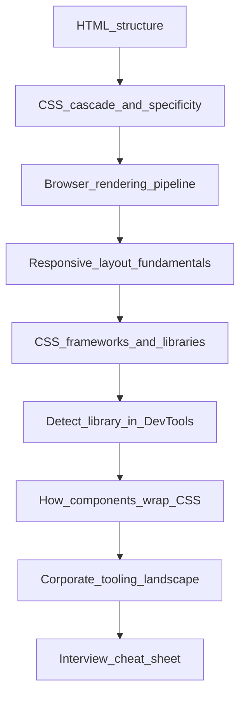
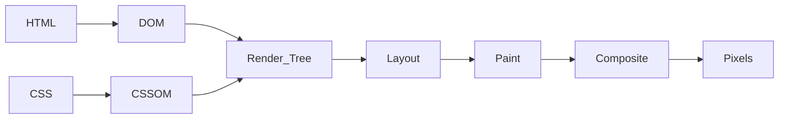
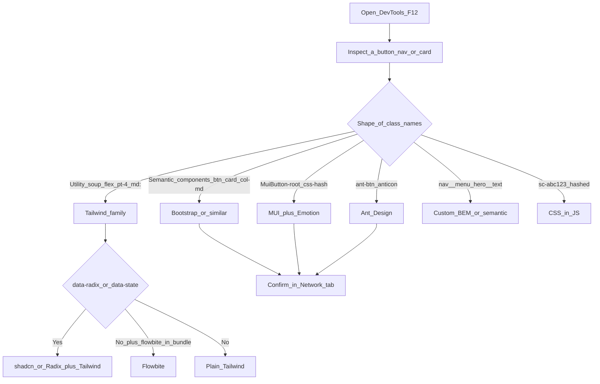

# The Current State of CSS

CSS is not decoration. It is the browser's layout-engine contract with your HTML: a set of rules that say *how* each node should look, where it sits, and how it must reflow when the viewport, the parent, or the content changes. Everything that looks like a "library" — Bootstrap, Tailwind, Flowbite, MUI, Ant Design, shadcn/ui — is still CSS under the hood. If you understand the contract, you can read any of those tools. If you only memorize class names, you will stall in interviews the moment someone asks *why*.

This note is written for a final-year CSE student. Read it top to bottom once (like compiling a program: each layer depends on the previous one). Before placements, jump to [Interview Quick-Fire](#8-interview-quick-fire).



**Course files this note refers to:**

- [`../06-css/01_basics/index.html`](../06-css/01_basics/index.html) — cascade: inline vs class vs external
- [`../06-css/09_bootstrap/bootstrap.html`](../06-css/09_bootstrap/bootstrap.html) — Bootstrap navbar, card, CDN CSS + JS
- [`../06-css/08_responsive/Responsive-design.html`](../06-css/08_responsive/Responsive-design.html) — fluid layout, media queries, flex, grid
- [`../../portfolio-poc/index.html`](../../portfolio-poc/index.html) — custom semantic / BEM CSS, no framework

---

## 1. How CSS Attaches to HTML (Foundation)

**Analogy:** HTML is the building's skeleton (rooms, doors, stairs). CSS is paint, furniture placement, and signage. The skeleton can stand without paint. Paint without a skeleton has nowhere to go.

### 1.1 Three ways to apply CSS

Your [`01_basics/index.html`](../06-css/01_basics/index.html) already shows all three on one page: an inline `style` on the `h1`, an internal `<style>` block for `.browntext`, and an external [`style.css`](../06-css/01_basics/style.css) linked in `<head>`.

```html
<!DOCTYPE html>
<html lang="en">
  <head>
    <meta charset="UTF-8" />
    <meta name="viewport" content="width=device-width, initial-scale=1.0" />
    <!-- 1. External: one file, cached, reusable across pages -->
    <link rel="stylesheet" href="style.css" />
    <!-- 2. Internal: page-specific rules -->
    <style>
      .browntext {
        color: brown;
      }
    </style>
  </head>
  <body>
    <!-- 3. Inline: highest specificity, worst reuse. Use rarely. -->
    <h1 style="color: orangered">Lorem ipsum</h1>
    <h2 class="browntext">Class-styled heading</h2>
    <p class="browntext">Class-styled paragraph</p>
  </body>
</html>
```

| Method | Where it lives | When to use | Interview trap |
| --- | --- | --- | --- |
| Inline | `style=""` on the element | One-off override, email HTML | Highest specificity; cannot reuse; pollutes markup |
| Internal | `<style>` in `<head>` | Single-page demos, tiny pages | Does not cache across pages |
| External | `.css` file via `<link>` | Almost everything in production | Default professional choice |

Production code almost always uses **external stylesheets**. Frameworks (Bootstrap, Tailwind) are just extra external CSS that somebody else wrote and named.

### 1.2 Selectors — how you point at HTML

A selector is the "address" of the node you want to style.

```css
/* Element — every <p> on the page */
p { color: cornflowerblue; }

/* Class — reusable. Prefix with .  Most common in real code. */
.browntext { color: brown; }

/* ID — unique. Prefix with #  Avoid for styling; keep IDs for JS/anchors. */
#hero { background: #111; }

/* Attribute */
input[type="email"] { border-color: royalblue; }

/* Pseudo-class — state of the element */
a:hover { text-decoration: underline; }
button:disabled { opacity: 0.5; }

/* Pseudo-element — a "fake" node the browser draws for you */
.card::before { content: ""; display: block; height: 4px; background: gold; }
```

**Interview line:** classes are for styling; IDs are for identity (JS `getElementById`, skip-links, fragment URLs). Styling with IDs makes overrides painful because of specificity.

### 1.3 Cascade and specificity

**Analogy:** CSS is a court. When two rules fight over the same property, the judge uses (1) origin + importance, (2) specificity, (3) source order. The last matching rule of equal weight wins.

Specificity is commonly written as `(inline, IDs, classes, elements)`:

```css
h1 { color: blue; }           /* 0, 0, 0, 1  — element */
.title { color: green; }      /* 0, 0, 1, 0  — class wins over element */
#hero { color: red; }         /* 0, 1, 0, 0  — ID wins over class */
/* style="color: purple" */   /* 1, 0, 0, 0  — inline wins over ID */
```

```html
<h1 id="hero" class="title" style="color: purple">Who wins?</h1>
<!-- Computed color: purple (inline). Remove inline → red (ID). -->
```

`!important` jumps the queue. It is a fire alarm, not a design tool. If you need it to "fix" a library, you usually need a more specific selector or a better override strategy (CSS variables, theming APIs, `cn()` / `tailwind-merge`).

**Source order** still matters when specificity is tied. That is why Bootstrap's CSS is loaded *before* your custom CSS: your later rules can override theirs at equal specificity.

### 1.4 Inheritance

Some properties flow down the tree the way a parent class's `public` fields are visible to children. Others do not.

| Inherits (text-ish) | Does not inherit (box-ish) |
| --- | --- |
| `color`, `font-family`, `font-size`, `line-height` | `width`, `margin`, `padding`, `border`, `display` |

```css
body {
  font-family: system-ui, sans-serif; /* children inherit this */
  color: #222;
}
.card {
  margin: 1rem; /* children do NOT inherit margin */
}
```

This is why setting `font-family` on `body` (or `:root`) styles the whole page, but setting `padding` on `body` does not pad every nested box.

### 1.5 The box model

Every visible element is a box:

```
+---------------------------+
|        margin             |
|  +---------------------+  |
|  |      border         |  |
|  |  +---------------+  |  |
|  |  |    padding    |  |  |
|  |  |  +---------+  |  |  |
|  |  |  | content |  |  |  |
|  |  |  +---------+  |  |  |
|  |  +---------------+  |  |
|  +---------------------+  |
+---------------------------+
```

By default (`content-box`), `width: 200px` means *content* is 200px. Padding and border add extra. Almost all modern CSS starts with this reset so that `width` means "the whole box":

```css
*,
*::before,
*::after {
  box-sizing: border-box;
}
```

`display: none` removes the box from layout entirely. `visibility: hidden` hides it but still occupies space. `opacity: 0` hides it visually, still occupies space, and still can receive events unless you also set `pointer-events: none`.

---

## 2. What Happens Behind the Scenes (Browser Pipeline)

**Analogy:** The browser is a factory assembly line. HTML and CSS are blueprints. Pixels on the screen are the finished product. You never "render HTML." You feed blueprints into a pipeline that produces a picture.

This sequence is the [Critical Rendering Path](https://developer.mozilla.org/en-US/docs/Web/Performance/Guides/Critical_rendering_path).



### 2.1 HTML → DOM

Bytes arrive. The HTML parser builds a tree: the Document Object Model. Construction is **incremental** — the browser can start building the DOM before the whole document is downloaded. Each tag becomes a node. Nested tags become children.

### 2.2 CSS → CSSOM

Stylesheets are parsed into the CSS Object Model. Unlike the DOM, the CSSOM is **not** incremental in a useful way: a later rule can override an earlier one, so the browser waits until it has the full cascade before it trusts the result. That is why CSS is **render-blocking**.

See [web.dev: render-tree construction](https://web.dev/articles/critical-rendering-path/render-tree-construction).

### 2.3 DOM + CSSOM → Render Tree

The browser merges structure (DOM) with computed styles (CSSOM). The render tree contains **only what will be painted**. `display: none` nodes, `<head>`, `<script>`, and similar are out.

### 2.4 Layout (reflow)

Geometry: x, y, width, height for every render-tree node, relative to the viewport. Percentages, `auto`, flex, and grid all resolve to pixels here.

### 2.5 Paint, then Composite

Paint turns boxes into drawing commands (text, colors, shadows, images). Composite stitches GPU layers into the final frame. Scrolling and `transform` / `opacity` animations can often run on the compositor thread without going back to layout.

### 2.6 Why this matters when you write CSS

Not all CSS changes cost the same:

| You change… | Pipeline stages that re-run | Cost |
| --- | --- | --- |
| `width`, `height`, `margin`, `font-size` | style → **layout** → paint → composite | Expensive (reflow) |
| `color`, `background`, `box-shadow` | style → **paint** → composite | Medium |
| `transform`, `opacity` | **composite** only (if on its own layer) | Cheap |

```css
/* Cheap hover: compositor-friendly */
.card:hover {
  transform: translateY(-4px);
  opacity: 0.95;
}

/* Expensive hover: forces layout of neighbors */
.card:hover {
  margin-top: -4px;
  height: 320px;
}
```

**Why `<link rel="stylesheet">` belongs in `<head>`:** the browser must finish CSSOM before first paint. Putting CSS at the bottom causes a flash of unstyled content (FOUC).

**Why the viewport meta tag belongs in `<head>`:** it tells mobile browsers not to pretend the screen is 980px wide. Without it, media queries never match "phone width" because the layout viewport is still desktop-sized. Covered in Step 3.

---

## 3. Making a Page Responsive

**Analogy:** Responsive design is water filling containers of different shapes. You do not manufacture a new mug for every table. You let the liquid occupy whatever volume is available.

A live lab for this section is [`08_responsive/Responsive-design.html`](../06-css/08_responsive/Responsive-design.html): fluid widths, flex wrap, `auto-fit` grid, and media queries.

### 3.1 The viewport meta tag (non-negotiable)

```html
<meta name="viewport" content="width=device-width, initial-scale=1.0" />
```

Without this, a phone loads the page as if it were ~980px wide, then *shrinks* the whole picture. Your `@media (max-width: 600px)` rules never fire. Every professional page starts with this tag. Bootstrap's navbar in [`bootstrap.html`](../06-css/09_bootstrap/bootstrap.html) includes it for the same reason.

### 3.2 Mobile-first media queries

Write the **simple** layout as the default (narrow screen, usually one column). Then *add* complexity as space appears, using `min-width`.

```css
/* Base: mobile — single column, no query needed */
.cards {
  display: flex;
  flex-direction: column;
  gap: 1rem;
}

/* Tablet and up */
@media (min-width: 768px) {
  .cards {
    flex-direction: row;
    flex-wrap: wrap;
  }
}

/* Desktop */
@media (min-width: 1024px) {
  .cards {
    max-width: 1100px;
    margin-inline: auto;
  }
}
```

Desktop-first (`max-width` queries that *remove* complexity) works, but overrides pile up and mobile pays for CSS it does not need. Industry default in 2025–2026 is mobile-first.

**Break where content breaks, not where device names live.** Common reference widths (Tailwind-aligned, widely used): 640 (`sm`), 768 (`md`), 1024 (`lg`), 1280 (`xl`), 1536 (`2xl`). Use them as a shared vocabulary, not as a law.

### 3.3 Fluid units

| Unit | Relative to | Use for |
| --- | --- | --- |
| `px` | Device-independent pixels | Borders, hairlines, shadows |
| `rem` | Root (`html`) font-size, usually 16px | Typography, spacing, component sizing (respects user font zoom) |
| `em` | Parent / element font-size | Padding that should scale with the element's own type |
| `%` | Parent | Fluid widths inside a container |
| `vw` / `vh` | Viewport | Full-bleed sections. Prefer `dvh` over `vh` on mobile (address bar) |
| `clamp(min, preferred, max)` | Mix | Fluid type/spacing without extra breakpoints |

```css
h1 {
  font-size: clamp(1.5rem, 4vw, 3rem);
}
.hero {
  min-height: 100dvh; /* dynamic viewport height — iOS chrome safe */
}
```

`2vw` alone for body text (as in the course demo) can become unreadably small on phones and huge on ultrawide monitors. `clamp()` is the interview-grade answer.

### 3.4 Flexbox — one dimension

Flex is for a **row or a column**: nav bars, button groups, splitting a card into image + text.

```css
.row {
  display: flex;
  flex-wrap: wrap;
  gap: 1rem;
}
.row > .box {
  flex: 1 1 300px; /* grow, shrink, basis 300px — wraps when it must */
}
```

This is the same idea as section 2 of [`Responsive-design.html`](../06-css/08_responsive/Responsive-design.html). On a narrow screen each box hits its 300px basis and wraps; on a wide screen they share leftover space.

### 3.5 CSS Grid — two dimensions

Grid is for **rows and columns together**: page shells, card galleries, dashboards.

```css
.gallery {
  display: grid;
  grid-template-columns: repeat(auto-fit, minmax(280px, 1fr));
  gap: 1rem;
}
```

- `minmax(280px, 1fr)` — each column is at least 280px, then grows equally.
- `auto-fit` — as many columns as fit; empty tracks collapse so items stretch.
- `auto-fill` — keeps empty tracks, so a single item does not balloon to full width.

This layout is **intrinsically responsive**. You often need **zero** media queries. Reserve `@media` for genuine structural changes (sidebar appears, nav becomes a hamburger).

### 3.6 Container queries — the component's parent, not the viewport

Media queries ask: "How wide is the *window*?" Container queries ask: "How wide is *my parent*?" A card in a fat main column and the same card in a skinny sidebar can look different without the card knowing about breakpoints.

```css
.sidebar,
.main {
  container-type: inline-size;
}

.card {
  display: grid;
  gap: 0.75rem;
}

@container (min-width: 400px) {
  .card {
    grid-template-columns: 120px 1fr;
  }
}
```

**Interview line:** media queries for page chrome; container queries for reusable components.

### 3.7 Responsive images

```html

```

`max-width: 100%` stops overflow. `aspect-ratio` reserves height so the page does not jump when the image loads (Cumulative Layout Shift). `srcset` lets the browser pick a file that matches device pixel ratio and slot size.

---

## 4. CSS Libraries vs Frameworks vs Component Kits

**Analogy:** Vanilla CSS is cooking every dish from a raw recipe. The rest of the ecosystem is different kinds of kitchen help — not different physics. The oven (the browser pipeline from Step 2) is always the same.

| Tool | Analogy | What you actually get |
| --- | --- | --- |
| **Vanilla CSS** | Hand-writing every recipe | Full control, more work. See [`portfolio-poc`](../../portfolio-poc/index.html) (`nav__menu`, `hero__text`) |
| **Bootstrap** | Pre-built IKEA furniture with labels (`btn`, `card`) | Component classes + 12-column grid + optional JS bundle |
| **Tailwind CSS** | LEGO bricks (`flex`, `pt-4`, `md:grid-cols-3`) | Utility-first stylesheet; you compose designs in HTML/JSX |
| **Flowbite** | IKEA kits that snap onto LEGO bases | Tailwind utilities + packaged components (npm). You do not own the source |
| **MUI / Ant Design** | Fully furnished React apartments | npm React components + a design system + heavy widgets (tables, datepickers) |
| **shadcn/ui** | Copy the furniture *blueprint* into your workshop | CLI pastes `Button.tsx` into *your* repo. Tailwind + Radix. You own the code |

Three categories interviewers mix up. Keep them separate:

1. **CSS framework / styling engine** — Bootstrap, Tailwind. They emit CSS. They do not require React.
2. **Component library** — MUI, Ant Design, Flowbite React, Chakra. You `import { Button } from '...'`. Styles and behavior live inside the package.
3. **Headless + copy-paste** — Radix primitives + shadcn. Behavior (focus trap, ARIA, keyboard) is headless; visual CSS is yours (usually Tailwind). The component file sits in `components/ui/`.

Tailwind is **not** a component library. MUI is **not** "just CSS." shadcn is **not** an npm dependency you bump in `package.json` for the components themselves (the CLI copies files; Radix/Tailwind *are* dependencies).

---

## 5. How to Spot Which Library a Site Uses

**Analogy:** Compilers leave fingerprints in object files. CSS toolchains leave fingerprints in `class` attributes, `data-*` hooks, and network requests. DevTools is `readelf` for the web.



### 5.1 Five-step DevTools workflow

1. **Elements** — `F12` (or `Cmd+Option+I`), element picker (`Cmd+Shift+C`), click a button, navbar, or card. Read the `class` attribute.
2. **Confirm the pattern on 2–3 components**, not one stray node.
3. **Network** — filter CSS / JS, reload. Look for `bootstrap.min.css`, hashed Tailwind bundles, `@mui`, `antd`.
4. **View Source / Console** — CDN URLs often embed the version (`bootstrap@5.3.3`). `window.React` suggests a React tree.
5. **Optional:** Wappalyzer, React DevTools (component names like `MuiButton`, `ConfigProvider`), or a sourcemap explorer if maps are exposed.

### 5.2 Fingerprint cheat sheet

| Library | Telltale signs in markup | Network / DOM clues |
| --- | --- | --- |
| **Bootstrap** | `container`, `row`, `col-md-6`, `btn btn-primary`, `navbar`, `data-bs-toggle`, `data-bs-target` | `bootstrap.min.css`, `bootstrap.bundle.min.js` (often jsDelivr / cdnjs) |
| **Tailwind** | Utility soup: `flex items-center gap-4`, variants `md:`, `hover:`, arbitrary `w-[327px]` | Bundle with `--tw-` variables, `@layer`, escaped selectors like `.md\:grid-cols-3` |
| **Flowbite** | Tailwind utilities **plus** Flowbite hooks (`data-dropdown-toggle`, etc.) | `flowbite` in JS bundle / `node_modules` |
| **shadcn/ui** | Tailwind + Radix: `data-state="open"`, `data-side`, `data-radix-*`, `focus-visible:ring-` | Files like `components/ui/button.tsx`; deps `clsx`, `tailwind-merge`, `class-variance-authority`, `@radix-ui/*` |
| **MUI** | `MuiButton-root`, `MuiPaper-root`, `MuiTouchRipple-root`, Emotion `css-xxxxx` | `@mui/material` in chunks; injected `<style>` tags |
| **Ant Design** | `ant-btn`, `ant-table`, `ant-modal`, `anticon` | `antd` CSS/JS assets |
| **Custom CSS** | Semantic / BEM: `nav__menu`, `hero__text`, `site-header` | Author-named `.css` file, no systematic utility scale |
| **CSS-in-JS** | Hashed: `sc-abc123` (styled-components), `css-1x2y3z` (Emotion) | Runtime style injection |
| **Bulma** | `columns`, `is-primary`, `has-text-centered` | `bulma.min.css` |
| **Fluent UI** (Microsoft) | `fui-*`, `ms-*` | Office / Azure-flavored bundles |
| **Carbon** (IBM) | `cds--*`, `bx--*` | IBM design-system assets |
| **Angular Material** | `mat-*` | Angular app shell |

Open [`bootstrap.html`](../06-css/09_bootstrap/bootstrap.html) and inspect the navbar. You should immediately see `navbar`, `navbar-brand`, `navbar-toggler`, `data-bs-toggle="collapse"`, `btn btn-outline-success`, `card`, `card-body`. Network will show Bootstrap 5.3.3 from jsDelivr. That is a textbook Bootstrap fingerprint.

Open [`portfolio-poc/index.html`](../../portfolio-poc/index.html) and you will see `nav__menu`, `nav__link`, `hero__text` — BEM-style custom CSS, **not** a framework.

### 5.3 Same button, two dialects

```html
<!-- Bootstrap: named component + modifier -->
<button class="btn btn-primary btn-lg">Submit</button>

<!-- Tailwind: atomic utilities composed in place -->
<button
  class="inline-flex items-center rounded-md bg-blue-600 px-4 py-2 text-sm font-medium text-white hover:bg-blue-700"
>
  Submit
</button>
```

Both become CSS rules in the CSSOM. Bootstrap authors wrote `.btn-primary { background: ... }` once. Tailwind's build generated `.bg-blue-600 { background-color: ... }` because that class string appeared in your source.

### 5.4 Misidentification traps

- **Bootstrap 5 utilities look a bit like Tailwind:** `d-flex`, `mt-3`, `me-2`. They sit *next to* component classes (`btn`, `navbar`) and never use colon variants (`md:flex`) or square-bracket arbitrary values.
- **DaisyUI** sits on Tailwind and adds `data-theme` plus component names (`btn`, `card`) — can look Bootstrap-ish until you notice `md:` utilities.
- **Hashed CSS-in-JS** is not Tailwind. Tailwind class names are human-readable (`flex`, `pt-4`).
- **shadcn vs "just Tailwind":** look for Radix `data-state` / `data-radix` and a `components/ui` file pattern, not only utilities.

Further reading: [How to tell if a site uses Bootstrap](https://stackoptic.com/blog/how-to-tell-if-a-website-uses-bootstrap), [How to tell if a site uses Tailwind](https://stackoptic.com/blog/how-to-tell-if-a-website-uses-tailwind-css).

---

## 6. How Libraries Use CSS Inside Components

**Analogy:** A UI component is a vending machine. You press `variant="primary"` (the public API). Inside the machine, CSS is still just class names and rules. Different vendors hide that machinery at different depths.

### 6.1 Pattern A — Predefined component classes (Bootstrap)

You apply **vocabulary the library already defined**. One class combo maps to a large ruleset.

```html
<button class="btn btn-primary btn-lg" type="submit">Search</button>
<nav class="navbar navbar-expand-lg bg-dark">
  <button
    class="navbar-toggler"
    data-bs-toggle="collapse"
    data-bs-target="#navbarSupportedContent"
  >
    <span class="navbar-toggler-icon"></span>
  </button>
</nav>
```

This is exactly how [`bootstrap.html`](../06-css/09_bootstrap/bootstrap.html) works:

- CSS arrives from the CDN (`bootstrap.min.css`).
- JS arrives from `bootstrap.bundle.min.js` (Popper + collapse/dropdown/modal behavior).
- `data-bs-*` attributes are the JS API. `data-bs-toggle="collapse"` is not CSS — it is Bootstrap's JavaScript hook. The *look* of the hamburger is CSS (`.navbar-toggler-icon`).

**Under the hood (simplified):**

```css
.btn { display: inline-block; padding: 0.375rem 0.75rem; border-radius: 0.375rem; }
.btn-primary { background-color: #0d6efd; color: #fff; }
.btn-lg { padding: 0.5rem 1rem; font-size: 1.25rem; }
```

You do not write those rules. You **compose named chunks**. Customizing means extra CSS after the Bootstrap stylesheet, Sass variables, or Bootstrap's CSS-variable API (`--bs-primary`).

### 6.2 Pattern B — Utility composition (Tailwind, Flowbite markup)

There is no `.btn-primary`. Each visual decision is a small class that maps to **one declaration** (or a tight cluster). Responsive and state variants are prefixes.

```html
<button
  class="inline-flex items-center rounded-md bg-blue-600 px-4 py-2 text-white hover:bg-blue-700 md:px-6"
>
  Submit
</button>
```

```css
/* What Tailwind's compiler emits (conceptually) */
.inline-flex { display: inline-flex; }
.items-center { align-items: center; }
.bg-blue-600 { background-color: #2563eb; }
.hover\:bg-blue-700:hover { background-color: #1d4ed8; }
@media (min-width: 768px) {
  .md\:px-6 { padding-left: 1.5rem; padding-right: 1.5rem; }
}
```

**Purging / tree-shaking:** Tailwind **scans your source** for class strings at build time and ships only the utilities you used. A class built by string concatenation (`'bg-' + color`) can be invisible to the scanner and never appear in the CSS. That is a classic production bug.

Flowbite (HTML mode) is Pattern B plus extra `data-*` attributes and a JS file that wires dropdowns, modals, etc. Flowbite **React** is Pattern C: you import components from an npm package; inside, they still apply Tailwind-ish class strings.

### 6.3 Pattern C — React (or Vue) components wrapping styles

The public API is a component and props. CSS is an implementation detail.

**C1 — Package owns the styles (MUI, Ant Design)**

```tsx
import Button from "@mui/material/Button";
import { Button as AntButton } from "antd";

<Button variant="contained" color="primary">Submit</Button>
<AntButton type="primary" size="large">Submit</AntButton>
```

Internally, MUI generates Emotion classes (`MuiButton-root`, `css-xxxxx`). Ant Design attaches `ant-btn ant-btn-primary`. Override cost is high: you fight the library's CSS (theme tokens, `sx`, Less/CSS-in-JS APIs). You gain dense widgets — data tables, date pickers, forms — that would take weeks to build accessibly.

**C2 — You own the file (shadcn/ui)**

shadcn is not "install `@shadcn/ui` and import." The CLI **copies** a component into your repo. Typical stack:

| Layer | Job |
| --- | --- |
| **Radix UI** | Behavior: focus trap, keyboard, ARIA, `data-state` |
| **Tailwind** | Look: spacing, color, radius |
| **CVA** (`class-variance-authority`) | Variants: `default` / `outline` / `ghost` |
| **`cn()`** (`clsx` + `tailwind-merge`) | Merge extra `className` without conflicting utilities |

```tsx
import { cva } from "class-variance-authority";
import { cn } from "@/lib/utils";

const buttonVariants = cva(
  "inline-flex items-center rounded-md text-sm font-medium",
  {
    variants: {
      variant: {
        default: "bg-primary text-primary-foreground",
        outline: "border bg-background",
      },
    },
    defaultVariants: { variant: "default" },
  }
);

export function Button({
  className,
  variant,
  ...props
}: React.ButtonHTMLAttributes<HTMLButtonElement> & { variant?: "default" | "outline" }) {
  return (
    <button className={cn(buttonVariants({ variant }), className)} {...props} />
  );
}
```

Usage still looks like a library:

```tsx
<Button variant="outline" className="w-full">Submit</Button>
```

But you can open `components/ui/button.tsx` and change anything. There is no upstream `node_modules` CSS to fight. That is the entire point.

### 6.4 How CSS "gets inside" a component — one mental model

Regardless of pattern:

1. Some **string of class names** (or a CSS-in-JS hash) is attached to a DOM node.
2. A **stylesheet** (file, `<style>` tag, or runtime insertion) contains matching rules.
3. The browser runs the **same pipeline** as Step 2: CSSOM → computed style → layout → paint.

Libraries differ only in *who wrote the class names* and *where the stylesheet is generated* (CDN file, Tailwind compiler, Emotion runtime, your copied TSX).

---

## 7. What Corporates Actually Use (2025–2026)

There is no single "industry standard CSS library." Hiring managers care that you can **identify the stack, justify a choice, and work inside it**. Rough landscape:

| Context | Common choices | Why |
| --- | --- | --- |
| Legacy marketing sites, WordPress, internal admin circa 2015–2020 | **Bootstrap** | Huge install base (~one fifth of websites in many surveys); CDN; designers know `btn`/`col-md` |
| Modern React / Next.js product UI, startups, design-forward apps | **Tailwind + shadcn/ui** | Fast iteration, no runtime CSS-in-JS tax, you own components, easy to match a custom brand |
| Enterprise dashboards, B2B admin, data-heavy internal tools | **Ant Design**, **MUI** | Tables, forms, trees, date pickers, i18n, dense information density |
| Microsoft / Azure / Office-adjacent | **Fluent UI** | Matches the Microsoft design language |
| IBM / some regulated enterprise | **Carbon Design System** | `cds--*` classes, accessibility process |
| Design-system teams at large product companies | **Custom tokens + a thin layer** (often Tailwind, vanilla, or CSS Modules) | Brand is the product; they cannot look like Bootstrap or Material |
| Pragmatic hybrids (often cited, e.g. PayPal-style thinking) | **Library for 80% standard UI + custom for the 20% that is brand** | Speed without painting every screen unique |

**Download / popularity snapshot (order of magnitude, changes yearly):** MUI and Ant Design remain the two heavyweight React kits (millions of weekly npm downloads). shadcn grew extremely fast after 2023 because it inverted the "npm component" model. Tailwind became the default styling engine for a large fraction of new JS apps. Bootstrap remains the default *if the app is not a SPA design system*.

**Interview answer template (use this, not hype):**

> I would pick based on product type, team skill, and how unique the visual brand is. For a data-dense admin panel I would reach for Ant Design or MUI so I am not rebuilding tables. For a custom marketing or consumer product on Next.js I would use Tailwind, and shadcn if we want accessible primitives we can restyle. For a simple multi-page site or a team that already knows it, Bootstrap is still a rational choice. I would not pick a library because it is trending.

Sources for deeper comparison: [Ant Design vs MUI vs shadcn (Index.dev)](https://www.index.dev/skill-vs-skill/shadcn-ui-vs-material-ui-vs-ant-design), [Tailwind v4 vs MUI / Ant / styled-components](https://jsdev.space/tailwind-v4-vs-mui-antd-styled-components/).

---

## 8. Interview Quick-Fire

Use these as spoken answers. Keep them short, then offer to go deeper.

**Q1. What is the CSS cascade?**  
Rules compete. The browser decides using origin/importance, then specificity, then source order. `!important` is an escape hatch, not a strategy.

**Q2. Calculate specificity:** `nav ul li a.button` vs `#cta` vs `style=""`.  
`(0, 0, 1, 4)` vs `(0, 1, 0, 0)` vs `(1, 0, 0, 0)`. Inline wins, then ID.

**Q3. Inline vs internal vs external CSS?**  
Inline on the element, `<style>` in the document, `<link>` to a file. Production: external, for cache and reuse.

**Q4. Box model and `box-sizing: border-box`?**  
Width/height include padding and border, so `width: 100%` does not overflow because of padding. Universal `border-box` is the modern default.

**Q5. What is the CSSOM? Why is CSS render-blocking?**  
CSS Object Model: parsed stylesheet tree. A later rule can override an earlier one, so the browser will not first-paint until the CSSOM is complete. See [MDN Critical Rendering Path](https://developer.mozilla.org/en-US/docs/Web/Performance/Guides/Critical_rendering_path).

**Q6. Layout vs paint vs composite?**  
Layout = geometry. Paint = pixels. Composite = GPU layers. Changing `width` reflows; changing `transform`/`opacity` can skip layout.

**Q7. Flexbox vs Grid?**  
Flex = one axis (row or column). Grid = two axes at once. Nav/toolbars → flex. Page layout/card galleries → grid. They nest: grid of cards, flex inside each card.

**Q8. Mobile-first vs desktop-first?**  
Mobile-first: base styles for small screens, `@media (min-width: …)` to enhance. Desktop-first: base for large, `max-width` to simplify. Mobile-first is the industry default.

**Q9. Why `min-width` queries instead of device names?**  
Break when *your content* breaks. Device widths change every year. Shared tokens (768, 1024) are a vocabulary, not a requirement.

**Q10. `auto-fill` vs `auto-fit` in Grid?**  
Both: `repeat(auto-*, minmax(min, 1fr))`. `auto-fit` collapses empty tracks (items stretch). `auto-fill` keeps empty tracks (rhythm stays).

**Q11. Media queries vs container queries?**  
Media = viewport (page chrome, hamburger nav). Container = parent size (a card that must work in sidebar *and* main).

**Q12. `rem` vs `em` vs `px` vs `vh`?**  
`rem` → root font (a11y zoom). `em` → parent/element font (compounds). `px` → borders. `vh` → viewport height; prefer `dvh` on mobile because of the collapsing address bar.

**Q13. How do you detect Bootstrap vs Tailwind on a live site?**  
Inspect a button. Semantic names (`btn btn-primary`, `col-md-6`, `data-bs-toggle`) → Bootstrap; confirm `bootstrap.min.css` in Network. Utility soup (`flex`, `md:grid-cols-3`, `w-[12rem]`) → Tailwind; confirm `--tw-` in the CSS bundle.

**Q14. How do you detect MUI vs Ant vs shadcn?**  
`MuiButton-root` + `css-` hashes → MUI. `ant-btn` / `anticon` → Ant Design. Tailwind + `data-radix` / `data-state` + `components/ui/*.tsx` → shadcn.

**Q15. shadcn vs MUI — what do you actually trade?**  
MUI: npm package, huge widget set, theme API, heavier runtime/CSS-in-JS, harder visual overrides. shadcn: copied source, Tailwind, Radix a11y, you own files, fewer built-in complex widgets (tables, date pickers) unless you add them.

**Q16. Is Tailwind a component library?**  
No. It is a utility CSS engine. Components are something you (or shadcn, or Flowbite) build *with* those utilities.

**Q17. Why can Tailwind miss classes in production?**  
The compiler scans static class strings. Dynamic concatenation may never appear in the output CSS. Use complete names or a safelist.

**Q18. What does `data-bs-toggle` mean?**  
Bootstrap JavaScript API, not a CSS feature. The collapse/dropdown behavior is JS; the chevron/hamburger look is CSS.

**Q19. How would you make images not blow a mobile layout?**  
`max-width: 100%; height: auto;`, preferably `aspect-ratio` to avoid layout shift, `srcset`/`sizes` for resolution switching.

**Q20. Which library do FAANG / banks / startups use?**  
None universally. Startups and new Next apps: Tailwind ± shadcn. Enterprise admin: MUI or Ant. Older multi-page and CMS: Bootstrap. Big product orgs: custom design system (sometimes Fluent, Carbon, or internal tokens). Pick from constraints, not from a brand name.

---

## 9. Hands-On Mini Exercises

Do these with the files already in this course. No new project required.

### Exercise 1 — Bootstrap fingerprint (15 min)

1. Open [`../06-css/09_bootstrap/bootstrap.html`](../06-css/09_bootstrap/bootstrap.html) in the browser.
2. Open DevTools → Elements. Inspect the navbar, the search button, and the card.
3. Write down **five Bootstrap-specific classes** and **one `data-bs-*` attribute**.
4. Open Network, reload, confirm `bootstrap.min.css` and `bootstrap.bundle.min.js` and the version in the URL (`5.3.3`).

Expected class examples: `navbar`, `navbar-toggler`, `btn`, `btn-outline-success`, `card`, `card-body`, `container-fluid`, `d-flex`. Attribute: `data-bs-toggle="collapse"`.

### Exercise 2 — Same UI, Tailwind dialect (15 min)

Rewrite the Bootstrap search button conceptually with utilities only (you do not need a Tailwind build for the thought exercise):

```html
<!-- From bootstrap.html -->
<button class="btn btn-outline-success" type="submit">Search</button>

<!-- Tailwind equivalent (approximate) -->
<button
  type="submit"
  class="rounded border border-green-500 bg-transparent px-3 py-1.5 text-green-500 hover:bg-green-500 hover:text-white"
>
  Search
</button>
```

Explain in one sentence: Bootstrap *names a component*; Tailwind *lists the visual atoms*.

### Exercise 3 — Mobile-first rule on the basics stylesheet (15 min)

[`01_basics/style.css`](../06-css/01_basics/style.css) currently does:

```css
p {
  color: cornflowerblue;
  font-size: 25px;
  padding: 200px;
}
```

`padding: 200px` is hostile on a 390px-wide phone. Add a mobile-first structure (conceptually, or edit the file if you are practising):

```css
p {
  color: cornflowerblue;
  font-size: 1rem;
  padding: 1rem;
}

@media (min-width: 768px) {
  p {
    font-size: 1.25rem;
    padding: 2rem;
  }
}
```

Reload [`01_basics/index.html`](../06-css/01_basics/index.html), shrink the window, and watch padding shrink. That is the entire mobile-first idea.

### Exercise 4 — Custom CSS vs framework (optional)

Inspect [`../../portfolio-poc/index.html`](../../portfolio-poc/index.html). Confirm there is **no** `btn-primary`, **no** `flex pt-4 md:`, **no** `Mui*`. Class names like `nav__brand` are BEM: `block__element--modifier`. That is how a team ships a unique brand without a UI kit.

---

## How to Use This in Depth (the sequential recap)

When you sit down to write CSS for the first time — or to explain it in an interview — walk the same staircase:

1. **HTML is structure.** CSS is a separate language that *selects* nodes and assigns properties. Three attachment methods; one cascade.
2. **The browser does not paint tags.** It builds DOM + CSSOM, then layout, paint, composite. Your performance instincts live here.
3. **Responsive means fluid first**, then queries where the design actually snaps. Flex for 1D, Grid for 2D, container queries for components.
4. **Libraries are CSS with a dialect.** Bootstrap speaks components. Tailwind speaks utilities. MUI/Ant speak React props. shadcn copies the dialect into your repo.
5. **DevTools is how you identify the dialect** in 60 seconds — which is a real interview and real onboarding skill.
6. **Corporates mix stacks.** Your job is to justify the mix from product constraints, not to recite a winner.

If you can take a live URL, name the styling system, sketch the rendering pipeline, and propose a mobile-first Grid/Flex layout, you are past "beginner CSS" and into the territory a final-year CSE interview actually tests.

---

## Further reading

- [MDN: Critical Rendering Path](https://developer.mozilla.org/en-US/docs/Web/Performance/Guides/Critical_rendering_path)
- [web.dev: Render-tree construction, layout, and paint](https://web.dev/articles/critical-rendering-path/render-tree-construction)
- [How to tell if a website uses Bootstrap (StackOptic)](https://stackoptic.com/blog/how-to-tell-if-a-website-uses-bootstrap)
- [How to tell if a website uses Tailwind CSS (StackOptic)](https://stackoptic.com/blog/how-to-tell-if-a-website-uses-tailwind-css)
- [Ant Design vs MUI vs shadcn/ui (Index.dev)](https://www.index.dev/skill-vs-skill/shadcn-ui-vs-material-ui-vs-ant-design)
- [Tailwind v4 vs MUI, Ant Design, and Styled Components](https://jsdev.space/tailwind-v4-vs-mui-antd-styled-components/)
