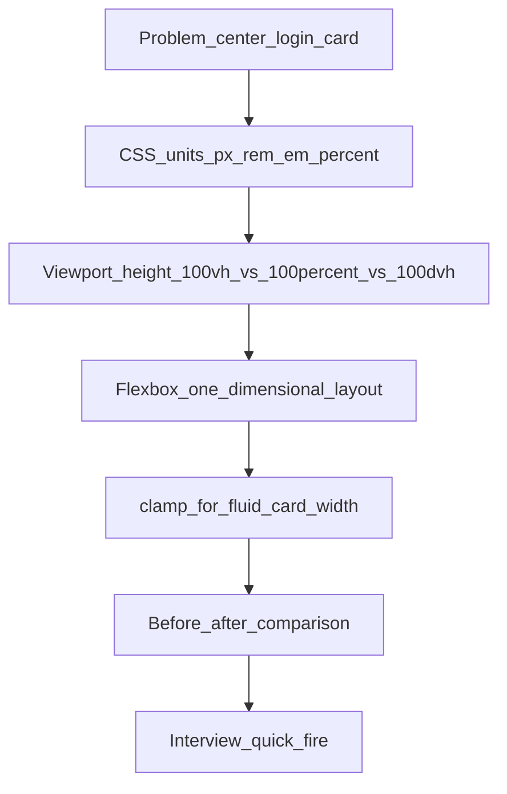
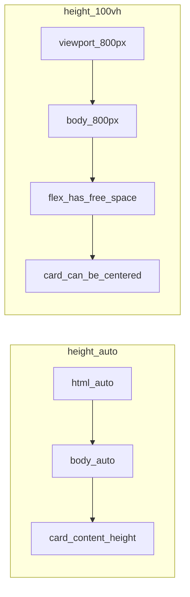
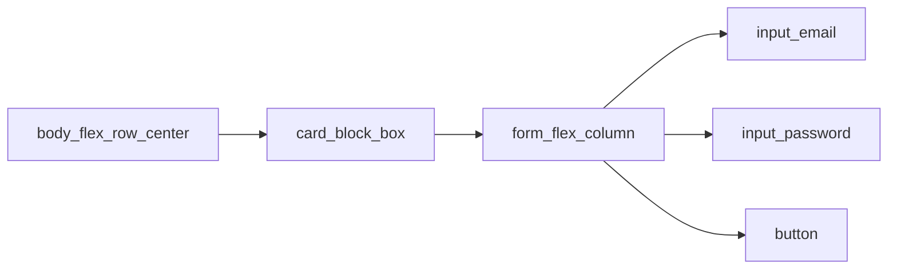
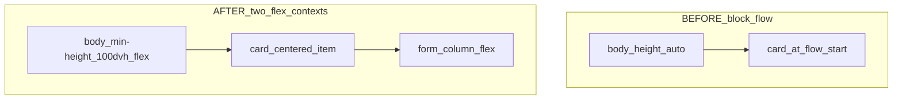

# Login Page: Flexbox, Viewport Height, and CSS Sizing

A login card is the smallest *real* UI that forces you to answer three interview questions at once: **where does this box sit**, **how tall is the screen**, and **what unit should every size be**. The course file [`../06-css/02_login_project/login.html`](../06-css/02_login_project/login.html) already solves the first two with four lines on `body`. This note unpacks *why* those lines work, how the browser's flex algorithm implements them, and how `px`, `rem`, `em`, `%`, `vh`, and `clamp()` change the same card.

This note is written for a final-year CSE student. Read it top to bottom once (like compiling a program: each layer depends on the previous one). Before placements, jump to [Interview Quick-Fire](#6-interview-quick-fire).



**Course files this note refers to:**

- [`../06-css/02_login_project/login.html`](../06-css/02_login_project/login.html) — the lecture's original login ( `100vh` + flex centering, `px` sizing)
- [`login-before.html`](./login-before.html) — broken layout: block flow, `px` only, body hugs the card
- [`login-after.html`](./login-after.html) — evolved layout: `100dvh` + flex + `rem` / `clamp()`
- [`../06-css/05_coming_soon/style.css`](../06-css/05_coming_soon/style.css) — same centering idea via `html, body { height: 100% }`
- [`../18-the-current-state-of-CSS/18-the-current-state-of-CSS.md`](../18-the-current-state-of-CSS/18-the-current-state-of-CSS.md) — Grid, media queries, the rest of the CSS contract (do not duplicate here)

**How to use the pictures:** open [`login-before.html`](./login-before.html) and [`login-after.html`](./login-after.html) in two browser tabs. Resize both. The red dashed outline on BEFORE is the body's true height. AFTER fills the window and parks the card in the middle.

---

## 1. Before: the Card as a Sticky Note

**Analogy:** the login card is a sticky note. With default CSS, the browser pastes it at the top-left of the wall and then *stops drawing the wall*. The rest of the screen is empty because you never told the body how tall the wall is, or where on the wall the note belongs.

Default HTML is **block flow**. A `<div>` is a block box: it starts on a new line, stretches to the parent's width unless you set `width`, and stacks downward. `body` has a default `margin` (usually `8px`) and a height of `auto` — which means "as tall as my children." If the only child is a 300px-wide card, the body is roughly *card-height tall*. The remaining viewport is just the background color showing through *nothing*.

```
BEFORE (block flow, height: auto)

+------------------------------------------+  <- viewport (the window)
| +------------------+                    |
| | LOGIN            |  <- card, top-left |
| | [email         ] |                    |
| | [password      ] |                    |
| | [ Login        ] |                    |
| +------------------+                    |
| ^^^^^^^^ body ends here (red outline)  |
|                                          |
|          empty dark background           |
|                                          |
+------------------------------------------+
```

The "before" CSS is the course markup with the layout contract stripped out:

```css
/* login-before.html — what the browser does if you only style the card */
body {
  font-family: Arial, Helvetica, sans-serif;
  background-color: #1a1a1a;
  margin: 0;
  padding: 0;
  /* no height, no display:flex */
}

.card {
  background-color: #d5d4d4;
  border-radius: 8px;
  padding: 30px;   /* frozen pixels */
  width: 300px;    /* frozen pixels */
}
```

Three things go wrong, and they are independent:

| Failure | Cause | What you see |
| --- | --- | --- |
| Card not centered | No flex (or grid, or `margin: auto` trick) | Card at the start of the writing mode — top-left in English |
| Body is short | `height: auto` = content height | Dark page with a card glued to the top |
| Sizes ignore zoom / phones | Everything in `px` | Padding stays 30px even if the user asked for larger type |

`justify-content: center` on a *block* `body` is a no-op. Flex properties only apply to a flex (or grid, for the alignment module) formatting context. Setting them without `display: flex` is like calling `Collections.sort` on an object that is not a `List` — the method exists in the language, but this instance does not implement it.

Open [`login-before.html`](./login-before.html). The red dashed outline is the body. That outline *is* the lesson.

---

## 2. Units: `px`, `rem`, `em`, `%`, and `clamp()`

**Analogy:** units are the coordinate system of layout. `px` is a constant. `rem` is a global. `em` is a local. `%` is a fraction of a parent. `vh` is a fraction of the window. `clamp()` is a thermostat around any of those.

If you only remember one interview sentence: **a CSS length is not a number; it is a number plus a resolution rule.** The browser resolves that rule during layout, then paints.

### 2.1 `px` — the CSS pixel (absolute-ish)

`1px` is a CSS pixel, not a hardware pixel. On a 2x Retina display the browser maps 1 CSS pixel to 4 device pixels. You still write `1px`.

**Use on the login page:** hairline borders, `box-shadow` offsets, maybe a tiny `border-radius` if the design is pixel-locked.

**Do not use for:** typography, padding, or component width. Those should grow when the user increases the browser's default font size (accessibility, WCAG 1.4.4).

```css
/* BEFORE — course login.html */
.card { padding: 30px; width: 300px; }
input { padding: 10px; font-size: 16px; } /* implied if unset */

/* AFTER — login-after.html */
.card { padding: 1.875rem; width: clamp(280px, 90vw, 360px); }
input { padding: 0.625rem; font-size: 1rem; }
button { border: none; } /* borders stay px when they exist */
input { border: 1px solid #111; }
```

**Interview trap:** "pixels don't scale with zoom." Partial myth. Browser zoom *does* scale `px`. What `px` ignores is the user's *default font size* (the `html` font-size they set in browser settings). `rem` respects that. That is the real reason design systems prefer `rem` for type and spacing.

### 2.2 `rem` — root em (a global constant)

`1rem` = the computed `font-size` of the root element (`html`). Browsers default this to `16px`, so:

| rem | at 16px root | at 20px root (user bumped settings) |
| --- | --- | --- |
| `1rem` | 16px | 20px |
| `1.25rem` | 20px | 25px |
| `1.875rem` | 30px | 30px → 37.5px |

**Analogy:** `rem` is `static final` in Java — one value for the whole app, changed in one place (`html { font-size }`). Every component that uses `rem` follows.

The course file's `padding: 30px` becomes `1.875rem` because `30 / 16 = 1.875`. Same visual at the default root, different visual when the user has asked for larger type.

```css
/* BEFORE */
h2 { margin-bottom: 20px; }

/* AFTER */
h2 { margin: 0 0 1.25rem; } /* 20 / 16 = 1.25 */
```

### 2.3 `em` — local multiplier

`1em` = the computed `font-size` of **this element** (or, for some properties like `font-size` itself, the *parent*). Nested `em` compounds: a `1.2em` child inside a `1.2em` parent is `1.44` times the grandparent.

**Analogy:** `em` is an instance field. `rem` is a static field. Change the instance (`button { font-size: 1.25rem }`) and all `em` padding on that button grows with it. Change `html` and `rem` everywhere grows.

```css
/* BEFORE — padding is a constant, even if you enlarge the button text */
button {
  padding: 10px;
  font-size: 16px;
}

/* AFTER — padding tracks THIS button's type size */
button {
  font-size: 1rem;
  padding: 0.625em 1em; /* 10px / 16px = 0.625em vertical */
}
```

**Login-page rule of thumb:** `rem` for the card, gaps, and input type. `em` for control padding that should scale with that control's own type. `px` for the 1px border.

### 2.4 `%` — fraction of the containing block

Percentage height and width resolve against the **containing block**, usually the parent.

- `width: 90%` on an input inside a 360px card → `324px`.
- `height: 100%` on `body` is **not** "full screen." It is "100% of `html`." If `html`'s height is `auto`, the percentage cannot resolve and the used value is `auto`. That is why `%` height often "does nothing."

**Analogy:** `%` is a share of a parent class's field. If the parent field is unset (`auto`), the child's percentage has nothing to read.

```css
/* BEFORE — fixed width, overflows a 280px-wide phone */
.card { width: 300px; }

/* A naive % attempt — 90% of body, which is 100% of the viewport *if*
   the body is full-width. On a 1200px monitor the card becomes 1080px. Too wide. */
.card { width: 90%; }
```

`%` alone cannot express "small on phones, not huge on desktops." That is `clamp()`.

### 2.5 `clamp(min, preferred, max)` — a thermostat

From [MDN](https://developer.mozilla.org/en-US/docs/Web/CSS/Reference/Values/clamp): `clamp()` takes three values and returns `preferred`, except it will never go below `min` or above `max`.

```
used = max(MIN, min(PREFERRED, MAX))
```

**Analogy:** a thermostat. Preferred is the temperature you asked for. Min is "never colder than this." Max is "never hotter than this." The HVAC (the browser, on every resize) picks.

```css
/* BEFORE */
.card { width: 300px; }

/* AFTER — login-after.html */
.card {
  width: clamp(280px, 90vw, 360px);
}
```

Walk a few viewports (preferred = `90vw`):

| Viewport width | `90vw` | Clamped result | Why |
| --- | --- | --- | --- |
| 280px phone | 252px | **280px** (min wins) | Card never thinner than 280px |
| 360px phone | 324px | **324px** (preferred) | Inside the band |
| 768px tablet | 691px | **360px** (max wins) | Card never wider than 360px |
| 1440px desktop | 1296px | **360px** (max wins) | Same cap |

That is one declaration replacing a pile of `@media` width queries for this card.

**Fluid type** uses the same shape, with a `vw` (or `vw + rem`) preferred value:

```css
h2 {
  font-size: clamp(1.25rem, 2vw + 1rem, 1.75rem);
}
```

**Interview-depth formula** (how designers compute the preferred term so the ramp hits min at viewport A and max at viewport B):

```
slope      = (maxSize - minSize) / (maxViewport - minViewport)
slopeVW    = slope * 100
intercept  = minSize - (slope * minViewport)
preferred  = calc(intercept + slopeVW * 1vw)
final      = clamp(minSize, preferred, maxSize)
```

Example: 16px at 320px-wide, 24px at 1200px-wide.

```
slope     = (24 - 16) / (1200 - 320) = 8 / 880 ≈ 0.00909
slopeVW   ≈ 0.909
intercept = 16 - (0.00909 * 320) ≈ 13.09
font-size: clamp(1rem, 0.818rem + 0.909vw, 1.5rem);
```

(Use `rem` for the bounds so user font settings still apply. Pure `vw` preferred values can fail zoom / WCAG 1.4.4 because viewport units do not always scale with zoom the way `rem` does. MDN's guidance: keep the max a relative unit, and ideally no less than twice the min for text so 200% zoom still works.)

`clamp()` is not only for width. The login after-file uses it on the heading too. You can clamp `padding`, `gap`, `border-radius` — any `<length>`.

### 2.6 Unit cheat sheet for this project

| Unit | Analogy | Resolves against | Login-page use |
| --- | --- | --- | --- |
| `px` | Bitmap constant | CSS pixel | `border: 1px`, shadows |
| `rem` | App-wide `static` | `html` font-size | card padding, gaps, input `font-size` |
| `em` | Instance field | element / parent font-size | button padding tied to its type |
| `%` | Share of parent | containing block | rarely, unless the parent is already capped |
| `vw` / `vh` | Percent of the window | viewport | preferred term of `clamp`, full-page canvas |
| `dvh` | Window *right now* (URL bar aware) | dynamic viewport | `min-height` of `body` |
| `clamp(min, pref, max)` | Thermostat | mix of the above | card width, heading size |

---

## 3. `100vh` Means 100% of the Viewport Height

**Correct statement:** `100vh` is **100% of the viewport's height** — the visible browser window — not 100% of the document, and not 100% of the parent.

From [MDN's length units](https://developer.mozilla.org/en-US/docs/Web/CSS/Reference/Values/length): `1vh` = 1% of the viewport height. If the window is 800px tall, `100vh` = 800px.

**Analogy:** the viewport is the glass pane of the monitor. `vh` measures the pane. `%` on `body` asks "how tall is my parent?" If the parent (`html`) has `height: auto`, that question has no numeric answer.



### 3.1 Why the login page needs a tall body

Flexbox distributes **free space**. If the flex container is only as tall as its item, there is no free space on the cross axis. `align-items: center` has nothing to center *in*.

```css
/* Course login.html */
body {
  margin: 0;
  padding: 0;
  height: 100vh;          /* canvas = the window */
  display: flex;
  justify-content: center;
  align-items: center;
}
```

```
AFTER (body is a viewport-tall flex container)

+------------------------------------------+  <- viewport = body (100vh / 100dvh)
|                                          |
|          +------------------+             |
|          | LOGIN           |  <- card   |
|          | [email        ] |    centered |
|          | [password     ] |            |
|          | [ Login       ] |            |
|          +------------------+             |
|                                          |
+------------------------------------------+
```

### 3.2 `100vh` vs `100%` vs `100dvh`

| Declaration | Resolves against | Works for full-screen login? | Catch |
| --- | --- | --- | --- |
| `body { height: auto }` | content | No | Body hugs the card |
| `body { height: 100% }` | parent `html` | Only if `html { height: 100% }` too | Percentage chain — easy to forget a link |
| `body { height: 100vh }` | viewport | Yes, on desktop | On mobile, `vh` is the *large* viewport (URL bar hidden). Content can sit under the URL bar or force a scrollbar |
| `body { min-height: 100dvh }` | *dynamic* viewport | Yes | `dvh` shrinks when the mobile URL bar is visible. Prefer this in 2026 |

The coming-soon project uses the percentage chain instead of `vh`:

```css
/* ../06-css/05_coming_soon/style.css */
body,
html {
  margin: 0;
  padding: 0;
  height: 100%;
}
.container {
  display: flex;
  justify-content: center;
  align-items: center;
  height: 100%;
}
```

Both patterns create a full-window canvas. `100vh` / `100dvh` is one declaration. `height: 100%` needs every ancestor in the chain to have an explicit height. Interviewers like both answers if you can name the tradeoff.

**Use `min-height`, not `height`, when the form might grow** (validation errors, extra fields). `height: 100vh` *caps* the body at the viewport and can clip overflowing content. `min-height: 100dvh` fills the window *at least*, then grows if needed.

```css
/* login-after.html — the 2026 version of the course's height: 100vh */
body {
  min-height: 100dvh;
}
```

`svh` = small viewport (URL bar shown). `lvh` = large viewport (URL bar hidden). `vh` currently tracks `lvh`. `dvh` interpolates between them as the chrome animates. For a centered login, `min-height: 100dvh` is the line to memorize.

### 3.3 The mobile URL-bar trap (say this in interviews)

On iOS Safari, `100vh` was historically the height *including* the area behind the collapsing address bar. A `height: 100vh` hero would overflow by ~50–100px, producing a tiny scrollbar or a bottom that hid behind the toolbar. `dvh` was added to CSS so the used value matches the *currently visible* viewport.

You do not need to implement a JS `window.innerHeight` hack anymore for this page. One unit swap is the modern fix.

---

## 4. Flexbox: How It Works and How This Page Implements It

**Analogy:** Flexbox is a moving crew that only works along a hallway (one dimension). You tell them which way the hallway runs (`flex-direction`), how to space boxes along the hallway (`justify-content`), and how to align them against the walls (`align-items`). If you need rooms *and* floors at once, that is Grid — see [lecture 18](../18-the-current-state-of-CSS/18-the-current-state-of-CSS.md).

### 4.1 The contract

1. `display: flex` on an element creates a **flex container**. Its *in-flow children* become **flex items**. Grandchildren are *not* flex items of this container.
2. The **main axis** is the direction items are laid out. `flex-direction` sets it: `row` (default, inline / left-to-right in English), `row-reverse`, `column`, `column-reverse`.
3. The **cross axis** is perpendicular to the main axis.
4. **Main axis alignment** = `justify-content`. **Cross axis alignment** = `align-items` (container) / `align-self` (one item).
5. Free space is computed *after* items take their base sizes. Grow/shrink factors then absorb leftover or deficit.

From [MDN's flexbox axes](https://developer.mozilla.org/en-US/docs/Web/CSS/Guides/Flexible_box_layout/Basic_concepts):

> main axis = direction set by `flex-direction` = alignment via `justify-content`
> cross axis = perpendicular = alignment via `align-items` / `align-self` / `align-content`

```
flex-direction: row  (login body)

main axis  ----justify-content---->
           [     card     ]
cross axis
     |
     | align-items
     v

flex-direction: column  (login form)

cross axis ----align-items (stretch)---->
           [ email    ]
           [ password ]
           [ button   ]
main axis
     |
     | justify-content (start)
     v
```

### 4.2 How the browser implements it (the flex algorithm, interview version)

Think of it as a four-pass pass over the flex line. You do not need the spec's exact numbering; you need the *order of decisions*:

1. **Collect items.** In-flow children of the container, in document order (or `order` if set).
2. **Resolve the main size of the container.** For `body` with `min-height: 100dvh` and `flex-direction: row`, the main size is the viewport width; the cross size is at least the viewport height.
3. **Flex base size.** Each item's starting main size: `flex-basis` if not `auto`, else its width/height, else its content size. The login card's base width is the used value of `clamp(280px, 90vw, 360px)`.
4. **Free space.** `free = container_main_size - sum(item_base_sizes) - gaps`.
   - If `free > 0`, distribute using `flex-grow` (default `0` — items do not grow unless asked).
   - If `free < 0`, shrink using `flex-shrink` (default `1`).
5. **Justify leftover.** Whatever space is still free after grow/shrink is placed according to `justify-content`: `flex-start`, `center`, `flex-end`, `space-between`, `space-around`, `space-evenly`.
6. **Align on the cross axis.** Each item's cross size defaults to `stretch` (`align-items: stretch`). `center` sizes the item to its content (or specified height) and equalizes leftover on both sides.

For the login `body` there is **one** flex item (the card). Grow/shrink barely matter. Almost all of the "centering" is steps 5 and 6: leftover width on the left and right (`justify-content: center`), leftover height above and below (`align-items: center`).

That is why **a tall container is a prerequisite**. Step 6 needs leftover cross-axis space.

### 4.3 Container properties vs item properties

| Property | Set on | Axis | Login use |
| --- | --- | --- | --- |
| `display: flex` | container | — | `body`, `form` |
| `flex-direction` | container | defines main | `row` on body (default), `column` on form |
| `justify-content` | container | main | `center` on body — horizontal centering |
| `align-items` | container | cross | `center` on body — vertical centering; default `stretch` on form so inputs fill the card |
| `gap` | container | both | `0.9375rem` on the form, instead of `margin-bottom` on each input |
| `flex-wrap` | container | — | not needed; one card, one column of fields |
| `flex-grow` / `flex-shrink` / `flex-basis` | item | main | unused here; remember `flex: 1 1 300px` from [`Responsive-design.html`](../06-css/08_responsive/Responsive-design.html) |
| `align-self` | item | cross | unused; would override `align-items` for one child |
| `margin: auto` | item | the auto sides eat leftover | the old "push this one item away" trick; there is **no `justify-self` in flexbox** |

**Interview line:** Flexbox treats items as a *group* on the main axis, so there is no `justify-self`. To push one item (a "Forgot password?" link to the right), give that item `margin-left: auto`. Auto margins steal leftover space before `justify-content` runs.

### 4.4 Two flex contexts on the login page



| Element | `display` | `flex-direction` | `justify-content` | `align-items` | Job |
| --- | --- | --- | --- | --- | --- |
| `body` | flex | `row` (default) | `center` | `center` | Place the single card in the middle of the viewport |
| `.card` | block (default) | — | — | — | Painted box; not a flex container |
| `form` | flex | `column` | `flex-start` (default) | `stretch` (default) | Stack email, password, button as a column; stretch them to the card's content width |

**Analogy:** `body` flex is a stage crew placing one prop in the middle of the stage. `form` flex is stacking plates on a tray. They are independent formatting contexts. The card is just a box that happens to be the *item* of the first and the *parent* of the second.

Course code, mapped:

```css
/* Flex context 1 — the stage */
body {
  height: 100vh;
  display: flex;
  justify-content: center; /* main axis = horizontal */
  align-items: center;    /* cross axis = vertical */
}

/* Flex context 2 — the tray */
form {
  display: flex;
  flex-direction: column; /* main axis = vertical now */
}
```

**Before vs after as formatting contexts:**



### 4.5 What happens if you forget a piece (debug table)

| You write | Used layout | Visual |
| --- | --- | --- |
| No `display: flex` | Block flow | `justify-content` ignored; card top-left |
| Flex, no `height` / `min-height` | Flex container = content height | Horizontally centered (main axis has leftover width), vertically *not* (cross axis has no leftover) |
| `align-items: center` only | Same | Same as above unless the container is taller than the card |
| `flex-direction: column` on `body` | Main axis is vertical | Then *`justify-content: center`* is the vertical centering, and `align-items: center` is horizontal. The property names follow the *axis*, not "horizontal/vertical" |
| `flex` on `body` but the card is `position: absolute` | Card leaves the flex formatting context | Centering must be done with offsets; do not mix unless you mean to |

That `flex-direction: column` swap is a favourite interview follow-up. `justify-content` is **not** "horizontal." It is "along the main axis."

### 4.6 Flex vs Grid for this page

A login page is **one column of controls, centered as a group**. That is 1D + alignment — Flexbox's job. Grid would also center (`place-items: center` on a one-cell grid) and would be the right tool if you later add a split layout (illustration | form). Until then, flex matches the mental model and the course file.

---

## 5. After: the Evolved Login, Line by Line

Open [`login-after.html`](./login-after.html) next to [`login-before.html`](./login-before.html) and the course [`login.html`](../06-css/02_login_project/login.html).

### 5.1 The after CSS, annotated

```css
* { box-sizing: border-box; } /* width includes padding/border — inputs fill the card */

body {
  font-family: Arial, Helvetica, sans-serif;
  background-color: #1a1a1a;
  margin: 0;
  padding: 0;
  min-height: 100dvh;        /* canvas = visible window, mobile URL-bar safe */
  display: flex;             /* formatting context 1 */
  justify-content: center;
  align-items: center;
}

.card {
  background-color: #d5d4d4;
  border-radius: 0.5rem;
  padding: 1.875rem;                    /* 30px at a 16px root */
  width: clamp(280px, 90vw, 360px);    /* thermostat */
}

h2 {
  color: #1a50a0;
  text-align: center;
  margin: 0 0 1.25rem;
  font-size: clamp(1.25rem, 2vw + 1rem, 1.75rem);
}

form {
  display: flex;             /* formatting context 2 */
  flex-direction: column;
  gap: 0.9375rem;            /* 15px at a 16px root; no margin-bottom on inputs */
}

input {
  padding: 0.625rem;
  border-radius: 0.3125rem;
  border: 1px solid #111;    /* px stays for the hairline */
  background-color: #d8d8d8;
  font-size: 1rem;
}

button {
  background-color: #1b81da;
  color: #fff;
  padding: 0.625em 1em;     /* em: tracks this button's font-size */
  border-radius: 0.5rem;
  border: none;
  font-size: 1rem;
}
```

### 5.2 Change table: before → course → after

| Concern | [`login-before.html`](./login-before.html) | Course [`login.html`](../06-css/02_login_project/login.html) | [`login-after.html`](./login-after.html) |
| --- | --- | --- | --- |
| Body height | `auto` (content) | `height: 100vh` | `min-height: 100dvh` |
| Centering | none | flex + `center` / `center` | same flex, safer viewport unit |
| Card width | `300px` | `300px` | `clamp(280px, 90vw, 360px)` |
| Card padding | `30px` | `30px` | `1.875rem` |
| Form stack | block inputs | `flex-direction: column` | flex column + `gap` |
| Input type size | `16px` | inherited | `1rem` |
| Button padding | `10px` | `10px` | `0.625em 1em` |
| Debug outline | red dashed body | none | none (caption instead) |

The course file is already *correct* for the lecture goal (center a card). The after file is what you write when an interviewer asks "how would you make this production-grade?"

### 5.3 Sequential story you can say out loud

1. I reset `body` margin so the canvas starts at (0, 0).
2. I give `body` `min-height: 100dvh` so the flex container is as tall as the visible window.
3. I make `body` a flex container and center on both axes — one item, so grow/shrink do not matter.
4. I size the card with `clamp` so phones get a usable width and desktops do not get a stretched form.
5. I switch padding and type to `rem` / `em` so user font settings still work.
6. I make the `form` a column flex with `gap` so spacing lives on the container, not on every field.

That is the whole page. Everything else is paint (colours, radius, hover).

---

## 6. Interview Quick-Fire

**Q1. What does `100vh` actually mean?**  
100% of the **viewport** height (the visible window), not 100% of the document and not 100% of the parent. `1vh` = 1% of that height.

**Q2. Why is `height: 100%` on `body` often a no-op?**  
Percentages resolve against the parent. `html` defaults to `height: auto`, so `100%` cannot compute. Either set `html, body { height: 100% }` (the coming-soon pattern) or skip the chain and use `100vh` / `100dvh`.

**Q3. `100vh` vs `100dvh`?**  
`vh` ≈ large viewport (URL bar hidden). `dvh` tracks the dynamic visible height as mobile chrome shows and hides. Prefer `min-height: 100dvh` for full-screen UIs in 2026.

**Q4. Why doesn't `align-items: center` center the card without a tall body?**  
Flex distributes *free space*. A `height: auto` body is only as tall as the card, so the cross axis has zero leftover. Horizontal centering can still work because the body is full *width* by default.

**Q5. You set `justify-content: center` but forgot `display: flex`. What happens?**  
Nothing. Alignment properties apply to flex/grid formatting contexts. The body stays in block flow; the card stays at the start.

**Q6. Is `justify-content` always horizontal?**  
No. It is the **main axis**. With `flex-direction: column`, `justify-content: center` is vertical centering and `align-items: center` is horizontal.

**Q7. `rem` vs `em` on a login form?**  
`rem` for page-level rhythm (card padding, gaps, input font-size) so everything tracks the root. `em` for a control's own padding so that one button can be enlarged without editing padding separately.

**Q8. Why not `px` for padding?**  
Browser zoom scales `px`, but the user's *default font size* does not. `rem` / `em` honour that setting. Borders can stay `1px`.

**Q9. Explain `clamp(280px, 90vw, 360px)` in one sentence.**  
Use 90% of the viewport width, but never narrower than 280px and never wider than 360px.

**Q10. How is `clamp` implemented in terms of `min` / `max`?**  
`clamp(MIN, PREFERRED, MAX)` = `max(MIN, min(PREFERRED, MAX))`.

**Q11. Why Flexbox for this login instead of Grid?**  
The layout is one-dimensional: a column of fields, then that group centered as a single item. Flex is the 1D tool. Grid is the right upgrade when you need a 2D split (art | form).

**Q12. How does the flex algorithm distribute free space?**  
Compute each item's flex base size, subtract from the container's main size, then assign leftover with `flex-grow` (or reduce with `flex-shrink`). Remaining leftover is placed by `justify-content`. Cross-axis leftover is placed by `align-items`.

**Q13. Why is there no `justify-self` in Flexbox?**  
On the main axis, items are aligned as a group. To move one item, use `margin-left: auto` / `margin-right: auto` (auto margins eat leftover before justification).

**Q14. `flex: 1 1 300px` — decode it.**  
`flex-grow: 1` (take leftover), `flex-shrink: 1` (can shrink), `flex-basis: 300px` (start at 300px, wrap if the container is narrower). Used in [`Responsive-design.html`](../06-css/08_responsive/Responsive-design.html), not on this login card.

**Q15. `gap` vs `margin-bottom` on form fields?**  
`gap` is on the container and does not collapse, does not add space after the last item, and does not require `:last-child { margin: 0 }`. Prefer `gap` on flex/grid forms.

**Q16. What if the login form grows taller than the viewport?**  
`height: 100vh` can clip. `min-height: 100dvh` lets the body grow and the page scroll. Pair with `padding` on `body` so the card does not kiss the viewport edge when it scrolls.

**Q17. Does the card need `display: flex`?**  
No. The card is a block box that is a *flex item* of `body`. Only `body` and `form` need to be flex containers here.

---

## 7. How to Use This in Depth (the sequential recap)

When you sit down to build — or to explain — a centered login, walk the same staircase:

1. **Units first.** Decide the coordinate system: `px` for hairlines, `rem` for rhythm, `em` for control-local padding, `clamp()` for anything that must be fluid and bounded. A length is a number plus a resolution rule.
2. **Give the canvas a height.** `min-height: 100dvh` (or the `html, body { height: 100% }` chain). `%` of an `auto` parent is not a height. `100vh` is the window, with a mobile URL-bar caveat that `dvh` fixes.
3. **Create a flex formatting context on `body`.** One item. `justify-content: center` on the main axis, `align-items: center` on the cross axis. Remember those names follow the axis, not "horizontal/vertical."
4. **Create a second flex context on the `form`.** `flex-direction: column` + `gap`. Stretch is the default and is what you want for full-width fields.
5. **Verify with before/after.** Open [`login-before.html`](./login-before.html) (red outline = short body) and [`login-after.html`](./login-after.html) (full window, fluid width). Resize. If the after-card never goes below 280px or above 360px, `clamp` is working.
6. **Tell the interview story.** "I needed leftover space, so I sized the container to the viewport. Flex distributes leftover. I clamped the card so the preferred width is `90vw` inside a min/max band. Spacing is `rem` so user font settings still apply."

If you can draw the two axes, decode `clamp(min, preferred, max)` as `max(min, min(preferred, max))`, and explain why `%` height failed, you are past "I used Bootstrap `d-flex`" and into the territory a CSE interview actually tests.

---

## Further reading

- [MDN: Basic concepts of flexbox](https://developer.mozilla.org/en-US/docs/Web/CSS/Guides/Flexible_box_layout/Basic_concepts) — main/cross axes, `flex` shorthand
- [MDN: Aligning items in a flex container](https://developer.mozilla.org/en-US/docs/Web/CSS/Guides/Flexible_box_layout/Aligning_items) — `justify-content`, `align-items`, `align-self`, `gap`
- [MDN: Box alignment in flexbox](https://developer.mozilla.org/en-US/docs/Web/CSS/Guides/Box_alignment/In_flexbox) — why there is no `justify-self`
- [MDN: CSS `clamp()`](https://developer.mozilla.org/en-US/docs/Web/CSS/Reference/Values/clamp) — min / preferred / max, accessibility note on text
- [MDN: CSS length units](https://developer.mozilla.org/en-US/docs/Web/CSS/Reference/Values/length) — `px`, `rem`, `em`, `vh`, `dvh`, `svh`, `lvh`
- [MDN: Sizing (Learn)](https://developer.mozilla.org/en-US/docs/Learn_web_development/Core/styling_basics/sizing) — `%` vs viewport units
- [CSS-Tricks: `clamp()`](https://css-tricks.com/almanac/functions/c/clamp/) — fluid type and width patterns
- [Lecture 18: The Current State of CSS](../18-the-current-state-of-CSS/18-the-current-state-of-CSS.md) — Grid, media queries, frameworks
