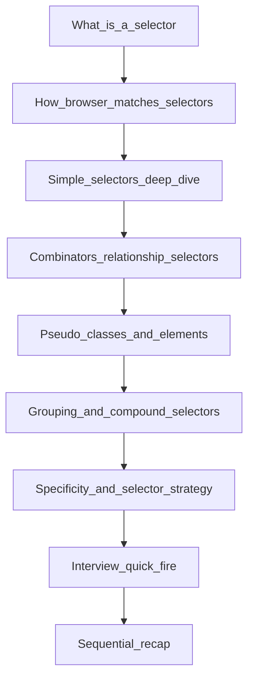

# Masterclass on CSS Selectors

A CSS selector is the **query language of the stylesheet**. HTML is a tree. A selector is a `WHERE` clause: "find every node that matches this pattern, then paint it." You never "style a page." You write queries. The engine matches them. The cascade decides which declarations win. If you only memorize `.btn-primary`, you will stall the moment someone asks *why `div p` painted a nested paragraph you did not mean to touch*.

This note is written for a final-year CSE student. Read it top to bottom once (like compiling a program: each layer depends on the previous one). Before placements, jump to [Interview Quick-Fire](#8-interview-quick-fire).



**Course files this note refers to:**

- [`../18-the-current-state-of-CSS/18-the-current-state-of-CSS.md`](../18-the-current-state-of-CSS/18-the-current-state-of-CSS.md) — cascade, specificity, CSSOM, rendering pipeline (do not duplicate here)
- [`selectors-demo.html`](./selectors-demo.html) — live playground: open in a browser, hover, inspect, watch matches light up
- [`../06-css/01_basics/index.html`](../06-css/01_basics/index.html) — course basics: type vs class vs inline

**How to use the pictures:** every deep-dive selector below has an ASCII tree with `[MATCH]` vs skip. After you read a section, open [`selectors-demo.html`](./selectors-demo.html) and find the matching panel. DevTools → Elements → Styles is the ground truth: the engine shows you *which selector actually won*.

---

## 1. How Selectors Work (and How the Engine Implements Them)

**Analogy:** HTML is a family tree. CSS is a search warrant. The browser does not "look at your CSS file and then look at the page." It parses both into in-memory trees, then **matches** every element against every selector, then **cascades** the winning declarations. Matching is native C++ / Rust in the engine. It is not JavaScript. `document.querySelectorAll("div > p")` uses the **same selector grammar**, but CSS matching happens earlier, during style calculation, on every layout-relevant change.

### 1.1 The pipeline, selector-shaped

```
HTML ──parse──► DOM tree          (nodes, attributes, text)
CSS  ──parse──► CSSOM             (selectors + declaration blocks)
                    │
                    ▼
            Style matching        (for each element: does this selector match?)
                    │
                    ▼
            Cascade + computed    (origin, importance, specificity, source order)
                    │
                    ▼
            Render tree → Layout → Paint → Composite
```

This is the [Critical Rendering Path](https://developer.mozilla.org/en-US/docs/Web/Performance/Guides/critical_rendering_path) from lecture 18, zoomed in on the **match** step. A selector never "runs." It is a pattern. The engine tests the pattern.

### 1.2 A tiny DOM, three queries

```html
<article id="post" class="card">
  <h2>Title</h2>
  <p class="lead">Hello <span>world</span></p>
</article>
```

```
article#post.card
 ├── h2
 └── p.lead
      └── span
```

| Query | Matches | Why |
| --- | --- | --- |
| `p` | the `<p>` | type = tag name |
| `.lead` | the `<p>` | class token present |
| `article span` | the `<span>` | descendant: `span` lives *anywhere* under `article` |
| `article > span` | **nothing** | child: `span` is not a *direct* child of `article` |

That last row is the whole combinator story in one line. Depth in the tree is not a detail. It is the difference between a working component and a leaky style.

### 1.3 Right-to-left matching (the interview implementation fact)

Most engines match **from the right**. For `article .card span.highlight`:

1. Find every `span.highlight` (the **key selector** — cheapest filter).
2. Walk *up* the ancestor chain looking for `.card`.
3. Keep walking looking for `article`.

This is why a selector like `body div div div span` is expensive in a large DOM: the rightmost `span` matches thousands of nodes, and then each one walks up. A class on the target (`.highlight`) filters first. **Write selectors so the rightmost piece is specific.** That is not a micro-optimization cult; it is how the matcher is implemented.

### 1.4 Vocabulary you will hear in interviews

| Term | Meaning | Example |
| --- | --- | --- |
| Simple selector | One condition on one node | `p`, `.card`, `#nav`, `[type]`, `:hover` |
| Compound selector | Several simple selectors on the **same** node, no combinator | `input[type="email"]:focus` |
| Complex selector | Compounds joined by combinators | `nav > ul li a` |
| Selector list | Comma-separated queries sharing one block | `h1, h2, h3 { ... }` |
| Combinator | Relationship between two compounds | space, `>`, `+`, `~` |

`:is()`, `:where()`, and `:not()` are **functional pseudo-classes** that wrap other selectors. They reduce repetition. `:where()` contributes **zero** specificity — that is the trick. Details in [section 4](#4-pseudo-classes-deep-dive). Cascade math lives in [lecture 18](../18-the-current-state-of-CSS/18-the-current-state-of-CSS.md#13-cascade-and-specificity).

---

## 2. Simple Selectors (Deep Dive)

A simple selector answers: *is this node the one I want, looking only at the node itself?* No parent, no sibling, no "inside a card." Just identity: tag, class, id, attribute.

Shared HTML for the next five subsections (keep this tree in your head):

```html
<body>
  <header id="top">Site</header>
  <p>Plain paragraph</p>
  <p class="lead">Lead paragraph</p>
  <p class="lead highlight">Lead + highlight</p>
  <input type="text" placeholder="name">
  <input type="email" placeholder="mail">
</body>
```

```
body
 ├── header#top
 ├── p
 ├── p.lead
 ├── p.lead.highlight
 ├── input[type=text]
 └── input[type=email]
```

---

### 2.1 Universal selector `*`

**Analogy:** the building PA system. `*` is "everyone in the building, including the janitor, including generated `::before` boxes if you write `*::before`." It does not care about job title, badge, or passport.

**Syntax:**

```css
* {
  box-sizing: border-box;
}

article * {
  max-width: 100%;
}
```

**Visual — `*` matches every element node:**

```
body                 [MATCH]
 ├── header#top      [MATCH]
 ├── p               [MATCH]
 ├── p.lead          [MATCH]
 ├── p.lead.highlight[MATCH]
 ├── input           [MATCH]
 └── input           [MATCH]
```

Text nodes are not elements. `*` does not select the letters inside a `<p>`. It selects the `<p>` box.

**Memory hook:** asterisk = all element nodes. PA system. No filter.

**Production use:**

- The modern box-model reset: `*, *::before, *::after { box-sizing: border-box; }`
- Scoped "don't overflow" rules: `article img, article iframe` is usually better than `article *`, but `article *` is a valid blunt instrument
- Making `:first-child` readable: `article > *:first-child` ("any element that is the first child")

**Interview trap:** "`*` has specificity 0, so it never wins." Half true. Universal contributes **0,0,0,0** — it does not add to the type column. A later `p { color: red }` **beats** `* { color: blue }` because `p` is `(0,0,0,1)`. The trap is thinking `*` "doesn't apply." It applies. It just loses to almost everything. Second trap: "never use `*` — it's slow." On modern engines a single universal reset is cheap. Deep `* * * *` chains are the real smell.

---

### 2.2 Type selector `p`, `div`, `input`

**Analogy:** job title. `p` is "every person whose job is Paragraph." Not "this specific paragraph." Every engineer in the company, regardless of which floor they sit on.

**Syntax:**

```css
p {
  line-height: 1.6;
  color: #222;
}

input {
  font: inherit;
}
```

**Visual — `p { }` paints paragraphs only:**

```
body
 ├── header#top           skip (not a p)
 ├── p                    [MATCH]
 ├── p.lead               [MATCH]
 ├── p.lead.highlight     [MATCH]
 ├── input                skip
 └── input                skip
```

The `<span>` inside a paragraph (if you add one) is **not** a `p`. Type matches the element's **tag name**, not its descendants.

**Memory hook:** no prefix = tag name. Bare word. Job title.

**Production use:**

- Document-level defaults: `body`, `h1–h6`, `a`, `img { max-width: 100% }`
- Form normalization: `button, input, select, textarea { font: inherit }`
- **Not** for components. `div { padding: 1rem }` will explode every layout wrapper on the page.

HTML type selectors are **case-insensitive** for HTML elements (`P` and `p` both match). In XML/SVG they are case-sensitive. Say that if they ask about SVG `<text>` vs HTML.

**Interview trap:** "Type selectors are deprecated; everyone uses classes." No. Type selectors are the **lowest-specificity defaults**. Classes override them. That is the point. A component library that starts with `button { }` and then `.btn-primary { }` is using the cascade correctly.

---

### 2.3 Class selector `.lead`

**Analogy:** a name badge. Many people can wear "STAFF." One person can wear several badges at once (`class="lead highlight"`). You style the badge, not the passport.

**Syntax:**

```css
.lead {
  font-size: 1.25rem;
}

.highlight {
  background: khaki;
}

/* Compound: SAME element must have BOTH classes */
.lead.highlight {
  font-weight: 700;
}
```

**Visual — `.lead` matches every node that has that token:**

```
body
 ├── header#top           skip
 ├── p                    skip (no class lead)
 ├── p.lead               [MATCH]
 ├── p.lead.highlight     [MATCH]  also matches .highlight and .lead.highlight
 ├── input                skip
 └── input                skip
```

HTML `class` is a **space-separated token list**. `class="lead highlight"` means the node has two independent classes. Order in the attribute does not matter. Order in CSS *does* matter when specificity ties.

**The critical distinction — no space vs space:**

```css
.btn.primary { }   /* one element with both classes */
.btn .primary { }  /* .primary nested somewhere inside .btn */
```

```
.btn.primary                    .btn .primary

[div.btn.primary]  MATCH        [div.btn]
                                └── [span.primary]  MATCH

[div.btn]          skip         [div.btn.primary]   skip
 └── [span.primary] skip         (primary is on .btn itself, not a descendant)
```

**Memory hook:** **dot = badge.** `.lead.highlight` = two badges, one person. `.lead .highlight` = a highlight-badge *inside* a lead-badge's office.

**Production use:** this is the **default styling hook** in real code. BEM (`.card__title--large`), utility classes (`flex`, `mt-4`), component classes (`.Navbar`). One class, many instances. Specificity stays at `(0,0,1,0)` so overrides are possible.

**Interview trap:** "Classes must be unique." That is IDs. Classes are *designed* to be reused. Second trap: confusing `.a.b` with `.a .b`. If you mix those up in a whiteboard, the rest of the CSS round is noise.

---

### 2.4 ID selector `#top`

**Analogy:** a passport number. The HTML spec says there should be **one** element with a given `id` in the document. The CSS engine, however, will match **every** element that has that id if you duplicate it. Invalid HTML, valid (and confusing) CSS.

**Syntax:**

```css
#top {
  position: sticky;
  top: 0;
}
```

```html
<header id="top">Site</header>
```

**Visual — `#top` is a laser pointer:**

```
body
 ├── header#top           [MATCH]
 ├── p                    skip
 ├── p.lead               skip
 ├── p.lead.highlight     skip
 ├── input                skip
 └── input                skip
```

**Memory hook:** **hash = unique handle.** `#` is the same character as a URL fragment (`page.html#top`). That is the job: identity, jump links, `getElementById`, skip navigation.

**Production use:**

- Fragment identifiers: `<a href="#main">Skip to content</a>`
- JS hooks: `document.getElementById("app")`
- **Avoid for styling.** Specificity is `(0,1,0,0)`. A class cannot override an ID without another ID, extra chain, or `!important`. That is how stylesheets become undebuggable.

**Interview trap:** "IDs are faster than classes, so use them for CSS." Matching speed is irrelevant next to specificity pain. Use classes to paint; use IDs to *name*. Duplicate IDs: the selector still matches all of them — the engine is not a validator.

---

### 2.5 Attribute selector `[type="email"]`

**Analogy:** a database `WHERE` clause on a column. You are not asking for a job title or a badge. You are filtering on **metadata the HTML already has** — `type`, `href`, `data-state`, `aria-expanded`. Square brackets are SQL.

**Syntax:**

```css
input[type="email"] {
  border-color: royalblue;
}

a[href^="https"] {
  /* external-looking links */
}

[data-state="open"] {
  display: block;
}
```

**Visual — `input[type="email"]`:**

```
body
 ├── header#top           skip
 ├── p                    skip
 ├── p.lead               skip
 ├── p.lead.highlight     skip
 ├── input[type=text]     skip
 └── input[type=email]    [MATCH]
```

**Operator table (memorize the symbols):**

| Selector | Meaning | Example |
| --- | --- | --- |
| `[attr]` | Attribute present, any value | `[disabled]`, `[hidden]` |
| `[attr="val"]` | Exact match | `[type="email"]` |
| `[attr^="val"]` | Starts with | `[href^="https"]` |
| `[attr$="val"]` | Ends with | `[src$=".png"]` |
| `[attr*="val"]` | Substring anywhere | `[class*="btn"]` |
| `[attr~="val"]` | Token in a space-separated list | `[class~="active"]` (like a class selector) |
| `[attr\|="val"]` | Exact or `val-` prefix (language codes) | `[lang\|="en"]` matches `en` and `en-US` |

**Memory hooks for operators:**

- `^` caret = start of string (regex muscle memory)
- `$` dollar = end of string
- `*` star = contains (wildcard)
- `~` tilde = word in a list (same tilde family as general sibling, different job)
- `|` pipe = hyphen-prefix (i18n `lang`)

**Case sensitivity:** HTML enumerated attributes (`type` on `<input>`) match case-insensitively. `id`, `class`, and `data-*` match **case-sensitively**. Add the `i` flag to force insensitive: `[data-state="open" i]`.

**Production use:**

- Forms: `input[type="checkbox"]`, `button[type="submit"]` — you often cannot add a class to third-party markup
- Design-system state: `[data-state="open"]`, `[aria-expanded="true"]` (Radix / shadcn live here)
- File-type icons: `a[href$=".pdf"]::after { content: " (PDF)"; }`

**Interview trap:** `[class*="btn"]` is not a class selector. It is a substring match. `class="btn-danger"` *and* `class="submitbtn"` both match. Prefer `.btn` or `[class~="btn"]` when you mean a token. Second trap: attribute selectors count as **classes** in specificity — `(0,0,1,0)`, same bucket as `.lead` and `:hover`.

---

## 3. Combinators (Relationship Selectors)

**Analogy:** family law on the DOM tree. A simple selector points at a person. A combinator says *how two people are related*: ancestor, parent, next sibling, later sibling. Combinators never match a node by themselves. They join two patterns.

**The shared tree for this entire section:**

```html
<div class="container">
  <h2 class="title">Heading</h2>
  <p>First paragraph</p>
  <p class="note">Note paragraph <span class="highlight">mark</span></p>
  <blockquote>
    <p>Quoted paragraph</p>
  </blockquote>
</div>
```

```
div.container
 ├── h2.title
 ├── p                 ← "First paragraph"
 ├── p.note
 │    └── span.highlight
 └── blockquote
      └── p            ← "Quoted paragraph"
```

| Combinator | Symbol | Relationship | Example |
| --- | --- | --- | --- |
| Descendant | space | Nested at any depth | `div p` |
| Child | `>` | Direct child only | `div > p` |
| Adjacent sibling | `+` | Immediate next sibling | `h2 + p` |
| General sibling | `~` | Any following sibling | `h2 ~ p` |

Siblings share a parent. Combinators **do not look backwards**: `h2 + p` never selects an `h2` that comes *after* a `p`. CSS combinators are forward (and downward) only.

---

### 3.1 Child combinator `>` (deep dive)

**Analogy:** "my kids," not "my whole bloodline." `div > p` is a direct report. A grandchild behind a `blockquote` is not on that list.

**Syntax:**

```css
.container > p {
  margin-top: 0.5rem;
}
```

**Visual — `div.container > p` vs `div.container p` on the same tree:**

```
CHILD  .container > p                 DESCENDANT  .container p

div.container                         div.container
 ├── h2.title          skip            ├── h2.title          skip
 ├── p                 [MATCH]         ├── p                 [MATCH]
 ├── p.note            [MATCH]         ├── p.note            [MATCH]
 │    └── span         skip            │    └── span         skip
 └── blockquote        skip            └── blockquote        skip
      └── p            skip                 └── p            [MATCH]  ← leak
```

That leaked quoted `<p>` is why interviews love this selector. "Style the article's own paragraphs, not the ones inside figures, quotes, or cards." Child combinator. If you only know the space combinator, you will restyle nested widgets by accident.

**Memory hook:** **`>` = arrow to a direct child only.** One hop down. No elevator to the basement.

**Production use:**

- Layout wrappers: `.hero > img` (the banner image, not icons nested in a caption)
- Resetting nested lists: `ul > li` vs accidental `ul li li`
- Component roots: `.card > header` for the card's own header

**Interview trap:** "`>` is just a faster descendant." No. It is a **different set**. Performance is a side effect of matching fewer nodes. The semantic difference is the reason it exists. Also: whitespace around `>` is optional (`div>p` and `div > p` are the same).

---

### 3.2 Descendant combinator (space)

**Analogy:** anyone downstairs in the family line — children, grandchildren, adopted widgets you forgot were nested.

**Syntax:**

```css
.container p {
  color: #333;
}

.container .highlight {
  background: khaki;
}
```

**Visual — `.container p`:**

```
div.container
 ├── h2.title          skip
 ├── p                 [MATCH]
 ├── p.note            [MATCH]
 │    └── span         skip (not a p)
 └── blockquote
      └── p            [MATCH]
```

**Memory hook:** **space = anywhere downstairs.** The most powerful and the most leaky combinator. Default when you type two selectors with a gap.

**When to use:** theming a subtree (`article a { color: inherit }`), scoped docs, "everything of type X inside this island." **When not:** a component that must not style its slots' internals — use `>` or a class on the target.

---

### 3.3 Adjacent sibling combinator `+`

**Analogy:** the person standing in the next seat. Same row (same parent), immediately to the right in tree order. Not two seats down. Not a cousin.

**Syntax:**

```css
h2 + p {
  font-size: 1.15rem; /* lead paragraph after a heading */
}
```

**Visual — `h2 + p`:**

```
div.container
 ├── h2.title          (left side of +)
 ├── p                 [MATCH]  ← immediately after h2
 ├── p.note            skip     ← after a p, not after h2
 │    └── span
 └── blockquote        skip
      └── p            skip     ← not a sibling of h2
```

Classic pattern: "the first paragraph after a heading is the dek / lede." `h2 + p`. Another: `label + input { margin-left: 0.5rem }` when the input is the next sibling.

**Memory hook:** **`+` = next seat only.** Plus means "plus the one right after."

**Interview trap:** `p + p` is "a paragraph that follows a paragraph" — a common way to add `margin-top` between stacked paragraphs without padding the last one. It does **not** select the first `p`.

---

### 3.4 General sibling combinator `~`

**Analogy:** everyone after you in the same row, whether they sit next to you or five seats down. Still the same parent. Still only *following* siblings, never preceding.

**Syntax:**

```css
h2 ~ p {
  max-width: 60ch;
}
```

**Visual — `h2 ~ p`:**

```
div.container
 ├── h2.title          (left side of ~)
 ├── p                 [MATCH]
 ├── p.note            [MATCH]
 │    └── span         skip
 └── blockquote        skip (not a p)
      └── p            skip (not a sibling of h2)
```

`h2 ~ p` is a **superset** of `h2 + p`. Adjacent is the first hit; general is all later hits of that type.

**Memory hook:** **`~` = everyone after me in the row.** Tilde = "the rest of this sibling list."

**Production use:** the checkbox hack (legacy, still asked):

```css
.nav-toggle:checked ~ .nav-links {
  display: flex;
}
```

The checkbox and the menu are siblings. Checking the box styles **later** siblings. You cannot style a previous sibling or a parent with classic combinators (that is `:has()`, a newer subject — mention it, don't live there unless asked).

**Interview trap:** confusing `~` with `[attr~="val"]`. Same character, different grammar. One is a combinator between selectors. The other is a word-match inside attribute brackets.

---

### 3.5 Combinator cheat card

On the shared `.container` tree (two direct `<p>`s, one nested inside `blockquote`):

| Selector | Matches | Count |
| --- | --- | --- |
| `.container p` | every `p` under `.container` | 3 |
| `.container > p` | `p` whose **parent** is `.container` | 2 |
| `h2 + p` | `p` immediately after `h2` | 1 |
| `h2 ~ p` | `p` after `h2`, same parent | 2 |

Open [`selectors-demo.html`](./selectors-demo.html). Each combinator has its own panel; the green outlines are the match set.

---

## 4. Pseudo-classes (Deep Dive)

**Analogy:** a mood, not a second person. `:hover` is you *while* the cursor is on you. The node does not change identity. Its **state** (or **position among siblings**, or **form validity**) matches a condition that is not a class you wrote in HTML.

**Syntax:** one colon. The type/universal, if present, comes **first**: `a:hover`, not `:hover a` (that would mean "a hovered-something that contains an `a`" — almost never what you meant).

```css
a:hover {
  text-decoration: underline;
}

button:disabled {
  opacity: 0.5;
  cursor: not-allowed;
}

input:focus-visible {
  outline: 2px solid dodgerblue;
  outline-offset: 2px;
}
```

**Memory hook:** **one colon = state / position / condition.** The element already exists in HTML.

### 4.1 Categories (interview table)

| Category | Examples | What it selects |
| --- | --- | --- |
| User action | `:hover`, `:active`, `:focus`, `:focus-visible`, `:focus-within` | Interaction |
| Location in tree | `:first-child`, `:last-child`, `:nth-child(2n)`, `:only-child` | Position among **all** siblings |
| Location by type | `:first-of-type`, `:last-of-type`, `:nth-of-type(2n)` | Position among siblings of **the same tag** |
| Input / form | `:checked`, `:disabled`, `:enabled`, `:required`, `:invalid`, `:placeholder-shown` | Control state |
| Link | `:link`, `:visited`, `:any-link` | Anchor history (`:visited` is privacy-limited) |
| Logic | `:not(.skip)`, `:is(h1, h2, h3)`, `:where(h1, h2, h3)` | Boolean / grouping |
| Relational | `:has(img)` | Parent that **contains** a match (modern) |

### 4.2 `:hover`, `:disabled`, `:focus-visible`

```html
<a href="/docs">Docs</a>
<button disabled>Save</button>
<input type="email" placeholder="you@corp.dev">
```

```css
a:hover { color: crimson; }

button:disabled {
  opacity: 0.5;
}

input:focus-visible {
  outline: 2px solid dodgerblue;
}
```

**Why `:focus-visible` instead of `:focus`:** `:focus` styles fire on mouse click *and* keyboard. Designers used to `outline: none` and then forgot keyboard users. `:focus-visible` is the engine's "this focus came from keyboard (or the UA thinks it should show)" signal. **Say this in interviews.** It is an accessibility one-liner that scores.

**`:focus-within`:** matches an ancestor if a descendant has focus. Use it to highlight a whole search box when the input inside is focused.

### 4.3 `:first-child` vs `:first-of-type` (the classic trap)

```html
<ul>
  <li>One</li>
  <li>Two</li>
  <li>Three</li>
</ul>

<div class="mix">
  <h2>Title</h2>
  <p>Alpha</p>
  <p>Beta</p>
</div>
```

```
ul                          div.mix
 ├── li  [first-child]       ├── h2   [first-child] [first-of-type]
 ├── li                      ├── p    NOT first-child
 └── li                      └── p         [first-of-type] among p
```

```css
li:first-child { font-weight: 700; }   /* first sibling, and it is an li */

p:first-child { color: red; }          /* a p that is ALSO the first child */
p:first-of-type { color: blue; }       /* the first p among its siblings */
```

On `div.mix`:

- `p:first-child` matches **nothing** — the first child is `h2`
- `p:first-of-type` matches **Alpha** — first paragraph in that parent

**Memory hook:** `:first-child` = "am I kid #1?" `:first-of-type` = "am I the first kid *with my tag*?"

`:nth-child(odd)` / `:nth-child(2n)` = zebra stripes. An+B micro-syntax: `2n` even, `2n+1` odd, `3n+1` every third starting at 1. You do not need to derive the grammar in an interview; you need to read `2n+1` out loud as "odd positions."

### 4.4 `:not()`, `:is()`, `:where()`

```css
p:not(.note) { color: #222; }

:is(h1, h2, h3) { line-height: 1.2; }

:where(h1, h2, h3) { margin-block: 0; } /* specificity 0 — easy to override */
```

- `:not(.note)` — match `p` that lack that class. Specificity of `:not()` is the specificity of its argument
- `:is(h1, h2, h3)` — **forgiving** selector list; takes the **highest** specificity of its arguments
- `:where(...)` — same matching as `:is()`, **zero** specificity. Use for resets you want utilities to beat

**Interview trap:** `:not(h1, h2)` as a list is Selectors Level 4; older engines wanted `:not(h1):not(h2)`. If they ask "why didn't my `:is()` override work?" — check whether they meant `:where()`.

---

## 5. Pseudo-elements (Deep Dive)

**Analogy:** ghost nodes. The printer adds a margin note that is not in the manuscript. `::before` is a box the engine **invents**. It is not in your HTML, not in the DOM you wrote, and (mostly) not queryable as a real element. You cannot `document.querySelector("div::before")` and get a node you created. The box exists in the **render tree**.

**Syntax:** two colons. Legacy CSS2 allowed `:before` / `:after` with one colon. Write `::` in new code so a reader can see "this is not a state."

**Memory hook:** **double colon = fake extra box the engine injects.**

### 5.1 Inventory

| Pseudo-element | Selects | Typical use |
| --- | --- | --- |
| `::before` / `::after` | Generated boxes as first/last child of the element | Icons, decorative lines, quotes |
| `::first-line` | First formatted line of a block | Lead line styling (viewport-dependent!) |
| `::first-letter` | First letter (with punctuation rules) | Drop cap |
| `::placeholder` | Placeholder text of an input | Form theming |
| `::selection` | User-highlighted text | Brand selection color |
| `::marker` | List bullet or number | Color/size the marker without hacking `list-style` |

### 5.2 `::before` / `::after` and the `content` contract

```css
.quote::before {
  content: "\201C"; /* left double quotation mark */
  font-size: 2rem;
  color: gold;
}

.card::after {
  content: "";
  display: block;
  height: 4px;
  background: gold;
}
```

```
.quote  (in HTML)
 ├── ::before   ← generated, content "“"
 └── "text you wrote"
 └── ::after    ← if you defined one
```

**Interview trap (say this clearly):** `::before` and `::after` **do not appear** unless `content` is set. `content: ""` is valid and common — an empty string still creates the box, which you then size with `display`, `width`, `height`, `background`. Omit `content` and the pseudo-element is not generated. They also do not work on **replaced elements** the way you hope (`img`, `input`, `br`). Put the pseudo on a wrapper.

`content` can be a string, `""`, `attr(data-label)`, counters (`counter(item)`), or `none` (don't generate). It is not a way to put live, accessible content in the page. Screen readers may announce `content` strings inconsistently. **Do not put important meaning only in `::before`.**

### 5.3 `::first-line`, `::placeholder`, `::selection`

```css
article > p.intro::first-line {
  font-variant: small-caps;
}

input::placeholder {
  color: #888;
}

::selection {
  background: navy;
  color: white;
}
```

`::first-line` is **layout-dependent**. Resize the window and a different set of words is "the first line." You cannot select `::first-line` with a combinator the way you select a `span`. Only a subset of properties apply (mostly font and color). Same idea for `::first-letter`.

---

## 6. Grouping Selector (Deep Dive)

**Analogy:** the CC line on an email. One body, many recipients. The comma is **OR**: if *any* of these queries match this node, apply the block.

**Syntax:**

```css
h1,
h2,
h3 {
  font-family: system-ui, sans-serif;
  line-height: 1.2;
}
```

**Visual:**

```
h1  [MATCH]  ──┐
h2  [MATCH]  ──┼── same declaration block
h3  [MATCH]  ──┘
p   skip
```

**Memory hook:** **comma = shared rule bundle.** Space = descendant. No space = compound (same element). Comma = list of independent queries.

| What you wrote | What it means |
| --- | --- |
| `h1, h2` | h1 **or** h2 |
| `h1 h2` | h2 **inside** an h1 (rare HTML) |
| `h1.h2` | an h1 that **also** has class `h2` |

**Specificity:** each selector in the list is scored **on its own**. `h1, .title, #hero { color: red }` is three candidates. A `<h1 class="title" id="hero">` still resolves `#hero` as the strongest of the three for that property; the comma did not average them.

**Invalid list behavior:** in classic CSS, **one bad selector poisons the whole list** — `h1, h2, :unknown-thing { }` may drop all three. `:is()` / `:where()` are **forgiving**: invalid arguments are dropped, the rest still match. That is a real interview footnote.

**Production use:** typography resets, shared focus styles (`a:focus-visible, button:focus-visible`), any time you would otherwise copy-paste the same four properties.

---

## 7. Compound Selectors, Specificity, and How You Actually Use This

A **compound** selector is several simple selectors glued onto **one** node, no combinator:

```css
input[type="email"]:focus { }
/* type + attribute + pseudo-class → still one element */

article > p.intro::first-line { }
/* child combinator, then compound p.intro, then a pseudo-element */

.card:not(.disabled):hover { }
/* class + not(class) + hover */
```

Read a long selector **right to left**, the way the engine does:

```css
nav ul li:first-child a:hover { }
```

1. `a:hover` — an anchor in the hover state (key selector)
2. whose ancestor `li` is a `:first-child`
3. inside a `ul` inside a `nav`

If you cannot say that sentence, the selector is too clever. Put a class on the thing you mean: `.nav-link:hover`.

### 7.1 Specificity (the four-tuple)

Written `(inline, IDs, classes, types)`:

| Selector | Tuple | Notes |
| --- | --- | --- |
| `*` | (0, 0, 0, 0) | Universal adds nothing |
| `p` | (0, 0, 0, 1) | Type |
| `p::first-line` | (0, 0, 0, 2) | Type + pseudo-**element** |
| `.lead` | (0, 0, 1, 0) | Class |
| `[type="email"]` | (0, 0, 1, 0) | Attribute counts as class |
| `a:hover` | (0, 0, 1, 1) | Pseudo-**class** counts as class |
| `#top` | (0, 1, 0, 0) | ID |
| `style=""` | (1, 0, 0, 0) | Inline |
| `:where(p)` | (0, 0, 0, 0) | `:where` wipes inner specificity |
| `:is(#top, p)` | (0, 1, 0, 0) | `:is` takes the **max** argument |

Worked example you will be asked:

```css
#nav .link { }     /* (0, 1, 1, 0) */
nav a.active { }   /* (0, 0, 1, 2) */
```

`#nav .link` wins. One ID beats two types and a class. Full cascade order (origin, `!important`, layers) is [lecture 18](../18-the-current-state-of-CSS/18-the-current-state-of-CSS.md#13-cascade-and-specificity).

### 7.2 Selector strategy (what you say when they ask "how do you write CSS?")

1. **Classes** for anything you will reuse or override — the default paintbrush
2. **Type** for document defaults (`body`, headings, `img`)
3. **Child `>`** when you mean one hop, not the whole subtree
4. **Attribute** for forms and `data-*` / ARIA state you do not control as a class
5. **ID** for identity (fragments, JS), not for paint
6. **Pseudo-class** for state and position; **pseudo-element** for decoration
7. **Grouping** for shared declarations; **`:is()` / `:where()`** when the list would otherwise explode specificity
8. **Avoid** `div div div span.x` — brittle HTML coupling, wide right-to-left scans

**The selected part, as an analogy you can say out loud:**

> CSS does not style "the page." It runs queries against a tree. A class is a badge many nodes can wear. An ID is a passport. An attribute selector is a SQL filter. A combinator is family law — child vs descendant is parent vs bloodline; `+` vs `~` is next seat vs the rest of the row. A pseudo-class is a mood. A pseudo-element is a ghost box. A comma is CC. I pick the smallest query that names the node I mean, then I let the cascade (specificity, source order) resolve fights. If I cannot draw the tree and circle the matches, I am not ready to write the rule.

---

## 8. Interview Quick-Fire

Use these as spoken answers. Keep them short, then offer to go deeper.

**Q1. What is a CSS selector? How does the browser match it?**  
A pattern that identifies DOM elements for a declaration block. The engine parses CSS into the CSSOM, then for each element tests selectors (typically **right-to-left**, from the key selector up the tree). Matching is native, not JavaScript. `querySelector` uses the same grammar later.

**Q2. Universal vs type selector?**  
`*` = every element node. `p` = elements whose tag is `p`. `*` adds no specificity; `p` is `(0,0,0,1)`. Use `*` for resets; use type for semantic defaults.

**Q3. Class vs ID — when do you use which?**  
Class = reusable badge, styling default, specificity `(0,0,1,0)`. ID = unique identity, fragments, `getElementById`, specificity `(0,1,0,0)`. Do not paint with IDs; overrides become painful.

**Q4. `[type="email"]` vs `.email-input`?**  
Attribute filters markup you already have (forms, third-party HTML). A class is what you add when you own the markup. Same specificity bucket `(0,0,1,0)`. Prefer a class if you can; use attributes for `type`, `data-*`, `aria-*`.

**Q5. `div p` vs `div > p`?**  
Descendant vs child. `div p` is any `p` nested at any depth. `div > p` is only a `p` whose **parent** is that `div`. Nested `<blockquote><p>` matches the first, not the second.

**Q6. `h2 + p` vs `h2 ~ p`?**  
Adjacent vs general sibling. Both require the same parent and `p` **after** `h2`. `+` = immediately next. `~` = any following sibling `p`. `~` is a superset of `+`.

**Q7. `:first-child` vs `:first-of-type`?**  
`:first-child` — this node is sibling index 1. `:first-of-type` — this node is the first of its **tag** among siblings. If the first child is an `h2`, `p:first-child` misses and `p:first-of-type` hits the first paragraph.

**Q8. Pseudo-class vs pseudo-element?**  
One colon = condition on an existing element (`:hover`, `:disabled`). Two colons = generated fragment (`::before`, `::first-line`). States vs ghost boxes.

**Q9. Why does `::before` need `content`?**  
The box is not generated without a `content` value. `content: ""` creates an empty box you can still paint. Omitting `content` means no pseudo-element. They also fail on most replaced elements (`img`, `input`).

**Q10. What does the comma in `h1, h2, h3` mean?**  
Selector list: OR. Same declarations for any match. Not descendant (space), not compound (no space). Each item keeps its own specificity.

**Q11. Specificity: `#nav .link` vs `nav a.active`?**  
`(0,1,1,0)` vs `(0,0,1,2)`. The ID wins.

**Q12. Why not style with IDs?**  
One ID outweighs any number of classes in the ID column. You will need another ID or `!important` to override. Classes compose; IDs dominate.

**Q13. Are deep descendant selectors slow?**  
The matcher starts at the right. A vague key selector (`span`) plus a long ancestor chain scans many nodes. A class on the target (`.price`) is the practical fix. Correctness (leaky `div p`) matters more than micro-benchmarks.

**Q14. `:is()` vs `:where()` in one sentence?**  
Both wrap a selector list. `:is()` takes the **highest** specificity of its arguments. `:where()` is always **zero** — use it for low-priority resets.

**Q15. Can you style a parent based on a child?**  
Classic combinators cannot. `:has(img)` can (`figure:has(img)`). Mention `:has()` as the modern relational pseudo-class; know it is newer than `>` / `+` / `~`.

**Q16. `.btn.primary` vs `.btn .primary`?**  
No space: one element with both classes. Space: `.primary` descendant of `.btn`. This is the compound-vs-descendant trap. Get it right.

---

## 9. How to Use This in Depth (the sequential recap)

When you sit down to style — or to explain a selector on a whiteboard — walk the same staircase:

1. **Read HTML as a tree.** Parent, children, following siblings. Draw it. If you cannot circle the nodes you want, you do not have a selector yet; you have a wish.
2. **Name the node with the simplest simple selector.** Class first. Type for defaults. Attribute if the data is already on the tag. ID only if you are targeting identity, not paint.
3. **Add a combinator only when the relationship is the point.** Ask: one hop (`>`) or any depth (space)? Next sibling (`+`) or all following (`~`)? The most common interview split is `A B` vs `A > B`.
4. **Layer state with pseudo-classes.** Default → `:hover` → `:focus-visible` → `:disabled` / `:invalid`. Position with `:first-child` / `:nth-child` only after you know `:first-of-type` exists.
5. **Decorate with pseudo-elements.** Quotes, rules, icons that are not content. Set `content`. Do not hide meaning in ghosts.
6. **Group shared rules with a comma.** Typography, focus rings, resets. Reach for `:where()` if you need the reset to stay weak.
7. **Verify in DevTools.** Elements → Styles: matched selectors, struck-through losers, computed specificity. Open [`selectors-demo.html`](./selectors-demo.html) and watch outlines move as you read each section.

If you can draw the tree, say "right-to-left from the key selector," decode `>` vs space and `+` vs `~`, and explain why IDs are a styling trap, you are past "I used Bootstrap classes" and into what a CSE interview actually tests.

---

## Further reading

- [MDN: Selectors and combinators](https://developer.mozilla.org/en-US/docs/Web/CSS/Guides/Selectors/Selectors_and_combinators) — types, combinators, compound vs complex
- [MDN: Basic selectors (Learn)](https://developer.mozilla.org/en-US/docs/Learn_web_development/Core/Styling_basics/Basic_selectors) — universal, type, class, ID, lists
- [MDN: Attribute selectors](https://developer.mozilla.org/en-US/docs/Web/CSS/Reference/Selectors/Attribute_selectors) — `=`, `^=`, `$=`, `*=`, `~=`, `|=`
- [MDN: Combinators](https://developer.mozilla.org/en-US/docs/Web/CSS/Reference/Selectors/Combinators) — descendant, child, next-sibling, subsequent-sibling
- [MDN: Pseudo-classes](https://developer.mozilla.org/en-US/docs/Web/CSS/Reference/Selectors/Pseudo-classes) — state, location, input, `:is` / `:where` / `:not` / `:has`
- [MDN: Pseudo-elements](https://developer.mozilla.org/en-US/docs/Web/CSS/Reference/Selectors/Pseudo-elements) — `::before`, `::after`, `::marker`, `::selection`
- [MDN: Specificity](https://developer.mozilla.org/en-US/docs/Web/CSS/Guides/Cascade/Specificity) — the four-tuple and cascade order
- [MDN: Selector structure](https://developer.mozilla.org/en-US/docs/Web/CSS/Guides/Selectors/Selector_structure) — simple, compound, complex, lists
- [W3C Selectors Level 4](https://www.w3.org/TR/selectors-4/) — the spec the engines implement
- [Lecture 18: The Current State of CSS](../18-the-current-state-of-CSS/18-the-current-state-of-CSS.md) — cascade, CSSOM, box model
