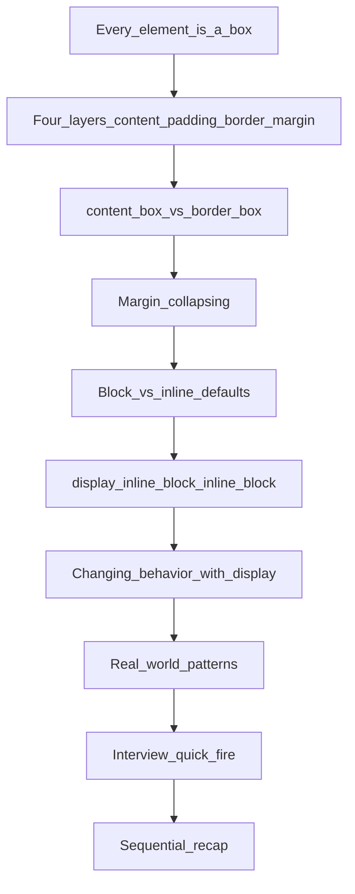

# Box Model, Inline, and Block Elements

Every pixel you see is a rectangle. CSS does not paint text — it sizes boxes, then paints inside them. HTML gives you *tags*. The browser turns every visible tag into a **box**. The **box model** is the contract for how that box is measured. `display` is the contract for how that box sits next to other boxes. If you only memorize `margin: 20px` and `display: flex`, you will stall the moment someone asks *why a 300px-wide card overflowed its 300px parent*, or *why `width` on a `span` did nothing*.

This note is written for a final-year CSE student. Read it top to bottom once (like compiling a program: each layer depends on the previous one). Before placements, jump to [Interview Quick-Fire](#8-interview-quick-fire).



**Course files this note refers to:**

- [`../18-the-current-state-of-CSS/18-the-current-state-of-CSS.md`](../18-the-current-state-of-CSS/18-the-current-state-of-CSS.md) — cascade, CSSOM, rendering pipeline, and a 30-line box-model primer (do not duplicate the pipeline here)
- [`box-model-demo.html`](./box-model-demo.html) — live playground: open in a browser, inspect, watch the Layout diagram
- [`../06-css/04_boxmodel/boxmodel.html`](../06-css/04_boxmodel/boxmodel.html) — course baseline: content-box vs border-box, inline vs block
- [`../21-Masterclass-on-CSS-selector/21-Masterclass-on-CSS-selector.md`](../21-Masterclass-on-CSS-selector/21-Masterclass-on-CSS-selector.md) — how you *select* the box; this note is how the box *occupies space*

**How to use the pictures:** every deep-dive below has an ASCII diagram and a worked number. After you read a section, open [`box-model-demo.html`](./box-model-demo.html) and find the matching panel. DevTools → Elements → **Layout** (Chrome) or the box diagram in **Styles** is the ground truth: the engine shows you content, padding, border, and margin as four nested rectangles with pixel values.

---

## 1. The Box Model (What and Why)

**Analogy:** a **framed photo hanging on a wall**.

| Layer | Analogy | CSS | Occupies layout? | Background shows? |
| --- | --- | --- | --- | --- |
| Content | The photograph | Text, images, child boxes | Yes | Yes |
| Padding | Mat board inside the frame | `padding` | Yes | Yes — same as the element |
| Border | The wooden frame | `border` | Yes | The border's own color |
| Margin | Wall space between frames | `margin` | Yes (pushes neighbors) | No — transparent |

The box model is not a metaphor the docs invented for beginners. It is how the [CSS Box Model Module](https://developer.mozilla.org/en-US/docs/Web/CSS/Guides/Box_model) defines **every visible element's geometry**. Layout is a packing problem. You cannot pack what you cannot measure.

### 1.1 Four edges, four areas

Every box has four concentric edges. MDN names them in order, inside out:

```
┌─────────────────── margin edge ───────────────────┐
│  margin (transparent, pushes neighbors)           │
│  ┌──────────────── border edge ─────────────────┐ │
│  │  border (visible frame)                      │ │
│  │  ┌────────────── padding edge ─────────────┐ │ │
│  │  │  padding (inside the frame, bg shows)   │ │ │
│  │  │  ┌────────── content edge ────────────┐ │ │ │
│  │  │  │  content  (width / height target)  │ │ │ │
│  │  │  │  Hello, box model                  │ │ │ │
│  │  │  └────────────────────────────────────┘ │ │ │
│  │  └─────────────────────────────────────────┘ │ │
│  └──────────────────────────────────────────────┘ │
└───────────────────────────────────────────────────┘
```

| Area | Bounded by | Typical properties |
| --- | --- | --- |
| Content box | content edge | `width`, `height`, `min-*`, `max-*` (depending on `box-sizing`) |
| Padding box | padding edge | `padding`, `padding-top` / `-right` / `-bottom` / `-left` |
| Border box | border edge | `border`, `border-width`, `border-style`, `border-color` |
| Margin box | margin edge | `margin` — can be negative (overlap) |

**Memory hook — onion, not sandwich:** you never skip a layer. Content is wrapped by padding, padding by border, border by margin. If you remember "photo → mat → frame → wall gap," you can reconstruct the diagram on a whiteboard without looking it up.

### 1.2 What each layer actually does

**Content.** The "real" stuff: text, an image, a video, nested boxes. This is the area `width` and `height` talk about *by default*. Overflow (`overflow: auto` / `scroll` / `hidden`) is a rule about what happens when content will not fit this area.

**Padding.** Internal breathing room. Because it is *inside* the border, the element's `background-color` / `background-image` paints through it. Padding cannot be negative. Scrollbars, when present, typically eat into this area.

**Border.** The visible edge. `background` extends *under* the border by default (`background-clip` can change that). Border width is added to (or absorbed into) the used size depending on `box-sizing`.

**Margin.** External breathing room. It does not take the element's background. It is not "empty pixels you can click" in the same way padding is — it is a *clearance* between this box and its neighbors. Positive margin pushes. Negative margin pulls (overlap). `outline` and `box-shadow` are painted in this visual neighborhood but **do not change the used size of the box**. That is a classic interview trap: "I set `outline: 20px` and the layout did not shift." Correct — outline is not in the box model.

```css
.card {
  width: 240px;
  padding: 16px;
  border: 2px solid #333;
  margin: 24px;
  background: #f4f4f4;
  outline: 8px dashed gold; /* visible, zero layout cost */
  box-shadow: 0 8px 24px rgb(0 0 0 / 0.25); /* same: paint only */
}
```

### 1.3 Block boxes vs inline boxes (preview)

The full four-layer model applies to **block-level** and **inline-block** boxes. **Inline** boxes use a reduced subset:

- `width` and `height` are ignored (non-replaced inline boxes).
- Horizontal padding, border, and margin work.
- Vertical padding and border *paint*, but they do not reliably grow the line box the way a block's vertical margin does.
- Vertical margin on a non-replaced inline box is effectively ignored for layout.

We unpack that in [section 4](#4-block-vs-inline-default-html-behavior). Hold one sentence for now: **the box model is the size of a box; `display` is how that box participates in flow.**

### 1.4 Logical properties (one interview-aware sentence)

Physical properties (`margin-top`, `padding-left`) are page-relative. Logical properties (`margin-block-start`, `padding-inline-start`) follow writing direction. Same box model. Different axis names. If the interviewer mentions RTL or vertical writing modes, say: "I would prefer logical properties so start/end flip with `direction`, not left/right." Then go back to physical numbers — that is what most whiteboards still use.

Open [`box-model-demo.html`](./box-model-demo.html) panel **1. Four layers**. The dashed pink ring is margin. The cyan frame is border. Gold is padding. Green is content.

---

## 2. Sizing Math (`content-box` vs `border-box`)

**Analogy:** ordering a desk.

- `content-box` (CSS default): "I want a **keyboard tray** 300cm wide." The drawers (padding) and the wooden rim (border) are *extra*. The desk that arrives is wider than 300.
- `border-box` (what almost every modern stylesheet uses): "I want the **whole desk** 300cm wide." Drawers and rim eat *into* the 300. The keyboard tray shrinks.

`box-sizing` answers: **when I write `width: 300px`, which edge am I promising?**

### 2.1 The default: `content-box`

```css
.box {
  box-sizing: content-box; /* initial value — even if you never write it */
  width: 300px;
  padding: 20px;     /* 20 left + 20 right = 40 */
  border: 5px solid; /* 5 left + 5 right = 10 */
}
```

**Used outer width (border-to-border):**

```
content  300
padding   40
border    10
─────────────
total    350px
```

Height is the same story: `height: 200px` + vertical padding + vertical border.

This is why "four cards at `width: 25%`" overflow a row the moment any of them has horizontal padding or a border. Percent width was 25% of the *content* of the parent. Padding was then *added*.

**Visual — parent is 300px, child declares `width: 300px` with padding and border:**

```
parent (300px)
┌──────────────────────────────┐
│ content-box child (350px)    │████  ← 50px overflow
│ [content 300][pad][border]   │████
└──────────────────────────────┘
```

### 2.2 The alternative: `border-box`

```css
.box {
  box-sizing: border-box;
  width: 300px;
  padding: 20px;
  border: 5px solid;
}
```

**Used outer width:** **300px**. Content width shrinks:

```
promised width     300
− padding           40
− border            10
──────────────────────
content width      250px
```

```
parent (300px)
┌──────────────────────────────┐
│ border-box child (300px)     │   ← fits
│ [content 250][pad 40][b 10]  │
└──────────────────────────────┘
```

Margin is **never** inside `width` for either model. `width` never means "including the wall gap." If you need the whole *occupied* slot, add horizontal margins yourself, or use `gap` on a flex/grid parent.

| `box-sizing` | What `width` / `height` include | Rendered outer (example) | Interview one-liner |
| --- | --- | --- | --- |
| `content-box` (default) | Content only | 300 + 40 + 10 = **350px** | "Width is a promise about the *content* only." |
| `border-box` | Content + padding + border | **300px**; content = 250px | "Width is a promise about the *visible box*." |

**Memory hook:** `content-box` = **C**ontent + extras = **C**onfusing in layouts. `border-box` = **B**order-box = **B**ehaves like designers and Figma expect: "300 means 300."

Content cannot go negative under `border-box`. If padding + border exceed `width`, content is floored to 0. You cannot hide a box by over-padding it.

### 2.3 The universal reset (what you actually ship)

Browsers default every element to `content-box`. Almost all production CSS starts by flipping that:

```css
*,
*::before,
*::after {
  box-sizing: border-box;
}
```

Why `*` **and** the pseudo-elements? Generated boxes (`::before` / `::after`) do not inherit `box-sizing` from `*` in a way that always covers them unless you list them. This is the same reset already used in [`selectors-demo.html`](../21-Masterclass-on-CSS-selector/selectors-demo.html) and [`box-model-demo.html`](./box-model-demo.html).

A slightly more conservative pattern (inherit from `html`) also appears in MDN Learn:

```css
html {
  box-sizing: border-box;
}
*,
*::before,
*::after {
  box-sizing: inherit;
}
```

Either is fine in an interview. The claim to make is: **"I do not want `width: 100%` plus padding to overflow the parent."**

### 2.4 Side-by-side HTML (matches the demo)

```html
<div class="parent"> <!-- 300px wide -->
  <div class="measure content-box-demo">content-box — spills</div>
</div>
<div class="parent">
  <div class="measure border-box-demo">border-box — fits</div>
</div>
```

```css
.parent {
  width: 300px;
}

.measure {
  width: 300px;
  padding: 20px;
  border: 5px solid;
}

.content-box-demo {
  box-sizing: content-box; /* 350px used width */
}

.border-box-demo {
  box-sizing: border-box;  /* 300px used width */
}
```

Open [`box-model-demo.html`](./box-model-demo.html) panel **2**. Inspect each `.measure`. The pink box sticks out of the dashed parent; the green box does not. Course file [`boxmodel.html`](../06-css/04_boxmodel/boxmodel.html) uses the same numbers (300 / 20 / 5).

### 2.5 Replaced elements and `width`

``, `<video>`, `<iframe>`, `<input>` are **replaced** (or replaced-like): the content is an external object with an intrinsic size. `width` / `height` on them *do* apply even when `display` is `inline`, because they are not non-replaced inline boxes. That is why `img { width: 200px; }` works without `display: block`. The baseline-gap gotcha in [section 7](#7-real-world-patterns-and-gotchas) is a different story (`display: inline` + line box).

---

## 3. Margin Collapsing (Interview Bonus)

**Analogy:** two people standing in a queue, each insisting on "personal space." Person A wants 20cm behind them. Person B wants 30cm in front of them. They do not add the gaps. They take the **larger** of the two requests: 30cm. That is vertical margin collapsing in normal flow.

### 3.1 The rule, with numbers

```html
<div class="a">box A</div>
<div class="b">box B</div>
```

```css
.a { margin-bottom: 20px; }
.b { margin-top: 30px; }
```

**Naive (wrong):** gap = 20 + 30 = 50px.

**Actual (block, adjacent, normal flow):** gap = `max(20, 30)` = **30px**.

```
┌─────────────┐
│    box A    │
└─────────────┘
       ↕  30px   ← collapsed, not 50
┌─────────────┐
│    box B    │
└─────────────┘
```

If both were `40px`, the gap is 40px, not 80px. Equal margins collapse to one copy of that value.

### 3.2 When collapsing happens (and when it does not)

**Typically collapses:**

- Adjacent **block-level** boxes in **normal flow** (siblings).
- Parent and first/last child, when the parent has no padding, no border, and no gap creating a separation on that edge (parent-child collapse). Empty blocks can collapse through as well.

**Does not collapse:**

- Horizontal margins (left/right) — always add.
- **Inline** boxes, **inline-block**, **flex items**, **grid items**.
- A box with `overflow` other than `visible` (creates a block formatting context that contains its margins).
- Floated or absolutely positioned boxes.
- When a **border** or **padding** on the parent sits between the parent's margin and the child's margin — that separator prevents parent-child collapse.

```css
/* These two siblings still collapse (no separator between them). */
.a { margin-bottom: 20px; }
.b { margin-top: 30px; }

/* Parent-child: padding-top on .card stops the child's margin-top
   from collapsing with the card's margin-top. */
.card {
  margin-top: 40px;
  padding-top: 1px; /* even 1px is a separator */
}
.card h2 {
  margin-top: 24px; /* now 24px inside the card, plus the card's 40px outside */
}
```

**Why interviews love this:** unexplained "mystery whitespace" at the top of a page is often `h1 { margin-top }` collapsing *out through* `body` / a wrapper with no padding. The fix is not `!important`. The fix is a separator (padding/border) or flattening the margin on the heading.

Open [`box-model-demo.html`](./box-model-demo.html) panel **6**. Inspect A and B. The gap between border edges is 30px.

---

## 4. Block vs Inline (Default HTML Behavior)

**Analogy:** a theater.

- **Block** = you booked a **whole row**. Nobody sits beside you on that row. The next act starts on the next row. By default you stretch to the width of the aisle (the containing block).
- **Inline** = you are a **word in a sentence**. You take only as much width as your letters. The next word sits beside you. You wrap to the next line only when the line is full.

HTML's default `display` comes from the **user-agent stylesheet**, not from the HTML spec's "block vs inline content models" (those are *content* categories: what is *allowed* inside what). Interviews mix the two. Be precise: **"phrasing vs flow is HTML validity; `display` is CSS layout."** A `<div>` inside a `<p>` is invalid HTML. `display: inline` on a `<div>` is legal CSS and will make that div *lay out* like a word.

### 4.1 The comparison that wins interviews

| | Block | Inline (non-replaced) |
| --- | --- | --- |
| Seating | Own row — full-width stage | Words in a sentence |
| New line | Starts on a new line; next sibling starts after | Stays in the line box |
| Width if unset | Stretch to containing block (100% of available) | Shrink-to-fit content |
| `width` / `height` | Honored | Ignored |
| Horizontal margin / padding / border | Honored | Honored (padding/border paint; margin pushes sideways) |
| Vertical margin | Honored (and can collapse) | Ignored for layout |
| Vertical padding / border | Honored | Paint, but line-box height is driven by line-height / fonts, not by that padding in a clean "grow the row" way |
| Typical UA `display` | `div`, `p`, `h1`–`h6`, `section`, `article`, `ul`, `li`, `header`, `footer` | `span`, `a`, `strong`, `em`, `code`, `label` |

```
Block (div after div):              Inline (spans in a paragraph):

┌─────────────────────────────┐     The [quick] [brown] [fox]
│ full width of parent        │     jumps — three chips in one sentence
└─────────────────────────────┘
┌─────────────────────────────┐
│ next block, new row         │
└─────────────────────────────┘
```

### 4.2 Default HTML, no CSS

```html
<p>
  Hello <span>world</span> and <a href="#">a link</a>.
</p>
<div>First block</div>
<div>Second block</div>
```

The `<p>` is a block. Inside it, `span` and `a` share line boxes with the text. The two `<div>`s each take a full row, stacked.

```html
<!-- UA stylesheet (simplified mental model) -->
div, p, h1, section { display: block; }
span, a, strong, em  { display: inline; }
```

You almost never see that file. You *feel* it: paragraphs stack; bold text does not break the sentence.

### 4.3 Containing block (why "full width" is not "the viewport")

A block box's default width is the width of its **containing block**, usually the content box of the nearest block ancestor. A `div` inside a 400px-wide card is 400px, not 100vw.

```
viewport
└── body
    └── .card (width: 400px)
        └── div (display: block, width auto)
            used width ≈ 400px minus the card's padding
```

This is why "block = always full screen" is a wrong interview answer. **Block = as wide as its containing block, unless you set `width`.**

### 4.4 Replaced inline: `img`

`` is inline *and* replaced. `width` / `height` work. It still sits on the **text baseline** by default, which leaves a mysterious gap under images inside a container (descender space of the line box). Fix: `img { display: block; }` or `vertical-align: middle` / `bottom`. Details in [section 7](#7-real-world-patterns-and-gotchas).

---

## 5. `display` Deep Dive: `inline`, `block`, `inline-block`

**Master analogy:** `display` is a **seating policy**, not a new employee. Same HTML tag. Different layout contract. HR can make a `div` sit in a sentence (`display: inline`) and make an `a` take a whole row (`display: block`). The passport (the tag name, the accessibility role unless you override it) does not change.

CSS `display` is two-axis in modern syntax (`display: block flex`), but interviews still start with the CSS 2.1 single keywords. This note stays there on purpose. Flex and grid change *how children are laid out inside* a box; they do not replace the box model.

### 5.1 Three values, one table

| Value | Line break | `width` / `height` | Vertical margin | Mental model | Use when |
| --- | --- | --- | --- | --- | --- |
| `block` | Yes — new row | Honored | Honored (can collapse) | Own conference row | Cards, sections, stacking |
| `inline` | No — text flow | Ignored (non-replaced) | Ignored (non-replaced) | A word | Highlighted text, inline links |
| `inline-block` | No — sits in a line | Honored | Honored (no collapse with siblings the same way) | A word that is allowed to be a real box | Pills, icon+label, old-school horizontal nav |

```
Same three <span>s, only `display` changes:

inline:         Text [hi] still flowing — width:120px IGNORED
inline-block:   Text [    120 × 48    ] still on this line
block:          Text
                ┌──────────────┐
                │  120 × 48    │  ← new row (width honored, not stretched
                └──────────────┘     unless width is auto)
```

A block with an explicit `width` does **not** have to be 100% wide. "Block" means "block-level participation" (breaks before/after, vertical margins work). Stretching is the *auto width* default, not a law.

### 5.2 The canonical snippet (W3Schools / CSS-Tricks pattern)

```html
<p>
  Text
  <span class="a">inline</span>
  still flows
  <span class="b">inline-block</span>
  then a
  <span class="c">block</span>
  which took its own row.
</p>
```

```css
span.a,
span.b,
span.c {
  width: 120px;
  height: 48px;
  padding: 8px 12px;
  border: 2px solid;
}

span.a { display: inline; }        /* size ignored */
span.b { display: inline-block; }  /* size honored, same line */
span.c { display: block; }         /* new line; size honored */
```

**What "behaves like a block" means for `inline-block`:** the *inner* layout is a block container — you can set dimensions, padding on all four sides affects the used size, vertical margins participate as on a block. The *outer* layout is inline-level — the box is placed on a line box like a word (aligned to the baseline by default, which is why `vertical-align` suddenly matters).

**What `inline` refuses:**

```css
span.label {
  display: inline;
  width: 200px;   /* ignored */
  height: 40px;   /* ignored */
  margin-top: 20px; /* ignored for layout */
  padding: 10px;  /* left/right push text; top/bottom paint and can overlap adjacent lines */
}
```

### 5.3 Line boxes and `vertical-align`

Inline-level boxes sit in **line boxes**. Default `vertical-align: baseline` lines up text baselines. A tall `inline-block` next to text looks "sunk" or "gapped" because the baseline of the inline-block is near its bottom (for boxes with text) or the bottom margin edge (for some replaced content).

```
line box
────────────── baseline ──────────────
  text  ┌─────────┐
        │  btn    │   ← inline-block sitting on baseline
        └─────────┘
              ░  ← often a few pixels of "descender" gap under images
```

Fixes you should be able to name: `vertical-align: middle` on the inline-block / img, or `display: block` on the image so it leaves the line box.

### 5.4 `display: none` (related, not a fourth seating policy)

`display: none` means **no box is generated**. The element is not in layout. `visibility: hidden` generates a box, occupies space, but paints nothing. `opacity: 0` occupies space *and* can still receive pointer events unless you also set `pointer-events: none`. Lecture 18 already has this trio; do not mix them with inline vs block. None of those three is "a kind of inline."

Open [`box-model-demo.html`](./box-model-demo.html) panel **3**. Three chips, same width/height declarations, three seating policies.

---

## 6. Changing Behavior: Block ↔ Inline

You do not change the HTML category. You change the **outer display** of an existing element. That is the whole skill.

**Caveat you must say in interviews:** semantics and accessibility follow the *tag* (and ARIA), not `display`. A `div` with `display: inline` is still not a link. An `h1` with `display: inline` is still a heading. Use the correct element first; use `display` for layout.

### 6.1 Pattern 1 — Block elements sitting on one line

**Problem:** you have `div`s (or `li`s) that stack, and you want a toolbar.

**Before (`display: block`, UA default for `div`):**

```
┌─────────────────────────────┐
│ Home                        │
└─────────────────────────────┘
┌─────────────────────────────┐
│ Docs                        │
└─────────────────────────────┘
┌─────────────────────────────┐
│ Blog                        │
└─────────────────────────────┘
```

```html
<div class="toolbar">
  <div class="item">Home</div>
  <div class="item">Docs</div>
  <div class="item">Blog</div>
</div>
```

```css
.toolbar .item {
  display: inline-block; /* still a box: padding and width work */
  padding: 0.45rem 0.85rem;
}
```

**After:**

```
[ Home ] [ Docs ] [ Blog ]
```

Why not `display: inline`? Because you usually want padding, a min-width, or a consistent height. Inline will ignore `width` / `height`. `inline-block` is the CSS 2.1 answer. Flexbox (`display: flex` on `.toolbar`) is the modern answer for alignment and wrapping — one sentence, then move on. Interviews still want you to *know* `inline-block`.

Whitespace between `inline-block` tags in HTML becomes a **real text node** (~4px gap). Fixes: remove the spaces in HTML, set `font-size: 0` on the parent (then restore on children), or use flex/`gap` and stop fighting the line box.

### 6.2 Pattern 2 — Inline elements taking a full row

**Problem:** `<a>` is inline. You want a stacked menu or a card that is entirely clickable.

**Before:**

```
See [Overview] [Pricing] [Contact] in this sentence.
```

```html
<nav class="link-stack">
  <a href="/overview">Overview</a>
  <a href="/pricing">Pricing</a>
  <a href="/contact">Contact</a>
</nav>
```

```css
.link-stack a {
  display: block;
  width: 100%;
  padding: 0.55rem 0.75rem;
}
```

**After:**

```
┌─────────────────────────────┐
│ Overview                    │  ← entire row is the hit target
└─────────────────────────────┘
┌─────────────────────────────┐
│ Pricing                     │
└─────────────────────────────┘
┌─────────────────────────────┐
│ Contact                     │
└─────────────────────────────┘
```

Padding on an inline `a` does not make a comfortable hit target; vertical padding paints over adjacent lines. `display: block` (or `inline-block` with explicit size) is the reason buttons-that-are-links exist.

### 6.3 Pattern 3 — `inline-block` hybrid (horizontal nav from `li`)

```html
<ul class="nav">
  <li><a href="/">Home</a></li>
  <li><a href="/docs">Docs</a></li>
  <li><a href="/blog">Blog</a></li>
</ul>
```

```css
.nav {
  list-style: none;
  margin: 0;
  padding: 0;
}

.nav li {
  display: inline-block;
  padding: 15px;
}
```

`li` is `display: list-item` in the UA stylesheet (a block-like box with a marker). `inline-block` drops the stacking and the outside marker placement you get with block list items. Reset `list-style` so you are not fighting bullets on a horizontal bar.

### 6.4 The conversion cheat sheet

| You have | You want | CSS |
| --- | --- | --- |
| `div` / `li` / `p` stacking | Items on one line, with sizes | `display: inline-block` (or flex on the parent) |
| `div` / `li` stacking | Items on one line, *no* width/height | `display: inline` (rare; padding still awkward) |
| `span` / `a` in a sentence | Full-width row, stacked | `display: block` |
| `span` / `a` in a sentence | Sized chip still in the sentence | `display: inline-block` |
| Anything | Remove from layout | `display: none` |

Open [`box-model-demo.html`](./box-model-demo.html) panels **4** and **5**. Same markup, two seating policies.

---

## 7. Real-World Patterns and Gotchas

### 7.1 Horizontal navigation

`inline-block` on `li` (section 6.3) is the historical pattern. Today you will write `nav { display: flex; gap: 0.5rem; }` more often. In an interview: acknowledge both. Flex wins for alignment (`align-items: center`), wrapping, and no whitespace nodes. `inline-block` proves you understand line boxes.

### 7.2 Button-like links

```css
a.btn {
  display: inline-block;
  padding: 0.5rem 1rem;
  border-radius: 6px;
  background: #2563eb;
  color: #fff;
  text-decoration: none;
}
```

`inline-block` keeps the control in the text/toolbar flow *and* lets padding define a hit target. `display: block` would force a break unless the parent is already a column.

### 7.3 Image baseline gap

```html
<figure>
  
</figure>
```

```
┌──────────────────┐
│      image       │
│                  │
└──────────────────┘░  ← 3–5px gap: the image sits on the text baseline
```

```css
img {
  display: block; /* leaves the line box; gap disappears */
  max-width: 100%;
  height: auto;
}
```

Alternate: `img { vertical-align: middle; }` if it must stay inline with text.

### 7.4 Hidden but layout-preserving

| Declaration | Box generated? | Occupies space? | Events? |
| --- | --- | --- | --- |
| `display: none` | No | No | No |
| `visibility: hidden` | Yes | Yes | No (not visible to hit-testing in the usual sense) |
| `opacity: 0` | Yes | Yes | Yes, unless `pointer-events: none` |

Cross-ref [lecture 18](../18-the-current-state-of-CSS/18-the-current-state-of-CSS.md#15-the-box-model). Do not use `display: none` vs `visibility` as a substitute for "inline vs block."

### 7.5 Why flex/grid superseded `inline-block` for *layout*

`inline-block` is a line-box citizen: baseline alignment, HTML whitespace gaps, wrapping like text. Flex and grid are **formatting contexts** that lay out *children* on axes with `gap`, alignment, and no collapsing margins between items. Use `inline-block` for "a box that should still sit in a sentence." Use flex/grid for "a row or a 2D template of boxes." This note stops there — flex/grid get their own lectures.

### 7.6 Padding does not inherit

`padding` and `margin` are **not inherited**. Setting padding on `body` does not pad every nested box. Font properties *do* inherit. That split is [lecture 18 section 1.4](../18-the-current-state-of-CSS/18-the-current-state-of-CSS.md). If an interviewer asks "does the box model inherit?", the answer is **no** — children generate their own boxes.

### 7.7 Shorthands you must decode on a whiteboard

```css
margin: 10px;                 /* all four = 10 */
margin: 10px 20px;            /* top/bottom 10, left/right 20 */
margin: 10px 20px 30px;       /* top 10, left/right 20, bottom 30 */
margin: 10px 20px 30px 40px;  /* top, right, bottom, left (clockwise from 12 o'clock) */
padding: 1rem 2rem;           /* same 2-value pattern */
border: 2px solid #333;       /* width style color — all three needed for a visible border */
```

**Clockwise TRBL** (Top, Right, Bottom, Left). Memory: **TRouBLe**.

---

## 8. Interview Quick-Fire

Use these as spoken answers. Keep them short, then offer to go deeper.

**Q1. What is the CSS box model?**  
Every visible element is a rectangle made of four areas: content, padding, border, and margin. Layout measures those areas; paint fills them. The box model is how used width and height are computed.

**Q2. Name the four layers inside-out, with one analogy.**  
Content (photo), padding (mat), border (frame), margin (wall gap between frames). Background shows through padding; margin is transparent.

**Q3. `content-box` vs `border-box` with numbers.**  
`width: 300px; padding: 20px; border: 5px solid`. Content-box used width = 300 + 40 + 10 = **350px**. Border-box used width = **300px**, content shrinks to 250px. Margin is in neither formula.

**Q4. Why do people put `* { box-sizing: border-box }` in a reset?**  
So `width: 100%` (or `25%`) includes padding and border and does not overflow the parent. It matches how designers specify a box. Include `*::before, *::after`.

**Q5. What is margin collapsing?**  
Adjacent vertical margins of block boxes in normal flow combine into one — typically the larger value. `margin-bottom: 20px` + `margin-top: 30px` → 30px gap, not 50. Horizontal margins never collapse. Flex/grid items do not collapse.

**Q6. Block vs inline — four differences.**  
Block: new line, stretches to containing block if width is auto, honors width/height, vertical margins work (and may collapse). Inline: flows in a line, shrink-to-fit, ignores width/height (non-replaced), vertical margin ignored.

**Q7. `inline` vs `inline-block` in one sentence.**  
Both sit on a line like text; **inline-block honors width, height, and vertical padding/margin** like a block.

**Q8. Can you set `width` on a `span`?**  
Not while it is `display: inline` (non-replaced). Set `display: inline-block` or `block`, then `width` applies. Replaced inlines (`img`) are the exception.

**Q9. How do you make block-level elements sit on the same line?**  
`display: inline-block` (or `inline`) on the items, or `display: flex` / `grid` on the parent. Inline-block is the classic answer; flex is what you ship.

**Q10. How do you make an inline element behave like a block?**  
`display: block`. Common: `a { display: block; }` for full-row hit targets. The tag is still a link.

**Q11. `display: none` vs `visibility: hidden`?**  
None: no box, no space, gone from layout. Hidden: box remains, space remains, not painted.

**Q12. Does padding inherit?**  
No. Each element has its own box. Fonts inherit; box-model properties do not.

**Q13. Why is there a gap under my image?**  
The image is inline and sits on the text baseline. `display: block` on `img` (or `vertical-align`) removes the descender gap.

**Q14. Do `outline` and `box-shadow` add to width?**  
No. They paint outside the border edge (in the margin's visual neighborhood) and do not change layout size.

**Q15. What happens to layout when you change `display`?**  
You change the element's outer (and sometimes inner) formatting — seating policy. You do not change the tag, the accessibility role, or HTML content categories. A `div` with `display: inline` still must not be nested inside a `p` if you care about valid HTML.

**Q16. Is a block always 100% of the viewport?**  
No. Auto-width block stretches to its **containing block**, usually the parent's content box.

---

## 9. How to Use This in Depth (the sequential recap)

When you sit down to debug a "why is this box huge / wrapping / gapped" bug — or to explain the box model on a whiteboard — walk the same staircase:

1. **Draw the box.** Content → padding → border → margin. If you cannot label all four, you do not have a size; you have a wish. Remember the photo-on-the-wall analogy out loud.
2. **Ask: `content-box` or `border-box`?** Check computed styles. If there is no reset, assume `content-box` and *add* padding and border to `width`. If there is `* { box-sizing: border-box }`, `width` is the visible box. Do the arithmetic with real numbers (300 + 40 + 10).
3. **Ask: block, inline, or inline-block?** Row vs sentence vs hybrid. If `width` on a `span` "does nothing," you are looking at inline. If two `div`s will not sit side by side, they are block (or you need flex on the parent).
4. **Set dimensions on the right box type.** Do not fight inline with `width`. Promote to `inline-block` or `block`. Do not fight stacking `div`s with negative margin hacks if `inline-block` or flex is the seating policy you want.
5. **Check vertical margins for collapse.** Mystery 30px instead of 50px is not a browser bug. Adjacent block margins in normal flow take the max. Padding or border on a parent is a separator.
6. **Verify in DevTools Layout.** Inspect the element. Read content / padding / border / margin from the diagram, not from the CSS file (shorthands lie until computed). Open [`box-model-demo.html`](./box-model-demo.html) and toggle the story you are explaining: layers, sizing, display, block→inline, inline→block, collapse.

**The selected part, as an analogy you can say out loud:**

> Every element is a rectangular employee. The box model is their desk setup: content is the keyboard tray, padding is the desk pad, border is the desk edge, margin is the aisle so the next desk does not touch. Block employees take the whole conference row. Inline employees sit inside a sentence. `inline-block` employees sit in the sentence *but are allowed to have a real desk size*. `display` is HR reassigning seating without hiring a new employee — the badge on the shirt (the HTML tag) stays the same. `border-box` is the facilities rule: "when I say 300px wide, I mean the whole desk, not just the keyboard tray." `content-box` is the default legal contract that surprises every intern once. I draw the onion, I do the addition, I check Layout in DevTools. If I cannot do that, I am not ready to ship the CSS.

If you can draw the four layers, compute 350 vs 300, explain why a `span` ignores `width`, convert `li` to a horizontal nav with `inline-block`, convert `a` to a full-row target with `display: block`, and name margin collapsing, you are past "I used Bootstrap spacing classes" and into what a CSE interview actually tests.

---

## Further reading

- [MDN: CSS box model](https://developer.mozilla.org/en-US/docs/Web/CSS/Guides/Box_model) — module overview
- [MDN: Introduction to the CSS box model](https://developer.mozilla.org/en-US/docs/Web/CSS/Guides/Box_model/Introduction) — four areas and edges
- [MDN: The box model (Learn)](https://developer.mozilla.org/en-US/docs/Learn_web_development/Core/Styling_basics/Box_model) — block vs inline boxes, alternative model, collapsing
- [web.dev: Box Model](https://web.dev/learn/css/box-model) — content / padding / border / margin boxes, `box-sizing`
- [MDN: `box-sizing`](https://developer.mozilla.org/en-US/docs/Web/CSS/Reference/Properties/box-sizing) — `content-box` vs `border-box` formulas
- [MDN: Mastering margin collapsing](https://developer.mozilla.org/en-US/docs/Web/CSS/Guides/Box_model/Margin_collapsing) — when vertical margins combine
- [MDN: `display`](https://developer.mozilla.org/en-US/docs/Web/CSS/Reference/Properties/display) — outer and inner display
- [CSS-Tricks: `display`](https://css-tricks.com/almanac/properties/d/display/) — inline vs block vs inline-block in practice
- [MDN: Block and inline layout](https://developer.mozilla.org/en-US/docs/Web/CSS/Guides/Basic_box_model/Block_and_inline_layout) — flow, line boxes
- [Lecture 18: The Current State of CSS](../18-the-current-state-of-CSS/18-the-current-state-of-CSS.md) — cascade, CSSOM, brief box model, `display: none` vs `visibility`
- [Course `boxmodel.html`](../06-css/04_boxmodel/boxmodel.html) — content-box vs border-box live example
- [Live demo](./box-model-demo.html) — layers, sizing math, display trio, conversions, collapsing
