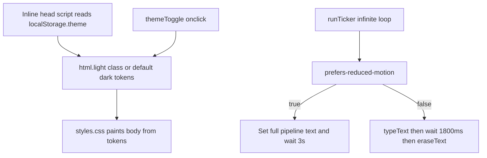

# Deep-dive answers — index

Interview prep for [portfolio-poc](./). Pair these files with [Deep-Dive-Questions.md](./Deep-Dive-Questions.md) and the three source files: `index.html`, `css/styles.css`, `js/main.js`.

Each answer has three parts:

1. **Non-technical** — what a recruiter, designer, or user would notice.
2. **Technical** — browser / CSS / JS / SEO / a11y mechanics, what happens if you remove or change it, and a real alternative.
3. **Snippet** — from this repo as it exists today, not from an older draft of the questions file.

## Files

| Questions | Answers | Source |
| --- | --- | --- |
| Q1–Q226 | [Deep-Dive-Answers-HTML.md](./Deep-Dive-Answers-HTML.md) | `index.html` |
| Q227–Q390 | [Deep-Dive-Answers-CSS.md](./Deep-Dive-Answers-CSS.md) | `css/styles.css` |
| Q391–Q453 | [Deep-Dive-Answers-JS.md](./Deep-Dive-Answers-JS.md) | `js/main.js` |
| Q454–Q495 | [Deep-Dive-Answers-Hosting.md](./Deep-Dive-Answers-Hosting.md) | robots, sitemap, assets, Netlify, Google verification |

Jump by number. Related questions may say “see Q19” instead of repeating a 20-line block.

## How the live page is wired

## Code the questions file no longer matches

Part 3 of the questions file was written against an older `js/main.js` (~60 lines). **These answers describe the current file.**

| Questions assume | Live `js/main.js` |
| --- | --- |
| Theme toggle is lines 1–4 | Theme toggle is after a leftover mobile-nav block (lines 25–28) |
| No mobile nav JS | Lines 6–23 look up `#navToggle` / `#navMenu`, which **do not exist** in `index.html`. The `if (navToggle && navMenu)` guard keeps it from throwing. |
| Pipelines: `auth_request…`, `job_description…`, `resume…`, `skill_list…` | Live strings: `resume.pdf -> parse -> embed -> match`, `audio_stream -> deepgram_stt -> llm -> tts_response`, `auth_request -> rate_limiter -> captcha -> session`, `skill_list -> qlora_model -> interview_questions` |
| `tickerEl.closest(".hero-text-ticker")` (Q410–411) | Only `getElementById("tickerText")` |
| JS adds/removes `is-waiting` (Q339–341, Q420–423) | **Never.** CSS still has `.hero-text-ticker.is-waiting .hero-text-ticker-cursor { animation: blink … }`, so the cursor does not blink. |
| No `prefers-reduced-motion` in JS (Q450) | **Present.** Reduced-motion users get the full line swapped every 3s, no type/erase. |

Other drift:

- Questions mention `google2e544ac390422587.html`. The repo only has `googleaafb6cb8726be5e4.html`.
- There is no `netlify.toml` or `_headers`. CSP / header questions are answered as “not present.”

## Gaps a reviewer will score you on (honest list)

These are real in the current markup. The answers defend the choice *and* name the fix.

- Empty theme button: no visible text, no `aria-label`, no `aria-pressed`.
- Contact form: `netlify-honeypot="bot-field"` with **no** hidden `bot-field` input.
- No Open Graph / Twitter card tags.
- `[95]%` in a work card looks like a leftover placeholder.
- About says “Associate Software Developer”; JSON-LD and Work say “Associate Software Engineer”.
- Nav has no `#projects` link.
- CSS has no `@media (prefers-reduced-motion: reduce)` for falling icons, smooth scroll, or button hover.
- Dead `navToggle` JS left in `main.js`.
- Cursor blink CSS is dead because JS never adds `is-waiting`.

## What you would add next without changing the story

Open Graph tags, a real honeypot field, `aria-label` + `aria-pressed` on the theme button, `prefers-reduced-motion` in CSS, a `#projects` nav item, and `color-scheme` on `html`. That is Q495 in the hosting file.
