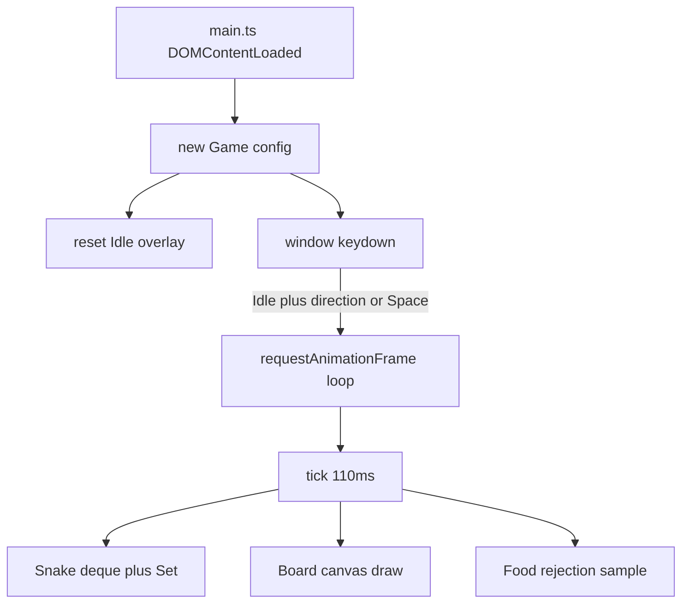

# Deep-dive answers — index

Interview prep for the snake game. Pair these files with [Deep-Dive-Questions.md](./Deep-Dive-Questions.md) and `index.html`, `style.css`, `src/*.ts`.

Each answer has three parts:

1. **Non-technical** — what a recruiter or player would notice.
2. **Technical** — browser / CSS / TypeScript / canvas / DSA / a11y mechanics, what happens if you remove or change it, and a real alternative.
3. **Snippet** — from this repo as it exists today. The questions file matches the live sources; there is no older-draft drift table.

## Files

| Questions | Answers | Source |
| --- | --- | --- |
| Q1–Q88 | [Deep-Dive-Answers-HTML.md](./Deep-Dive-Answers-HTML.md) | `index.html` |
| Q89–Q151 | [Deep-Dive-Answers-CSS.md](./Deep-Dive-Answers-CSS.md) | `style.css` |
| Q152–Q244 | [Deep-Dive-Answers-DSA.md](./Deep-Dive-Answers-DSA.md) | `src/types.ts`, `src/Deque.ts`, `src/Snake.ts` |
| Q245–Q372 | [Deep-Dive-Answers-Game.md](./Deep-Dive-Answers-Game.md) | `src/Board.ts`, `src/Food.ts`, `src/Game.ts`, `src/main.ts` |
| Q373–Q442 | [Deep-Dive-Answers-Tooling.md](./Deep-Dive-Answers-Tooling.md) | `package.json`, `tsconfig.json`, `dist/`, README, demo gaps |

Jump by number. Related questions may say “see Q60” instead of repeating a long block.

## How the live game is wired

The browser loads `dist/*.js` (ES modules), not `src/*.ts`. Edit TypeScript, then `npm run build`, or you are demoing stale JS.

## Questions file vs live `Game.ts`

A few questions are phrased as if the code did something it does not. **Correct the interviewer, then answer both.**

| Question assumes | Live `src/Game.ts` |
| --- | --- |
| Space on GameOver does nothing (Q318, Q439) | Space hits `else this.start()`, and `start()` **does** `reset()` on GameOver. Space **does** restart after death. |
| Direction keys restart after death (overlay copy, Q319) | Direction only `start()`s from **Idle**. After GameOver they queue a heading and never start. Overlay/README are wrong. |
| Restart always means new game (Q307–Q309) | `reset()` only on Idle or GameOver. Restart while Running or Paused does **not** reset. |

## Gaps a reviewer will score you on (honest list)

These are real in the current game. The answers defend the choice *and* name the fix.

- Overlay is not `hidden` in HTML — empty cover until `Game.reset()` runs.
- Canvas has no `aria-label`, no fallback content, no HTML `width`/`height`; Board does not scale for `devicePixelRatio`.
- Score and status have no `aria-live`; input is keyboard-only; `window` `keydown` is never removed.
- CSS `prefers-reduced-motion` only disables the Restart transition; the 110ms tick still runs.
- `--accent` in CSS can drift from `FOOD_COLOR` / head / body hex in `Game.ts`.
- One-slot `queuedDirection`: two 90° keys in one tick can collapse into a 180 that `setDirection` ignores.
- `start()` only calls `reset()` on Idle or GameOver — Restart while Running or Paused does not start a new game.
- Food uses rejection sampling with no full-board win; a filled 24×24 grid is an infinite loop.
- HUD status shows `"Game Over"` (space) because that is the enum string.
- `file://` blocks ES modules; committed `dist/` can lie if `src/` changed.
- No unit tests for the deque or the tail-cell self-collision exception.

## What you would add next without changing the story

Keep Deque + Set, the OOP split, and no framework. Add tests for Deque/`wouldCollideWithSelf`, `devicePixelRatio`, a direction queue of length 2, Restart always `reset()`, overlay `hidden` in HTML, `aria-label` on the canvas, `aria-live` on score, a full-board win, touch controls, slower `tickMs` under `prefers-reduced-motion`, and a `readyState` boot. That is Q442.
